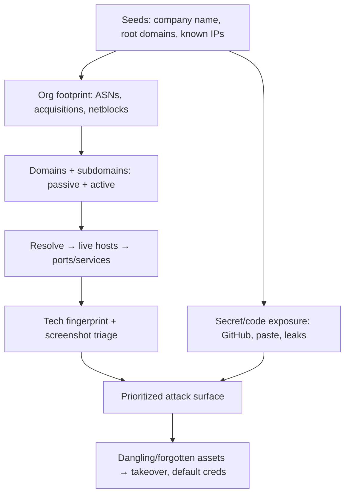

# 04.13 — External Recon and Attack Surface Mapping

## What is it?

External recon is the **organization-level** discovery phase: before testing a single app, you map the *entire* internet-facing footprint of the target — all domains, subdomains, IP ranges (ASNs), cloud assets, exposed services, leaked secrets, and forgotten/shadow systems. The goal is to find the **full attack surface**, because the easiest way in is usually the asset nobody remembered they owned. This complements per-app [[03 - Reconnaissance Phase]]; here the unit is the company, not one host.

## Why it matters

Real breaches often start at an unmonitored edge: an old subdomain pointing to a deprovisioned bucket (subdomain takeover), a staging box with default creds, a dev API with no auth, or an API key in a public repo. Comprehensive attack-surface mapping turns "test this URL" into "here is everything they expose" — and finds the weak link.

## Methodology

1. **Seed + org footprint** — identify legal entities, acquisitions, brands; map **ASNs** and netblocks (`amass intel`, `bgp.he.net`, `asnmap`), root domains (reverse-whois, `whoxy`).
2. **Subdomain enumeration** — passive (`subfinder`, `amass`, `crt.sh`/CT logs, `chaos`) + active (DNS brute `puredns`/`shuffledns`, permutations `dnsgen`/`gotator`).
3. **Resolve & probe** — `dnsx` resolve, `httpx` for live web, `naabu`/`nmap` for ports/services; identify cloud assets (S3/GCS/Azure blobs, cloud IP ranges).
4. **Triage** — `httpx` tech detection + `gowitness`/`aquatone` screenshots to quickly spot login panels, default pages, dev/staging, admin interfaces.
5. **Exposure hunting** — GitHub/GitLab dorking (`trufflehog`, `gitleaks`), paste sites, public buckets, Shodan/Censys/FOFA for exposed services + banners.
6. **Prioritize** — rank by exploitability: dangling DNS (takeover), unauth services, known-CVE versions, sensitive panels, leaked secrets.

## Key tools
`amass`, `subfinder`, `asnmap`, `dnsx`, `httpx`, `naabu`, `puredns`, `gowitness`, `nuclei`, `trufflehog`/`gitleaks`, Shodan/Censys/FOFA.

## Pitfalls / scope
- **Stay in scope** — acquisitions/related brands may be out of scope; confirm netblocks belong to the target before active scanning.
- Passive-first to avoid noise; rate-limit active DNS/port scans; respect engagement rules.

## Related Notes
- [[03 - Reconnaissance Phase]], [[02 - Rules of Engagement and Scope]]; subdomain takeover: I-34 (Web). Web recon detail: folder B-05.

## Output
A living asset inventory (domains/IPs/services/tech/secrets) feeding scanning ([[04 - Scanning and Enumeration Phase]]) and prioritized testing.
