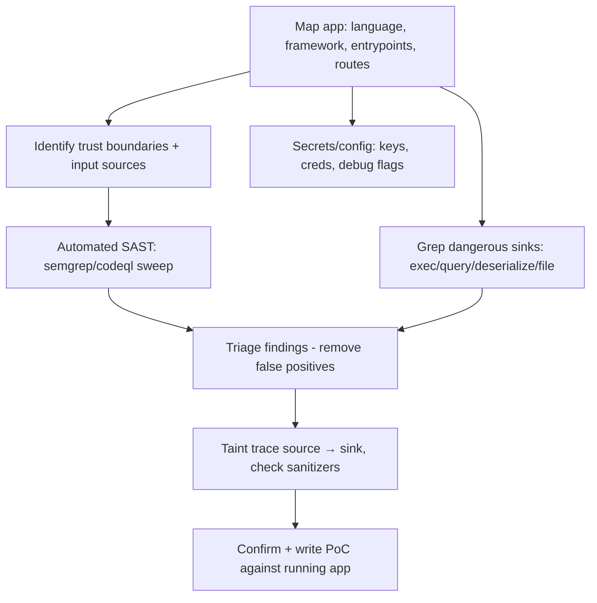

# 04.14 — Source Code Review Methodology

## What is it?

Source code review (white-box / SAST) is finding vulnerabilities by reading the **application's source** rather than only probing the running app. With code access you see every input path, every dangerous sink, the auth logic, and the secrets — often spotting bugs that black-box testing would miss (logic flaws, hidden endpoints, weak crypto). The core mental model is **taint tracking**: follow untrusted input (a *source*) to a dangerous operation (a *sink*) and check whether sanitization happens in between.

## Why it matters

White-box review is faster and deeper for many bug classes (injection, deserialization, SSRF, access-control gaps, hardcoded secrets). It pairs with dynamic testing — code review finds *where* a bug is; dynamic testing confirms exploitability.

## Methodology

1. **Orient** — identify language/framework, build the route/endpoint map, find entrypoints (controllers, handlers, message consumers), and trust boundaries.
2. **Automated pass** — run `semgrep` (rulesets) and/or **CodeQL** for a baseline; language linters (`bandit` Python, `gosec` Go, `brakeman` Rails, `eslint-plugin-security` JS).
3. **Sink hunting (grep)** — search for dangerous calls: `eval`/`exec`/`system`, raw SQL/`query`, `Runtime.exec`, deserialization (`pickle`/`ObjectInputStream`/`unserialize`), file ops (`include`, `readFile`, path joins), HTTP fetchers (SSRF), template render, `innerHTML`.
4. **Source → sink taint trace** — for each sink, trace backward to user input; verify whether validation/encoding/parameterization neutralizes it. Unsanitized path = finding.
5. **Auth & logic review** — authn/authz checks per route (BOLA/BFLA), session handling, crypto usage (weak algos, hardcoded keys, ECB, static IVs), business logic.
6. **Secrets & config** — hardcoded credentials/keys, debug/verbose modes, insecure defaults, dependency versions (→ SCA, [[17 - Software Composition Analysis (SCA) and SBOM]]).
7. **Confirm** — turn high-confidence findings into PoCs against the running app.

## Key tools
`semgrep`, **CodeQL**, `SonarQube`, `bandit`/`gosec`/`brakeman`, `trufflehog`/`gitleaks` (secrets), `grep`/`ripgrep`, IDE call-graph.

## Pitfalls
- Don't drown in SAST false positives — triage by reachability. Generated/vendored code and tests inflate noise.
- Absence of a finding in code ≠ secure config/deployment; combine with dynamic + infra review.

## Related Notes
- [[05 - Vulnerability Identification Phase]], [[17 - Software Composition Analysis (SCA) and SBOM]], [[16 - Fuzzing Methodology]]; bug classes live in the Web App + Exploit-Dev categories.

## Output
Findings with file:line, taint path, severity, and PoC — feeding the report ([[08 - Reporting Phase]]).
