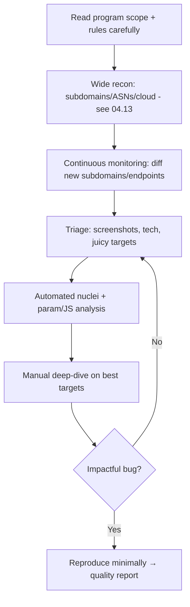

# 04.15 — Bug Bounty Hunting Methodology

## What is it?

Bug bounty hunting is continuous, **breadth-first** testing against (often large) public scopes for a reward per valid bug. It differs from a fixed-scope pentest ([[10 - Bug Bounty vs Pentest Engagement]]): you self-direct, compete against other hunters, and optimize for **finding impactful bugs fast** across a moving target. The winning approach is heavy **recon + automation to surface fresh/forgotten assets**, then focused manual testing on the most promising ones.

## Why it matters

On a wide scope, the differentiator isn't knowing one more payload — it's **seeing assets others miss** (new subdomains, recently shipped endpoints, acquisitions) and recognizing **high-impact patterns** quickly. Automation watches the surface; your manual skill closes the bugs.

## Methodology

1. **Scope discipline** — read the policy: in/out-of-scope assets, allowed test types, no-go actions (no DoS/social-eng/automated-scanning if banned), disclosure rules. Out-of-scope or rule-breaking = no pay + possible ban.
2. **Recon engine** — full attack-surface mapping ([[13 - External Recon and Attack Surface Mapping]]); set up **continuous monitoring** to alert on new subdomains/endpoints (the freshest assets have the most bugs).
3. **Content/JS discovery** — crawl + parse JS (`gau`, `katana`, `LinkFinder`) for hidden endpoints, params, API keys; param mining (`Arjun`, `ParamMiner`); historical URLs (`waybackurls`).
4. **Automated low-hanging fruit** — `nuclei` templates (CVEs, misconfigs, takeovers, exposures) across the surface; dedupe + verify (no blind auto-submit).
5. **Manual deep-dive** — pick high-value targets (auth flows, payment, file upload, admin, GraphQL/APIs); test for IDOR/BOLA, access control, SSRF, account takeover, business logic — the bug classes that pay.
6. **Report quality** — minimal clear repro steps, impact, PoC, remediation; one bug per report; avoid dupes by checking known issues.

## Key tools
`subfinder`/`amass`, `httpx`, `nuclei`, `katana`/`gau`/`waybackurls`, `LinkFinder`, `Arjun`/`ParamMiner`, BurpSuite, `notify`/`interactsh`.

## Pitfalls / ethics
- **Never exceed scope or rules** — automated scanning, DoS, accessing other users' real data beyond PoC, or social engineering can be illegal/bannable. Prove impact with the *minimum* necessary; don't pivot/exfiltrate.
- Expect duplicates; focus on depth + novel assets to stand out.

## Related Notes
- [[13 - External Recon and Attack Surface Mapping]], [[10 - Bug Bounty vs Pentest Engagement]], [[02 - Rules of Engagement and Scope]]; report craft: [[08 - Reporting Phase]] + folder I-42.

## Output
Validated, well-written reports of impactful, in-scope bugs.
