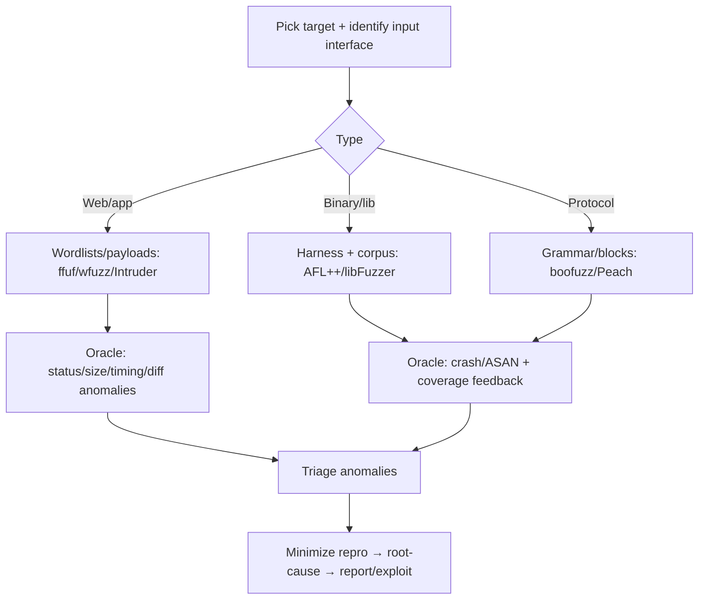

# 04.16 — Fuzzing Methodology

## What is it?

Fuzzing is automated testing that feeds **malformed, unexpected, or random input** to a target to trigger crashes, hangs, memory corruption, or anomalous behavior that reveals bugs. It spans two worlds: **app/web fuzzing** (discover endpoints/params, test input handling — `ffuf`/`wfuzz`/Burp Intruder) and **binary/protocol fuzzing** (find memory-safety bugs in parsers/services — AFL++, libFuzzer, boofuzz). The art is maximizing **coverage** (reaching new code) while having a good **oracle** (detecting when something went wrong).

## Why it matters

Fuzzing finds the bugs humans don't think to try — edge cases, off-by-ones, parser corner cases — at machine scale. It's foundational to vuln research (memory-safety bugs → exploits) and efficient in web testing (content/param discovery, injection probing).

## Methodology

1. **Choose target + interface** — file format, network protocol, library API, or HTTP endpoint/param.
2. **Pick approach** — **mutation** (mutate a valid sample corpus — fast to start) vs **generation/grammar** (build inputs from a spec — better for structured protocols); **coverage-guided** (AFL++/libFuzzer) is the gold standard for binaries.
3. **Build a harness + seed corpus** — for libFuzzer/AFL write a small harness calling the target with fuzzer-provided bytes; seed with diverse valid samples; compile with **sanitizers** (ASAN/UBSAN) so subtle corruption crashes loudly.
4. **Define the oracle** — crashes/ASAN reports (binary); for web: response **status/size/timing/word-count diffs**, error strings, reflected markers (`ffuf -mc`, `-fs`, calibration).
5. **Run + monitor coverage** — track new-coverage rate; add dictionaries/grammars to get past magic bytes/format checks; run long, parallelize.
6. **Triage + minimize** — dedupe crashes by stack hash, **minimize** the reproducer (`afl-tmin`, `halfempty`), root-cause, assess exploitability.

## Key tools
Web: `ffuf`, `wfuzz`, BurpSuite Intruder, `feroxbuster`. Binary/lib: **AFL++**, **libFuzzer**, `honggfuzz`, ASAN/UBSAN. Protocol: `boofuzz`, `Peach`. Minimize: `afl-tmin`.

## Pitfalls
- No coverage feedback + bad corpus = shallow results; structured formats need dictionaries/grammars to get deep.
- Web fuzzing without calibration drowns in false positives — baseline + filter by size/status.
- Fuzzing live production can cause outages/data corruption — fuzz test/staging or with explicit authorization.

## Related Notes
- Feeds [[05 - Vulnerability Identification Phase]]; memory-corruption triage → Exploit Dev & RE category; web fuzzing overlaps API fuzzing (I-31/17) + content discovery (folder B-05).

## Output
Reproducible crash/anomaly cases with minimized inputs and root cause → bug reports or exploit dev.
