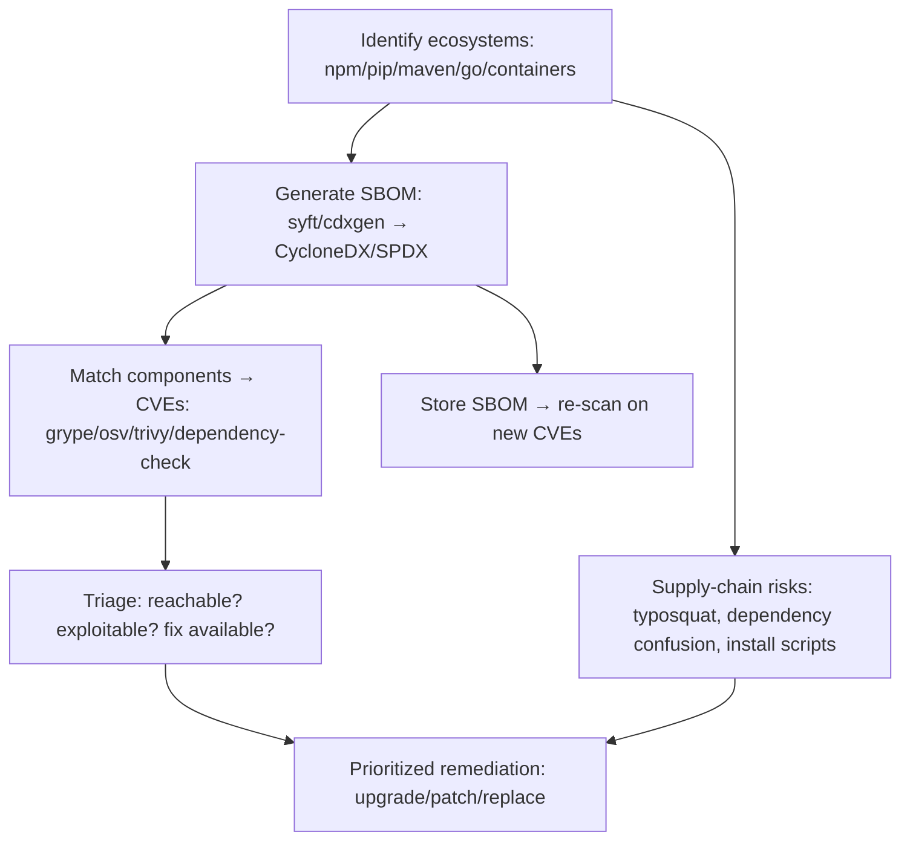

# 04.17 — Software Composition Analysis (SCA) and SBOM

## What is it?

Modern apps are mostly **third-party code** — open-source libraries, transitive dependencies, base container images. Software Composition Analysis (SCA) inventories every component and flags those with **known vulnerabilities (CVEs)**, risky licenses, or malicious/typosquatted packages. An **SBOM** (Software Bill of Materials) is the machine-readable inventory that makes this possible and repeatable. Given how many breaches ride a vulnerable dependency (Log4Shell) or a poisoned package, SCA is now a core part of assessing real-world risk.

## Why it matters

You can write perfectly secure app code and still be owned through a dependency. SCA answers "what are we actually running, and which pieces are known-bad?" — and an SBOM lets you re-check instantly when the *next* Log4Shell drops, instead of scrambling to find where the library is used.

## Methodology

1. **Map ecosystems** — language package managers (npm, pip, Maven/Gradle, Go modules, RubyGems, NuGet) + container base images + OS packages.
2. **Generate the SBOM** — `syft`, `cdxgen`, or build-tool plugins → standard formats (**CycloneDX**, **SPDX**); capture **transitive** deps + versions + hashes from lockfiles.
3. **Vulnerability matching** — scan the SBOM/components against advisory DBs: `grype`, **OSV-Scanner**, `trivy`, OWASP **Dependency-Check**, `npm audit`/`pip-audit`. Map components → CVEs.
4. **Triage** — filter by **reachability** (is the vulnerable function actually called?), exploitability, exposure, and fix availability; deduplicate; avoid alert fatigue (most raw CVE counts are noise).
5. **Supply-chain risk** — beyond CVEs: typosquatting, **dependency confusion** (see Web App I-58), unmaintained/abandoned packages, malicious `postinstall`/`setup.py` scripts, integrity (lockfile hashes, signing).
6. **Remediate + monitor** — upgrade/patch/replace; pin + verify integrity; store the SBOM and **continuously re-scan** so new CVEs against existing components are caught automatically.

## Key tools
`syft`/`cdxgen` (SBOM), `grype`/`trivy`/**OSV-Scanner**/OWASP Dependency-Check (vulns), `npm audit`/`pip-audit`/`govulncheck`, `dependabot`/`renovate` (continuous), `trufflehog` (secrets in deps).

## Pitfalls
- Raw CVE counts overstate risk — prioritize by reachability/exploitability, not severity alone.
- Transitive deps + vendored/bundled code are easy to miss; scan lockfiles and built artifacts, not just manifests.
- An SBOM is only useful if kept current and re-scanned.

## Related Notes
- Complements [[14 - Source Code Review Methodology]] and [[05 - Vulnerability Identification Phase]]; supply-chain attack side: Dependency Confusion (Web App folder I-58), malicious container images (folder I-38). Standards: OWASP Dependency-Check (folder I-57).

## Output
A current SBOM + prioritized, reachable dependency findings → remediation plan and continuous monitoring.
