# VAPT Report Structure

## 1. Introduction

A well-structured VAPT (Vulnerability Assessment and Penetration Testing) report is the foundational cornerstone of professional security consulting. Without a standardized, logical, and predictable flow, the most critical vulnerabilities can get lost in a sea of technical jargon, leading to unpatched systems, frustrated clients, and ultimately, compromised networks.

The structure of a VAPT report is specifically designed to cater to multiple entirely different audiences within a single document. It begins with high-level, business-focused summaries for executives and progressively dives deeper into granular technical details for developers and system administrators. This layered, onion-like approach ensures that everyone gets exactly the information they need without being overwhelmed by irrelevant data.

In this exhaustive document, we will dissect the complete anatomy of a professional VAPT report, examining each macro and micro section, its purpose, and the best practices for writing it effectively.

## 2. The Standard Report Architecture

While different security consultancy firms have their own uniquely branded templates, the underlying structure of a comprehensive VAPT report remains remarkably consistent across the cybersecurity industry. The standard architecture is divided into three distinct main parts, followed by optional appendices:

1. **Front Matter & Executive Summary** (Designed for Business Leaders and C-Suite)
2. **Methodology & Engagement Details** (Designed for Management, Compliance, and Auditors)
3. **Technical Findings & Detailed Analysis** (Designed for Technical Remediation Teams)

### 2.1 Visualizing the Report Structure

```mermaid
flowchart TD
    Root["VAPT Report Anatomy"]
    Root --> P1["Part 1: High-Level / Business Focus"]
    P1 --> P1_1["Cover Page (Branding, Title, Date)"]
    P1 --> P1_2["Document Control & Version History"]
    P1 --> P1_3["Table of Contents"]
    P1 --> P1_4["Executive Summary"]
    P1_4 --> P1_4_1["Engagement Overview & Scope"]
    P1_4 --> P1_4_2["High-Level Risk Posture & Bottom Line"]
    P1_4 --> P1_4_3["Visual Risk Summary (Charts/Graphs)"]
    P1_4 --> P1_4_4["Strategic Recommendations & Roadmap"]

    Root --> P2["Part 2: Engagement Context & Compliance"]
    P2 --> P2_1["Detailed Scope of Work (In-Scope vs Out-of-Scope)"]
    P2 --> P2_2["Testing Methodology (OSSTMM, PTES, OWASP, NIST)"]
    P2 --> P2_3["Limitations, Constraints, and Assumptions"]

    Root --> P3["Part 3: Deep Technical Details & Remediation"]
    P3 --> P3_1["Summary of Findings (Matrix/Table Overview)"]
    P3 --> P3_2["Detailed Technical Findings (Iterated per vulnerability)"]
    P3_2 --> P3_2_1["Vulnerability Title, ID, & Severity Rating"]
    P3_2 --> P3_2_2["Technical Description & Business Impact"]
    P3_2 --> P3_2_3["Proof of Concept (PoC) & Exact Reproduction Steps"]
    P3_2 --> P3_2_4["Actionable Remediation & Code Fixes"]

    Root --> P4["Part 4: Appendices"]
    P4 --> P4_1["Attack Narratives / Exploit Kill Chains"]
    P4 --> P4_2["Risk Rating Methodology (CVSS Metrics Explanation)"]
    P4 --> P4_3["Tools Used / Open Source Intelligence (OSINT) Gathered"]
    P4 --> P4_4["Raw Data Excerpts (Massive IP lists, Nmap dumps)"]
```

## 3. Section-by-Section Breakdown

Let us explore each section of the report architecture in extreme detail to fully understand its distinct role and how to craft it perfectly.

### 3.1 Cover Page and Document Control
**Purpose:** Professionalism, branding, and strict document tracking.
The cover page sets the initial tone for the entire deliverable. It must be visually appealing, incorporating the branding of both the consulting firm and the target client.
- **Key Elements:** Report Title (e.g., "Comprehensive Unauthenticated External Network Penetration Test Report"), Client Name, Consulting Firm Name, Lead Tester Name (optional), Date of Submission, and a highly visible Confidentiality Notice.
- **Document Control:** A version history table is mandatory. VAPT reports often go through multiple iterations and drafts (e.g., v0.1 Initial Draft for Internal QA, v1.0 Final Deliverable to Client, v1.1 Retest Updated following remediation). Tracking exactly who made what changes and when is vital for legal accountability.

### 3.2 Executive Summary
**Purpose:** To provide a non-technical, purely business-focused overview of the engagement, the overall risk posture, and strategic advice.
This is unequivocally the most important section of the entire report. Board members and C-level executives will read *only* this section and base critical budget decisions on it. It must be completely free of deep technical jargon. (See [[03 - Executive Summary]] for a dedicated deep dive).

### 3.3 Scope of Work
**Purpose:** Defines the exact legal and technical boundaries of the test to avoid legal disputes and clarify what was genuinely tested.
This section details exactly what was in scope and, equally importantly, what was explicitly **out of scope**.
- **In Scope:** Specific IP CIDR ranges, subdomains, web applications, APIs, or physical office locations.
- **Out of Scope:** Third-party hosted services (e.g., AWS infrastructure underlying the app, unless explicit authorization was provided), specific fragile legacy systems, or social engineering/phishing (if not requested).
- **Timeframe:** The exact dates and times the testing occurred. This is critical for the client's internal SOC (Security Operations Center) to correlate their SIEM logs with the pentester's activities to evaluate their detection capabilities.

### 3.4 Methodology
**Purpose:** Validates the professionalism, repeatability, and thoroughness of the assessment.
Clients and strict compliance auditors (like SOC2 or ISO 27001 auditors) need to know that the test was not just randomly running a Nessus scan. You must outline the specific industry frameworks adhered to, such as:
- **OWASP Top 10** or **ASVS** for Web Applications.
- **PTES** (Penetration Testing Execution Standard) for network and infrastructure tests.
- **MITRE ATT&CK** for Red Team and threat-simulated engagements.

### 3.5 Limitations and Constraints
**Purpose:** Sets realistic expectations and legally protects the penetration tester's liability.
No penetration test can realistically find 100% of all vulnerabilities. It is inherently a time-boxed exercise. This section should explicitly state limitations such as:
- "Testing was strictly limited to 40 billable hours."
- "The client explicitly requested that no Denial of Service (DoS) or destructive attacks be performed to protect production stability."
- "Testing was conducted in a UAT/staging environment, which may have differing configurations from the live production environment."

### 3.6 Summary of Findings
**Purpose:** A quick-reference triage guide for IT managers to immediately assign tasks and track overall progress.
This is usually a large table listing all identified vulnerabilities, their severity, and the specific affected asset.
- **Columns:** Finding ID, Vulnerability Name, Severity (Critical, High, Medium, Low), Affected Hosts/URLs, Status (Open/Closed/Risk Accepted).
- **Visuals:** A pie chart, donut chart, or bar graph showing the distribution of vulnerabilities by severity to provide an instant visual understanding of the workload.

### 3.7 Detailed Technical Findings
**Purpose:** Provides developers and engineers with absolutely everything they need to understand, reproduce, and permanently fix the issue.
This is the core technical meat of the report. Every single finding must follow a strict, unvarying sub-structure. (See [[04 - Findings Section]] for an exhaustive breakdown).
Key components must include:
- **Title, ID, and Severity**
- **Description** (What exactly is the vulnerability?)
- **Business Impact** (What happens if a threat actor exploits it?)
- **Affected Assets** (Where precisely is it located?)
- **Proof of Concept (PoC)** (How do I trigger it step-by-step?)
- **Remediation** (How do I fix it at the code or configuration level?)
- **References** (Links to CVEs, OWASP, or official vendor patches).

### 3.8 Attack Narratives / Kill Chains (Optional but Highly Recommended)
**Purpose:** Tells the cohesive story of how multiple disparate low-severity issues were chained together to achieve a critical system compromise.
Sometimes individual, isolated findings do not convey the full picture or the true risk. If you chained an Information Disclosure (Low) to gain a valid username format, used Password Spraying (Medium) to get initial access, and then exploited a Local Privilege Escalation (High) to achieve Domain Admin, the narrative section tells this compelling story sequentially, proving the catastrophic impact of combined minor flaws.

### 3.9 Appendices
**Purpose:** Supplementary information that would otherwise clutter and bloat the main report body.
This section includes:
- **Tools Used:** Nmap, Burp Suite, Metasploit, Custom Python Scripts (this proves you utilized a diverse toolset and didn't rely on one automated tool).
- **Raw Data:** Lengthy Nmap outputs, large lists of affected IP addresses, or extensive cracked password hashes that would otherwise span 15 pages in the detailed findings section.
- **Risk Rating Methodology:** An exact explanation of how severities were mathematically calculated (e.g., CVSS v3.1 parameters).

## 4. Best Practices for Report Formatting and Styling

The technical content is undoubtedly king, but formatting is the kingdom. A poorly formatted report severely diminishes the perceived value of the content and the firm that produced it.

### 4.1 Consistent Typography and Document Styling
- Use a consistent font family (e.g., Arial or Calibri for body text, Consolas or Courier New for code blocks and HTTP requests).
- Ensure headers (H1, H2, H3) are styled consistently, properly nested, and logically numbered (e.g., 1.0, 1.1, 1.1.1) to allow for easy referencing during debrief meetings.
- Use page breaks appropriately so that findings do not split awkwardly across pages, orphaned titles are avoided, and charts remain with their descriptive text.

### 4.2 Screenshot Etiquette and Rules
- **Annotate:** Use clearly visible red boxes, arrows, or highlights to point out the exact parameter, payload, or sensitive data in a screenshot.
- **Crop:** Do not include your entire desktop, taskbar, browser tabs, or irrelevant windows. Crop the image strictly to the specific terminal or browser window showing the exploit.
- **Legibility:** Ensure the text in the screenshot is actually readable when printed. If it is too small, use formatted text code blocks to present the data instead of a blurry image.

### 4.3 Action-Oriented and Authoritative Language
Write purely in the active voice. Instead of saying "It was found that the server is vulnerable to XSS," confidently state "The server is vulnerable to XSS." Be direct, authoritative, and entirely unambiguous. Avoid passive voice whenever possible.

## 5. Tailoring the Report Structure to the Engagement Type

While the core architecture outlined above remains the same, specific types of security engagements require slight structural modifications to be effective:

### 5.1 Web Application and API Pentesting
Focus heavily on OWASP Top 10 categories, complex session management state, input validation, and business logic flaws. PoCs will consist almost entirely of HTTP requests and responses (e.g., Burp Suite Repeater screenshots) rather than terminal outputs.

### 5.2 Internal Network Pentesting and Active Directory
Focus heavily on Active Directory misconfigurations (BloodHound graphs are excellent here), lateral movement, privilege escalation paths, and network segmentation bypasses. Attack narratives (e.g., "The Path to Domain Admin") are absolutely crucial in this structure.

### 5.3 Red Teaming and Adversary Simulation
Red Team reports are vastly different from standard VAPT reports. They focus less on exhaustively listing every single missing patch or vulnerability, and more on evaluating the effectiveness of the Blue Team (detection, response, and resilience). The structure heavily emphasizes the MITRE ATT&CK framework, a chronological timeline of adversary events, and specific "Time to Detect" (TTD) and "Time to Respond" (TTR) metrics.

## 6. Structure Considerations for Compliance
When the primary driver of the penetration test is a compliance standard (such as SOC2 Type II or ISO 27001), the report structure should explicitly map the findings to the specific compliance controls. 
For example, adding a column in the "Summary of Findings" table that reads "SOC2 Control Mapping (e.g., CC6.1, CC6.6)" immediately helps the client's auditors verify that the test addressed the necessary regulatory requirements. This transforms the VAPT report from a pure technical exercise into a massive compliance asset.

## 7. Common Formatting Mistakes Checklist
When structuring your report, ensure you actively avoid these common formatting and layout errors:
- [x] Orphaned Headers (Headers sitting alone at the bottom of a page with the content on the next page).
- [x] Split Code Blocks (A single PoC script spanning across a page break).
- [x] Unlabeled Figures (Every chart and diagram must have a caption, e.g., "Figure 1: Severity Breakdown").
- [x] Mismatched Header Numbering (e.g., jumping from 1.2 to 1.4).
- [x] Unresolved "TK" or "TBD" Placeholders. (Always regex search for these before exporting to PDF!).
- [x] Inconsistent date formats (e.g., mixing DD/MM/YYYY with MM/DD/YYYY in the document control section).

## 8. Conclusion

The rigid, standardized structure of a VAPT report is a carefully designed vehicle for delivering highly complex security information to a widely diverse audience. By strictly adhering to this logical flow, penetration testers ensure that their hard work is comprehensively understood, properly appreciated, and, most importantly, decisively acted upon to fundamentally improve the client's overall security posture.

---

### Chaining Opportunities
- **[[01 - Why Reporting Matters]]**: Explains the foundational reasons why this highly structured approach is strictly necessary for business success.
- **[[03 - Executive Summary]]**: A deep dive into writing the most critical high-level section of the report structure.
- **[[04 - Findings Section]]**: A deep dive into formatting the most critical technical section of the report structure.
- **[[05 - Severity Ratings]]**: Essential knowledge for structuring the Summary of Findings tables and prioritizing remediation efforts.

### Related Notes
- [[Vulnerability Management Lifecycle]]
- [[Penetration Testing Execution Standard (PTES)]]
- [[Technical Writing for Hackers and Security Professionals]]
