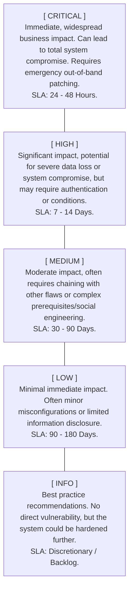

# Severity Ratings

## 1. Introduction

In the highly critical context of a Vulnerability Assessment and Penetration Testing (VAPT) report, all vulnerabilities are fundamentally not created equal. A missing `Strict-Transport-Security` (HSTS) header on a marketing blog does not pose remotely the same risk as an unauthenticated Remote Code Execution (RCE) flaw on the organization's primary domain controller. To help organizations realistically prioritize their remediation efforts amidst limited time and budget, penetration testers must assign an accurate severity rating to every identified vulnerability.

Severity ratings are the core mechanism by which technical flaws are quantified, ranked, and triaged. However, assigning severity is not merely a subjective guess based on a pentester's gut feeling; it requires a standardized, mathematically objective framework to ensure total consistency, eliminate personal bias, and provide defensible, actionable metrics to the client.

In this extensive document, we will explore the mechanisms of severity ratings, the industry-standard CVSS framework, vital contextual risk adjustments, and how to communicate these ratings effectively in a final deliverable.

## 2. The Core Categories of Severity

Most professional VAPT reports utilize a standard four- or five-tier qualitative severity scale. These tiers dictate the absolute urgency of the required remediation and often tie directly into a client's internal SLAs (Service Level Agreements).

### 2.1 Critical Severity
**Definition:** Vulnerabilities that can be exploited by an unauthenticated, remote attacker to gain immediate, full system control, compromise the entire backend database, or cause complete organizational operational shutdown.
**Examples:** Unauthenticated Remote Code Execution (RCE), severe SQL Injection leading to complete database dump, hardcoded Domain Admin credentials left in a public, accessible GitHub repository.

### 2.2 High Severity
**Definition:** Vulnerabilities that are difficult to exploit, require an authenticated user role, or have a significant but somewhat contained impact.
**Examples:** Authenticated Stored Cross-Site Scripting (XSS) leading to admin session hijacking, Insecure Direct Object Reference (IDOR) allowing unauthorized modification of other users' data, local privilege escalation from a standard user to an administrator.

### 2.3 Medium Severity
**Definition:** Flaws that require highly specific, rare conditions to exploit, require deep social engineering/victim interaction, or have a highly limited impact scope.
**Examples:** Reflected XSS (requires active victim interaction via a phishing link), lack of rate limiting on login pages (enabling slow brute force), weak password complexity policies.

### 2.4 Low / Informational Severity
**Definition:** Minor misconfigurations that pose no immediate threat but deviate from strict security best practices.
**Examples:** Missing HTTP security headers (e.g., CSP, X-Frame-Options), verbose error messages disclosing backend framework versions, directory listing enabled (with no sensitive files actually present).

## 3. The Common Vulnerability Scoring System (CVSS)

To completely remove subjectivity from severity assignment, the global cybersecurity industry relies heavily on the **Common Vulnerability Scoring System (CVSS)**, currently maintained by FIRST (Forum of Incident Response and Security Teams). CVSS v3.1 (and the newly emerging v4.0) provides a strict mathematical formula to calculate severity based on specific, observable attack vectors.

CVSS outputs a score from **0.0 to 10.0**, which maps cleanly to the qualitative ratings:
- **0.0:** None
- **0.1 - 3.9:** Low
- **4.0 - 6.9:** Medium
- **7.0 - 8.9:** High
- **9.0 - 10.0:** Critical

### 3.1 The Base Metrics Breakdown
The CVSS Base Score is calculated using multiple distinct metrics that precisely define how the vulnerability is exploited and what its ultimate impact is.

**Exploitability Metrics (How hard is it to hack?):**
1. **Attack Vector (AV):** Network, Adjacent, Local, Physical. (Network is highest severity).
2. **Attack Complexity (AC):** Low, High. (Low complexity is highest severity).
3. **Privileges Required (PR):** None, Low, High. (None required is highest severity).
4. **User Interaction (UI):** None, Required. (None required is highest severity).

**Impact Metrics (The CIA Triad - What happens when it is hacked?):**
1. **Confidentiality (C):** None, Low, High.
2. **Integrity (I):** None, Low, High.
3. **Availability (A):** None, Low, High.

**Example Calculation:**
A vulnerability that can be exploited over the internet (Network), requires no specialized conditions (Low Complexity), requires no login (None PR), requires no victim interaction (None UI), and results in complete data theft, modification, and system wipe (High C, High I, High A) will result in a CVSS Base Score of **10.0 (Critical)**.

## 4. Contextual Risk Adjustments (Environmental Metrics)

A major, often disastrous flaw in relying solely on raw CVSS Base Scores is that they exist in a vacuum. A professional penetration tester must adjust the final severity based on the specific **environmental context** of the client's network.

**Risk = Likelihood x Impact**

### 4.1 Downgrading Severity based on Compensating Controls
Suppose an automated vulnerability scanner flags a finding as a **CVSS 9.8 (Critical)** because the application is running a known vulnerable version of Apache Log4j. However, upon manual, thorough verification, the penetration tester realizes that the server is situated entirely behind a strict Web Application Firewall (WAF) that aggressively blocks all JNDI lookup payloads, and the server cannot initiate any outbound connections to the internet (strict Egress filtering).

Because the actual *likelihood* of successful exploitation is drastically reduced by these massive compensating controls, the pentester should logically downgrade the finding in the report to a **Medium**, explicitly explaining the contextual reasoning to the client.

### 4.2 Upgrading Severity based on Asset Value
Conversely, a vulnerability's severity must be significantly upgraded if the affected asset is uniquely critical to the business.
A simple Information Disclosure flaw revealing employee names might be a **Low** severity on a public marketing blog. However, if that exact same flaw exists on an intelligence agency's internal HR portal, revealing the names of covert operatives, the impact is catastrophic. The pentester must elevate this to a **Critical** finding immediately.

## 5. Communicating Severity in the Final Report

When presenting severity in the VAPT report, visual clarity and mathematical consistency are absolutely vital.

### 5.1 Use Consistent Color Coding
Visual cues help readers triage findings instantly without reading a word. Standardize color coding throughout the entire report:
- **Critical:** Dark Red
- **High:** Red or Bright Orange
- **Medium:** Yellow
- **Low:** Blue or Green
- **Informational:** Grey

### 5.2 Provide the CVSS Vector String
In the detailed findings section, do not just provide the raw number (e.g., 8.5); provide the full CVSS Vector String (e.g., `CVSS:3.1/AV:N/AC:H/PR:L/UI:N/S:U/C:H/I:H/A:H`). This specifically allows the client's internal security and compliance teams to see exactly how you calculated the score and debate it logically if necessary.

### 5.3 Defend Your Adjustments Rigorously
If you deviate from the standard CVSS base score due to environmental factors, write a "Risk Justification" or "Environmental Modifier" paragraph within the finding. 
**Example:** "While the base CVSS score for this specific CVE is officially 9.8 (Critical), the severity has been manually downgraded to 6.5 (Medium) for this specific environment because the affected administrative service is strictly only accessible via a heavily monitored internal management VLAN, requiring prior compromise of the corporate VPN and MFA."

## 6. The EPSS (Exploit Prediction Scoring System) Framework Integration
Modern, highly mature VAPT reports are beginning to incorporate the EPSS framework alongside CVSS. While CVSS tells you how bad a vulnerability *could* be, EPSS provides a strict probability percentage of whether that vulnerability will *actually be exploited* in the wild in the next 30 days, based on real-time threat intelligence and active honeypot monitoring. Including EPSS scores helps clients confidently prioritize patching "High CVSS flaws with a 95% EPSS probability" over "Critical CVSS flaws with a 0.01% EPSS probability".

## 7. Analyzing CVSS v4.0 Changes
As the industry moves towards CVSS version 4.0, severity reporting will change. Penetration testers must understand that v4.0 introduces the concept of **Macro Vectors**, specifically splitting base scores into:
- **Base (CVSS-B):** The standard base score we know today.
- **Base + Threat (CVSS-BT):** Factors in if exploit code is actively available in the wild.
- **Base + Environmental (CVSS-BE):** Factors in compensating controls.
- **Base + Threat + Environmental (CVSS-BTE):** The most accurate, holistic representation of real-world risk.
Future VAPT reports should clearly state which v4.0 Macro Vector is being presented to avoid client confusion.

## 8. Conclusion

Severity ratings are the essential triage system of the cybersecurity industry. They direct the highly limited, expensive resources of IT and development teams to the exact fires that are burning the brightest. By utilizing standardized frameworks like CVSS, whilst intelligently applying environmental and business context, penetration testers provide a highly accurate, defensible, and actionable prioritization roadmap for their clients.

---

### Chaining Opportunities
- **[[04 - Findings Section]]**: Severity ratings are a mandatory, structural component of every single technical finding documented in this section.
- **[[03 - Executive Summary]]**: The distribution of severities directly informs the graphical charts and overall business risk posture presented to the C-Suite.
- **[[02 - VAPT Report Structure]]**: The Summary of Findings triage table is entirely organized, sorted, and color-coded by these severity ratings.
- **[[01 - Why Reporting Matters]]**: Inaccurate severity ratings directly lead to a false sense of security or wasted developer time, heavily underlining the importance of accurate reporting.

### Related Notes
- [[Common Vulnerability Scoring System (CVSS) Deep Dive]]
- [[Risk Assessment vs Vulnerability Assessment]]
- [[Threat Modeling Methodologies]]
- [[Service Level Agreements (SLAs) for Patch Management]]
