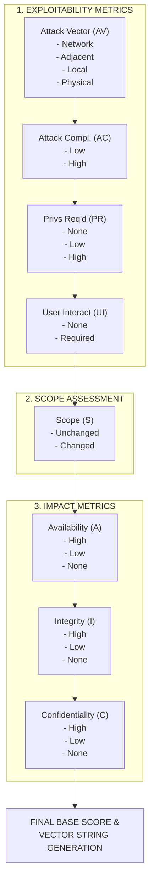

# 42.06 CVSS v3.1 Scoring

## 1. Introduction and Overview

The Common Vulnerability Scoring System (CVSS) version 3.1 is the industry standard for assessing the severity of computer system security vulnerabilities. Managed by FIRST (Forum of Incident Response and Security Teams), it provides a standardized way to capture the principal characteristics of a vulnerability and produce a numerical score reflecting its severity.

CVSS v3.1 is absolutely critical for Vulnerability Assessment and Penetration Testing (VAPT) professionals. It provides a common lexicon that allows researchers, vendors, and clients to communicate the severity of a finding without relying on subjective terms like "really bad" or "kind of dangerous."

However, a fundamental rule must be understood: CVSS v3.1 is **not** a measure of risk; rather, it is a measure of the technical severity of a vulnerability. To determine risk, organizations must combine CVSS scores with context-specific factors such as asset criticality, threat intelligence, and business impact. This distinction is paramount in professional VAPT reporting and separates elite consultants from amateurs.

The CVSS v3.1 framework is divided into three distinct metric groups:
1.  **Base Metric Group**: Represents the intrinsic qualities of a vulnerability that are constant over time and across all user environments.
2.  **Temporal Metric Group**: Represents the characteristics of a vulnerability that change over time but not across user environments.
3.  **Environmental Metric Group**: Represents the characteristics of a vulnerability that are relevant and unique to a particular user's environment.

When assessing a vulnerability, VAPT professionals typically focus exclusively on the Base Metric Group to provide a standardized severity score. The Temporal and Environmental metrics are often calculated by the client's internal risk management team, though elite VAPT reports may offer Environmental scoring based on client-provided context.

## 2. The Base Metric Group Details

The Base Metric Group is composed of two sub-groups: the Exploitability metrics and the Impact metrics. Accurately assessing these requires a deep, fundamental understanding of the vulnerability mechanism.

### 2.1. Exploitability Metrics

The Exploitability metrics reflect the ease and technical means by which the vulnerability can be exploited. They describe the characteristics of the *thing* that is vulnerable.

#### 2.1.1. Attack Vector (AV)
This metric reflects the context by which vulnerability exploitation is possible. The more remote an attacker can be to exploit the vulnerability, the greater the score.
*   **Network (N)**: The vulnerability is exploitable from remote networks (e.g., the Internet). The vulnerable component is bound to the network stack and the attacker's path is across OSI layer 3 (e.g., IP).
*   **Adjacent (A)**: The vulnerability is exploitable from an adjacent network. The attacker must be on the same shared physical (e.g., Bluetooth or IEEE 802.11) or logical (e.g., local IP subnet) network.
*   **Local (L)**: The vulnerability is not bound to the network stack. The attacker's path is via read/write/execute capabilities. The attacker may be logged in locally or rely on User Interaction to execute a payload.
*   **Physical (P)**: The vulnerability requires the attacker to physically touch or manipulate the vulnerable component. Physical interaction, such as inserting a USB drive, is required.

#### 2.1.2. Attack Complexity (AC)
This metric describes the conditions beyond the attacker's control that must exist in order to exploit the vulnerability.
*   **Low (L)**: Specialized access conditions or extenuating circumstances do not exist. The attacker can expect repeatable success when exploiting the vulnerability.
*   **High (H)**: A successful attack depends on conditions beyond the attacker's control. That is, a successful attack cannot be accomplished at will, but requires the attacker to invest in some measurable amount of effort in preparation or execution against the vulnerable component before a successful attack can be expected (e.g., overcoming ASLR, winning a race condition).

#### 2.1.3. Privileges Required (PR)
This metric describes the level of privileges an attacker must possess before successfully exploiting the vulnerability.
*   **None (N)**: The attacker is unauthorized prior to attack, and therefore does not require any access to settings or files of the vulnerable system to carry out an attack.
*   **Low (L)**: The attacker requires privileges that provide basic user capabilities that could normally affect only settings and files owned by a user. Alternatively, an attacker with Low privileges has the ability to access only non-sensitive resources.
*   **High (H)**: The attacker requires privileges that provide significant (e.g., administrative) control over the vulnerable component allowing access to component-wide settings and files.

#### 2.1.4. User Interaction (UI)
This metric captures the requirement for a human user, other than the attacker, to participate in the successful compromise of the vulnerable component.
*   **None (N)**: The vulnerable system can be exploited without interaction from any user.
*   **Required (R)**: Successful exploitation of this vulnerability requires a user to take some action before the vulnerability can be exploited. For example, a successful exploit may only be possible during the installation of an application by a system administrator, or a user clicking a link (XSS).

### 2.2. Scope (S)
The Scope metric captures whether a vulnerability in one vulnerable component impacts resources in components beyond its security scope. This is often the most misunderstood metric in CVSS v3.1.
*   **Unchanged (U)**: An exploited vulnerability can only affect resources managed by the same security authority. In this case, the vulnerable component and the impacted component are either the same, or both are managed by the same security authority.
*   **Changed (C)**: An exploited vulnerability can affect resources beyond the security scope managed by the security authority of the vulnerable component. In this case, the vulnerable component and the impacted component are different and managed by different security authorities (e.g., a vulnerable web app affecting a user's local browser via XSS).

### 2.3. Impact Metrics

The Impact metrics reflect the direct consequence of a successful exploit, measured across the classic CIA triad.

#### 2.3.1. Confidentiality Impact (C)
This metric measures the impact to the confidentiality of the information resources managed by a software component due to a successfully exploited vulnerability.
*   **High (H)**: There is a total loss of confidentiality, resulting in all resources within the impacted component being divulged to the attacker. Alternatively, access to only some restricted information is obtained, but the disclosed information presents a direct, serious impact.
*   **Low (L)**: There is some loss of confidentiality. Access to some restricted information is obtained, but the attacker does not have control over what information is obtained, or the amount or kind of loss is constrained. The information disclosure does not cause a direct, serious loss to the impacted component.
*   **None (N)**: There is no loss of confidentiality within the impacted component.

#### 2.3.2. Integrity Impact (I)
This metric measures the impact to integrity of a successfully exploited vulnerability. Integrity refers to the trustworthiness and veracity of information.
*   **High (H)**: There is a total loss of integrity, or a complete loss of protection. For example, the attacker is able to modify any/all files protected by the impacted component. Alternatively, only some files can be modified, but malicious modification would present a direct, serious consequence to the impacted component.
*   **Low (L)**: Modification of data is possible, but the attacker does not have control over the consequence of a modification, or the amount of modification is limited. The data modification does not have a direct, serious impact on the impacted component.
*   **None (N)**: There is no loss of integrity within the impacted component.

#### 2.3.3. Availability Impact (A)
This metric measures the impact to the availability of the impacted component resulting from a successfully exploited vulnerability.
*   **High (H)**: There is a total loss of availability, resulting in the attacker being able to fully deny access to resources in the impacted component; this loss is either sustained (while the attacker continues to deliver the attack) or persistent (the condition persists even after the attack has completed). Alternatively, the attacker has the ability to deny some availability, but the loss of availability presents a direct, serious consequence to the impacted component.
*   **Low (L)**: Performance is degraded or there are interruptions in resource availability. Even if repeated exploitation of the vulnerability is possible, the attacker does not have the ability to completely deny service to legitimate users. The resources in the impacted component are either partially available all of the time, or fully available only some of the time, but overall there is no direct, serious consequence to the impacted component.
*   **None (N)**: There is no impact to availability within the impacted component.

## 3. Visualizing the Base Metric Assessment Flow

To properly evaluate a vulnerability, an assessor must systematically evaluate each metric in sequence. The following ASCII diagram outlines the logical decision flow for Base Metric evaluation:

## 4. The Severity Rating Scale

Once the metrics are assigned, a mathematical formula produces a score ranging from 0.0 to 10.0. This score is then mapped to a qualitative severity rating:

| Rating   | CVSS Score   | Description / Action Required                                                                                           |
| :---     | :---         | :---                                                                                                                    |
| None     | 0.0          | Informational only; no immediate security impact.                                                                       |
| Low      | 0.1 - 3.9    | Minor vulnerabilities. Often chained with other issues to produce a higher impact. Usually addressed in regular cycles. |
| Medium   | 4.0 - 6.9    | Moderate vulnerabilities. May require user interaction or significant prerequisites. Address in standard patch cycles.  |
| High     | 7.0 - 8.9    | Severe vulnerabilities. Typically remote, low complexity, and significant impact. Prioritize patching/mitigation.     |
| Critical | 9.0 - 10.0   | Catastrophic vulnerabilities. Often remote code execution with no user interaction or authentication. Immediate action! |

## 5. Practical Scoring Examples in VAPT

To master CVSS v3.1, you must practice scoring various real-world scenarios encountered during penetration testing.

### 5.1. Example 1: Remote Code Execution (RCE) via Unauthenticated API
An API endpoint `/api/v1/execute` accepts unvalidated input directly into a system shell via `exec()`.

*   **AV:** Network (N) - Exploit is delivered via HTTP over the internet.
*   **AC:** Low (L) - The exploit is a simple, direct POST request.
*   **PR:** None (N) - The endpoint lacks authentication.
*   **UI:** None (N) - No user needs to click anything.
*   **S:** Unchanged (U) - The vulnerable component and the impacted component are the same (the server).
*   **C:** High (H) - The attacker gains a shell and can read any file.
*   **I:** High (H) - The attacker can modify any file.
*   **A:** High (H) - The attacker can delete files or crash the system.
*   **Score:** 9.8 (Critical)

### 5.2. Example 2: Stored Cross-Site Scripting (XSS) in a Comment Field
A web application allows users to post comments without sanitizing `<script>` tags. When an administrator views the comment, the script executes and steals their session cookie.

*   **AV:** Network (N) - Payload is delivered over the internet.
*   **AC:** Low (L) - Simple to inject the payload.
*   **PR:** Low (L) - The attacker needs a basic user account to post the comment.
*   **UI:** Required (R) - The administrator must navigate to the page and view the comment.
*   **S:** Changed (C) - The vulnerable component is the web application, but the impacted component is the administrator's browser.
*   **C:** Low (L) - The attacker steals a session token (some confidentiality loss).
*   **I:** Low (L) - The attacker can perform actions as the admin within the web app context.
*   **A:** None (N) - The application itself is not taken down.
*   **Score:** 5.4 (Medium)

### 5.3. Example 3: Insecure Direct Object Reference (IDOR) leaking PII
An authenticated user can change a parameter `id=100` to `id=101` and view another user's personal profile data (email, phone number). They cannot modify it.

*   **AV:** Network (N) - Accessed via HTTP.
*   **AC:** Low (L) - Simple parameter tampering.
*   **PR:** Low (L) - Requires a standard user account.
*   **UI:** None (N) - Can be exploited directly via API.
*   **S:** Unchanged (U) - Scope is within the application's data.
*   **C:** Low (L) - Partial data exposure (only other users' data, not system passwords or total database dump).
*   **I:** None (N) - Cannot modify the data.
*   **A:** None (N) - Cannot disrupt service.
*   **Score:** 4.3 (Medium)

## 6. Common Pitfalls in Scoring

Novice penetration testers often make several critical mistakes when assigning CVSS scores, leading to client pushback:

1.  **Over-scoring based on theoretical impact:** Scoring an XSS vulnerability as "Confidentiality: High" simply because "an attacker *might* use it to phish someone for their password" is incorrect. Score the direct, demonstrable, and immediate impact of the vulnerability itself.
2.  **Confusing Scope:** Scope changes occur when the vulnerability in one authority affects another. The classic example is XSS (vulnerability is in the web app, impact is on the user's browser).
3.  **Ignoring Prerequisites:** If an exploit requires the attacker to win a race condition, brute-force a randomized token, or bypass an ASLR implementation, the Attack Complexity should be High (H), not Low (L).
4.  **Conflating CVSS with Risk:** Always remember CVSS is technical severity. A 9.8 CVSS on an isolated lab machine is still a 9.8 CVSS, even if the business risk is Low.

## 7. The Importance of Consistency

In professional VAPT, consistency in scoring is critical. If your report contains multiple similar vulnerabilities, they must be scored consistently across the board. Clients use CVSS scores to prioritize remediation workflows, trigger SLAs, and allocate budgets; inconsistent scoring undermines the credibility of your report and confuses the client's remediation teams. Always document and justify your scores in the technical details section of the report.

## Chaining Opportunities
*   A Low severity Information Disclosure (e.g., CVSS 3.0) can be chained with a Medium severity Access Control flaw to achieve a Critical severity Remote Code Execution.
*   Understanding how to score chained vulnerabilities is essential. Usually, the final score reflects the maximum impact achieved by the entire chain, often resulting in a score much higher than the sum of its parts.

## Related Notes
*   [[07 - CVSS Vector String]]
*   [[08 - Risk Rating vs CVSS]]
*   [[09 - Proof of Concept]]
*   [[10 - Screenshots and Evidence]]
