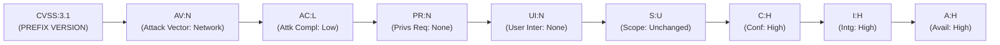

# 42.07 CVSS Vector String

## 1. Demystifying the Vector String

The CVSS vector string is a concise text representation of the metric values used to derive a specific CVSS score. While the numerical score (e.g., 9.8 or 5.4) provides a quick glance at the severity of a vulnerability, the vector string provides the exact technical context, assumptions, and impact parameters of the flaw. 

For VAPT professionals, communicating via the vector string is like speaking the native language of vulnerability management. It allows another practitioner to instantly reverse-engineer your thought process and understand exactly how you evaluated the exploitability and impact of a given finding.

A vector string is composed of metric names and metric values separated by colons (`:`), with each metric group separated by a forward slash (`/`). It always begins with the CVSS version prefix to ensure parsing compatibility.

## 2. Structure and Anatomy of the Base Vector

A standard CVSS v3.1 Base vector string looks exactly like this:

`CVSS:3.1/AV:N/AC:L/PR:N/UI:N/S:U/C:H/I:H/A:H`

Let's break down this anatomy in exhaustive detail, parsing each segment from left to right:

1.  **Prefix:** `CVSS:3.1` - This mandatory prefix identifies the framework version. Mixing versions (e.g., v2 scoring with a v3.1 prefix) in reporting is a major amateur mistake that breaks automated ingestion tools.
2.  **Attack Vector (AV):** 
    *   `AV:N` (Network): Exploit over the internet/remote network.
    *   `AV:A` (Adjacent): Exploit over local LAN, Bluetooth, or WiFi.
    *   `AV:L` (Local): Exploit via local shell, SSH, or malicious file execution.
    *   `AV:P` (Physical): Exploit requires physical hardware access (e.g., Evil Maid attack).
3.  **Attack Complexity (AC):** 
    *   `AC:L` (Low): Easy, reliable exploit.
    *   `AC:H` (High): Complex exploit relying on race conditions, exact timing, or ASLR bypass.
4.  **Privileges Required (PR):** 
    *   `PR:N` (None): Unauthenticated exploit.
    *   `PR:L` (Low): Basic user authentication required.
    *   `PR:H` (High): Administrative/root authentication required.
5.  **User Interaction (UI):** 
    *   `UI:N` (None): Zero-click exploit.
    *   `UI:R` (Required): Victim must click a link, open a file, or browse a site.
6.  **Scope (S):** 
    *   `S:U` (Unchanged): Vulnerability and impact reside in the same system context.
    *   `S:C` (Changed): Vulnerability traverses a security boundary (e.g., XSS, VM Escape).
7.  **Confidentiality (C):** 
    *   `C:H` (High): Total data compromise (e.g., full database dump).
    *   `C:L` (Low): Partial data compromise (e.g., reading another user's email).
    *   `C:N` (None): No data leaked.
8.  **Integrity (I):** 
    *   `I:H` (High): Total modification capabilities (e.g., altering system binaries).
    *   `I:L` (Low): Partial modification (e.g., modifying a single database record).
    *   `I:N` (None): No modification possible.
9.  **Availability (A):** 
    *   `A:H` (High): Total system crash or permanent resource exhaustion.
    *   `A:L` (Low): Temporary degraded performance.
    *   `A:N` (None): No impact to uptime.

## 3. Visual Anatomy of a Vector String

The following ASCII diagram illustrates the construction and parsing of a standard CVSS v3.1 vector string, highlighting the strict ordering and delimiters.

## 4. Why the Vector String is Crucial in VAPT Reporting

Including the vector string in a VAPT report is not optional; it is a mandatory requirement for any professional-grade engagement. Here is why:

### 4.1. Transparency and Audibility
A client or a third-party auditor must be able to verify your scoring. If you provide a score of 8.8 but no vector string, the client cannot understand *why* you arrived at that score. The vector string acts as the mathematical formula proving your conclusion. It allows the client to challenge specific metrics (e.g., "Actually, this system requires a VPN, so the Attack Vector should be Local, not Network").

### 4.2. Automated Ingestion and Triaging
Modern vulnerability management platforms (like DefectDojo, Tenable, Qualys, or custom Jira integrations) ingest VAPT reports automatically via APIs or structured parsers. These systems rely on the exact formatting of the vector string to update their internal risk dashboards. A malformed vector string will break ingestion pipelines, delaying remediation.

### 4.3. Client Recalculation (Environmental Scoring)
As noted in earlier modules, VAPT consultants typically provide the Base score. Clients take the vector string, import it into their systems, and append Environmental metrics (e.g., `/CR:H/IR:M/AR:L/MAV:A...`) to calculate a context-specific risk score. They cannot perform this crucial risk calculation without your foundational Base vector string.

## 5. Common Vector Strings and Their Archetypes

Memorizing common vector string patterns accelerates report writing and helps identify when you might be mis-scoring a vulnerability during triage.

### 5.1. The "Worst Case Scenario" (RCE)
`CVSS:3.1/AV:N/AC:L/PR:N/UI:N/S:U/C:H/I:H/A:H` (Score: 9.8 - Critical)
This is the holy grail for attackers. Unauthenticated, remote code execution over the network with total system compromise. Examples include Log4Shell (CVE-2021-44228) or remote buffer overflows in listening web services.

### 5.2. The Standard Cross-Site Scripting (Reflected XSS)
`CVSS:3.1/AV:N/AC:L/PR:N/UI:R/S:C/C:L/I:L/A:N` (Score: 6.1 - Medium)
The attacker sends a malicious link to a victim over the network (AV:N), requiring the user to click it (UI:R). The scope changes from the web server to the user's browser context (S:C). The impact is limited to the user's session and DOM (C:L, I:L).

### 5.3. The Local Privilege Escalation (LPE)
`CVSS:3.1/AV:L/AC:L/PR:L/UI:N/S:U/C:H/I:H/A:H` (Score: 7.8 - High)
The attacker already has low-level access to the machine (AV:L, PR:L). They exploit a kernel flaw, misconfigured service, or weak file permissions to gain root/SYSTEM access, resulting in complete compromise (C:H, I:H, A:H).

### 5.4. The Network Denial of Service (DoS)
`CVSS:3.1/AV:N/AC:L/PR:N/UI:N/S:U/C:N/I:N/A:H` (Score: 7.5 - High)
An attacker sends a specially crafted packet over the network that crashes a critical service (e.g., a SYN flood or a malformed packet triggering a null pointer dereference). There is no data stolen (C:N) or modified (I:N), but the service goes offline entirely (A:H).

## 6. Syntax Rules and Validation

When manually constructing vector strings for your reports (or when reviewing scanner output), you must adhere strictly to the CVSS v3.1 specification. Failure to do so will result in an invalid score.

1.  **Strict Ordering:** The metrics *must* be presented in the exact order: AV, AC, PR, UI, S, C, I, A.
2.  **No Whitespace:** The string must not contain any spaces, tabs, or line breaks.
3.  **Case Sensitivity:** All metric identifiers and values must be capitalized. `cvss:3.1/av:n...` is invalid.
4.  **Completeness:** All Base metrics must be present. You cannot omit a metric just because its value is 'None' (e.g., `A:N` must be explicitly stated).

Failure to follow these syntax rules will result in a rejected report when reviewed by a senior technical lead or QA team.

## Chaining Opportunities
*   A vector string ending in `/C:L/I:N/A:N` (Information Disclosure) might provide the exact software version number or internal IP needed to exploit a separate, more severe vulnerability with a vector of `/AV:N/AC:L/PR:N/UI:N/S:U/C:H/I:H/A:H`.
*   Reporting chained vulnerabilities often requires documenting the vector strings of all constituent vulnerabilities to properly explain the escalation path and risk vector.

## Related Notes
*   [[06 - CVSS v3.1 Scoring]]
*   [[08 - Risk Rating vs CVSS]]
*   [[09 - Proof of Concept]]
*   [[10 - Screenshots and Evidence]]
