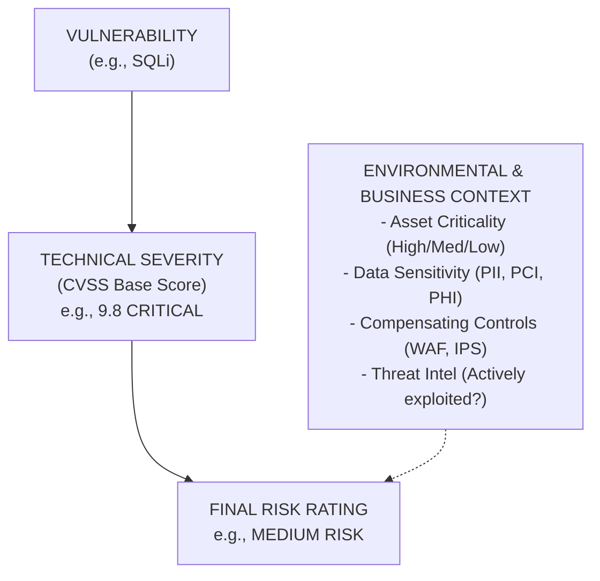

# 42.08 Risk Rating vs CVSS

## 1. The Fundamental Disconnect in Cybersecurity

One of the most critical concepts for an elite VAPT professional to grasp is the distinct and often massive difference between **Technical Severity** (measured by CVSS) and **Business Risk** (measured by organizational impact and likelihood).

A common fallacy among junior penetration testers is asserting that a "Critical (9.8)" CVSS score automatically implies a "Critical Risk" to the business, requiring the CISO to wake up at 2 AM to patch a system. This is completely false. CVSS is designed to measure the technical attributes of a vulnerability. It operates in a theoretical vacuum, completely devoid of business context, asset criticality, or compensating security controls.

Risk, on the other hand, is a business calculation. It is typically defined by the classic equation:
`Risk = Likelihood x Impact`

While CVSS provides variables that *inform* both likelihood (via Exploitability metrics like Attack Vector) and impact (via Impact metrics like Confidentiality loss), it does not account for the specific environment where the vulnerability resides.

## 2. Defining Technical Severity (CVSS)

As covered in previous modules, the Common Vulnerability Scoring System (CVSS) provides a standardized, objective method for rating IT vulnerabilities.

**Characteristics of CVSS:**
*   **Objective and Static:** Based on fixed technical parameters (e.g., does it require authentication? Is it network reachable?).
*   **Universal:** A 9.8 vulnerability in an Apache Tomcat server is calculated as a 9.8 regardless of whether that server is hosting a public e-commerce payment gateway or a forgotten, isolated testing environment in a basement.
*   **Asset Agnostic:** CVSS does not know the value of the data residing on the vulnerable system. It treats a database containing 10 test records the same as a database containing 10 million real credit card numbers.
*   **Control Ignorant:** Base CVSS ignores existing network defenses like Web Application Firewalls (WAFs), strict egress filtering, Zero Trust architectures, or endpoint detection and response (EDR) solutions.

## 3. Defining Business Risk Rating

Risk Rating is the final, contextualized assessment of the clear and present danger a vulnerability poses to an organization. It is the metric that executive leadership (CISO, CIO, Board of Directors) uses to allocate budget, accept risk, and prioritize remediation efforts.

**Characteristics of Risk Rating:**
*   **Contextual:** Heavily dependent on the specific environment, network topography, and business operations.
*   **Asset Aware:** Vulnerabilities on mission-critical financial databases or active directory domain controllers carry significantly higher risk than identical vulnerabilities on a staging server.
*   **Control Aware:** Takes into account compensating controls. A remote exploit might have a high CVSS, but if the vulnerable service is blocked by a restrictive firewall rule and a WAF that drops malicious payloads, the *likelihood* of exploitation drops drastically, thereby reducing the Risk Rating.
*   **Impact Oriented:** Focuses on real-world business impact (financial loss, reputational damage, regulatory fines, operational downtime) rather than purely technical impact (e.g., reading an `/etc/passwd` file).

## 4. Visualizing the Transformation: From CVSS to Risk

The following ASCII diagram illustrates how a raw CVSS score is transformed into a final Business Risk Rating through the application of environmental and business context.

## 5. Practical Scenarios: The Divergence of CVSS and Risk

To truly master this concept, we must examine real-world scenarios where CVSS and Risk Rating diverge significantly. This divergence is where VAPT consultants add the most value.

### Scenario A: High CVSS, Low Risk
*   **Vulnerability:** A known, easily exploitable Remote Code Execution (RCE) flaw in a legacy monitoring application (CVSS: 9.8 Critical).
*   **Context:** The application is hosted on an isolated, heavily segmented, air-gapped network used exclusively by the physical security team for monitoring building temperatures. It contains no sensitive data and cannot route traffic to the corporate LAN or the internet.
*   **Risk Rating:** **Low**. The likelihood of a threat actor reaching this system is near zero, and the business impact of its compromise is negligible.

### Scenario B: Medium CVSS, Critical Risk
*   **Vulnerability:** A simple Stored Cross-Site Scripting (XSS) vulnerability in an administrative dashboard (CVSS: 5.4 Medium).
*   **Context:** The dashboard is used by the CFO to approve multi-million dollar wire transfers. The attacker can use the XSS to hijack the CFO's session and silently authorize fraudulent transfers to offshore accounts.
*   **Risk Rating:** **Critical**. While technically a moderate flaw requiring user interaction, the business impact (massive financial loss) is catastrophic.

### Scenario C: Low CVSS, High Risk (The Chaining Effect)
*   **Vulnerability:** Verbose Error Messages revealing internal IP addresses, software versions, and absolute file paths (CVSS: 3.1 Low).
*   **Context:** The application is externally facing. A highly motivated Advanced Persistent Threat (APT) group is actively targeting the company. These "low severity" disclosures provide the exact intelligence the APT needs to craft a highly specific, zero-day exploit payload bypassing the organization's perimeter defenses.
*   **Risk Rating:** **High**. In the context of an active, advanced threat, information disclosure is the first critical step in the kill chain, elevating its risk significantly.

## 6. How to Report Risk as a Consultant

As an external VAPT consultant, you rarely have complete, 100% visibility into the client's business operations, asset valuation, or overarching risk tolerance. Therefore, your primary responsibility is to provide the **Technical Severity (CVSS)** accurately and objectively.

However, elite consultants differentiate themselves by providing a preliminary Risk Rating based on the context they *do* observe during the engagement.

When drafting your report:
1.  **Clearly state the CVSS Base Score** and the associated vector string. This is your objective anchor.
2.  **Provide a contextual Risk Rating** based on your observations. If you know a server is highly sensitive or heavily exposed, elevate the risk. If it's isolated, lower it.
3.  **Document your rationale.** In the "Risk Justification" section of your write-up, explicitly state why the Risk Rating differs from the CVSS score.
    *   *Example wording:* "Although the CVSS Base Score for this vulnerability is 8.8 (High), the Risk Rating has been reduced to Medium because the vulnerable endpoint is shielded by the corporate WAF, which requires prior authentication via mutual TLS, significantly reducing the likelihood of exploitation by unauthenticated external actors."

By mastering the distinction between CVSS and Risk Rating, you elevate your reporting from a simple output of a vulnerability scanner to an invaluable piece of strategic business intelligence.

## Chaining Opportunities
*   A string of Low severity/Low Risk vulnerabilities can be chained to create a High severity/Critical Risk exploit path. Reporting should reflect the compounded risk of the *chain*, not just the individual components in isolation.

## Related Notes
*   [[06 - CVSS v3.1 Scoring]]
*   [[07 - CVSS Vector String]]
*   [[09 - Proof of Concept]]
*   [[10 - Screenshots and Evidence]]
