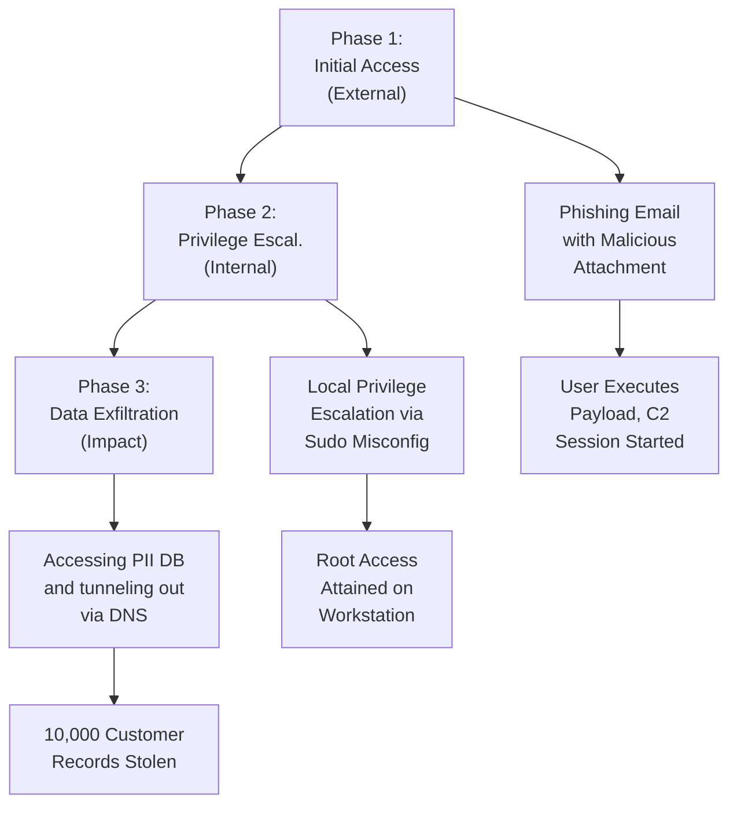

# 12 - Attack Narrative

## Introduction

The Attack Narrative, often referred to as the "Story of the Hack," is a crucial section within a comprehensive VAPT report.
While the findings section lists isolated vulnerabilities, the attack narrative connects these vulnerabilities to demonstrate real-world impact.
It illustrates how a seemingly low-risk issue can be chained with others to achieve total system compromise.
By reading the attack narrative, non-technical stakeholders and business owners can quickly grasp the true severity of the situation.
A well-written narrative turns dry technical data into a compelling argument for immediate action and robust security investment.

## Purpose of the Attack Narrative

1.  **Demonstrate Impact**: Translate technical jargon into business risk. A non-technical executive might not understand "SSRF," but they will understand "the attacker accessed the internal payroll system."
2.  **Contextualize Risk**: Show how different vulnerabilities interact. A single vulnerability might have a CVSS score of 4.0, but when chained, the resulting impact could be a 9.8.
3.  **Justify Remediation Effort**: By vividly illustrating the consequences of exploitation, the narrative helps justify the resources required for remediation.
4.  **Provide a Timeline**: Offer a chronological account of the attack, which is invaluable for incident response teams looking to improve their detection capabilities.

## Key Elements of a Strong Narrative

-   **Chronological Flow**: Present the attack steps in the order they occurred. Start from the very beginning.
-   **Clear Milestones**: Highlight key achievements (e.g., "Initial Access," "Privilege Escalation," "Data Exfiltration").
-   **Evidence Integration**: Seamlessly weave screenshots, command outputs, and logs into the narrative to provide irrefutable proof.
-   **Business Context**: Relate technical achievements to business impact continuously so that the focus remains on organizational risk.

## ASCII Diagram: The Attack Chain

## Step-by-Step Construction

### Phase 1: Reconnaissance and Initial Access

The narrative should begin by describing the attacker's starting position. Was it a black-box test with zero knowledge? An assumed breach scenario?

Document the reconnaissance phase:
-   What tools were used (e.g., Nmap, Amass, Shodan)?
-   What interesting assets were discovered?
-   How was the initial foothold achieved?

*Example:* "During initial reconnaissance, the assessment team identified an exposed administrative interface at `admin.example.com`. This interface was protected by weak, default credentials (admin:admin), allowing the team to bypass authentication and gain initial access to the CMS."

### Phase 2: Lateral Movement and Discovery

Once inside, what did the attacker see? How did they move from the initial landing point to other, potentially more valuable, systems?

-   What internal networks were accessible?
-   Were there vulnerable internal services?
-   How were credentials harvested from memory or the network?

*Example:* "From the compromised CMS server, the team performed internal network scanning and identified a Jenkins server. The Jenkins server was running an outdated version vulnerable to CVE-XXXX-XXXX, allowing for unauthenticated remote code execution. This facilitated lateral movement into the CI/CD pipeline."

### Phase 3: Privilege Escalation

Detail how the attacker moved from a low-privileged user to a highly privileged administrator (e.g., Domain Admin, root, AWS AdministratorAccess).

-   What misconfigurations were exploited?
-   Were there kernel exploits involved?
-   How were access tokens manipulated?

*Example:* "Upon gaining shell access to the internal Jenkins server as the `jenkins` user, the team enumerated local privilege escalation vectors. A misconfigured cron job running as root was discovered. By modifying the script executed by the cron job, the team successfully elevated privileges to root, gaining full control over the build server."

### Phase 4: Action on Objectives

This is the climax of the narrative. What was the ultimate goal, and how was it achieved?

-   Was sensitive data accessed or exfiltrated?
-   Was ransomware simulated?
-   Was financial fraud demonstrated?

*Example:* "With root access to the Jenkins server, the team extracted hardcoded AWS credentials from the environment variables. Using these credentials, the team accessed the organization's AWS S3 buckets and demonstrated the ability to download unencrypted backups containing customer Personally Identifiable Information (PII)."

## Best Practices for Writing

1.  **Use Active Voice**: "The team executed the exploit," not "The exploit was executed." This makes the reading more engaging.
2.  **Avoid Unnecessary Details**: Don't list every failed attempt unless it's relevant to the story (e.g., demonstrating WAF evasion). Focus on the successful path.
3.  **Include Screenshots Strategically**: Use screenshots to prove impact (e.g., a directory listing of `/root`, a customized defacement page, a snippet of dummy PII). Redact sensitive information appropriately.
4.  **Map to Frameworks**: Where possible, map the steps of the narrative to the MITRE ATT&CK framework. This adds a layer of professionalism and helps defenders build targeted detections.

## Example Scenario: The E-commerce Breach

Let's construct a mini-narrative for an e-commerce platform.

**Objective:** Demonstrate the risk of an unpatched web server.

1.  **Initial Access:** The team identified that the web server hosting the main e-commerce application was running an outdated version of Apache Tomcat, vulnerable to the Ghostcat vulnerability (CVE-2020-1938).
2.  **Exploitation:** By exploiting Ghostcat, the team was able to read arbitrary files from the web application's root directory, including `WEB-INF/web.xml` and configuration files containing database connection strings.
3.  **Lateral Movement:** Using the extracted database credentials, the team connected directly to the backend PostgreSQL database, bypassing the application's authentication mechanisms entirely.
4.  **Impact:** The team queried the `users` and `credit_cards` tables, demonstrating the ability to extract sensitive customer data without ever logging into the application front-end.

## Integrating with the Findings Section

The Attack Narrative should strongly reference the specific findings detailed later in the report.

For example: "The team utilized the Cross-Site Scripting vulnerability detailed in Finding #3 (Reflected XSS in Search Module) to steal the session cookie of an authenticated administrator."

This cross-referencing ensures the report is cohesive and that the narrative is firmly grounded in the technical findings, eliminating any perception of exaggeration.

## The Executive Summary Connection

The Attack Narrative provides the raw material for the Executive Summary. The Executive Summary should distill the narrative into a high-level overview, emphasizing the business impact without getting bogged down in the technical details. They act as two sides of the same coin: one for leadership, one for engineering.

## Conclusion

A well-crafted Attack Narrative is a powerful tool for communicating risk. It transforms an abstract list of vulnerabilities into a compelling story that drives action and remediation. By illustrating the realistic path an adversary might take, it forces stakeholders to confront their defensive gaps.

## Chaining Opportunities

-   The attack narrative explicitly demonstrates how isolated findings can be chained together. For instance, combining a low-severity information disclosure with a medium-severity authentication bypass to achieve a critical outcome.
-   Understanding the attack chain is vital for developing effective [[11 - Remediation Guidance]], as fixing a single link in the chain can often prevent the entire attack.

## Related Notes

-   [[11 - Remediation Guidance]]
-   [[13 - Retesting Methodology]]
-   [[14 - Sample Finding — SQL Injection]]
-   [[15 - Sample Full Report]]
