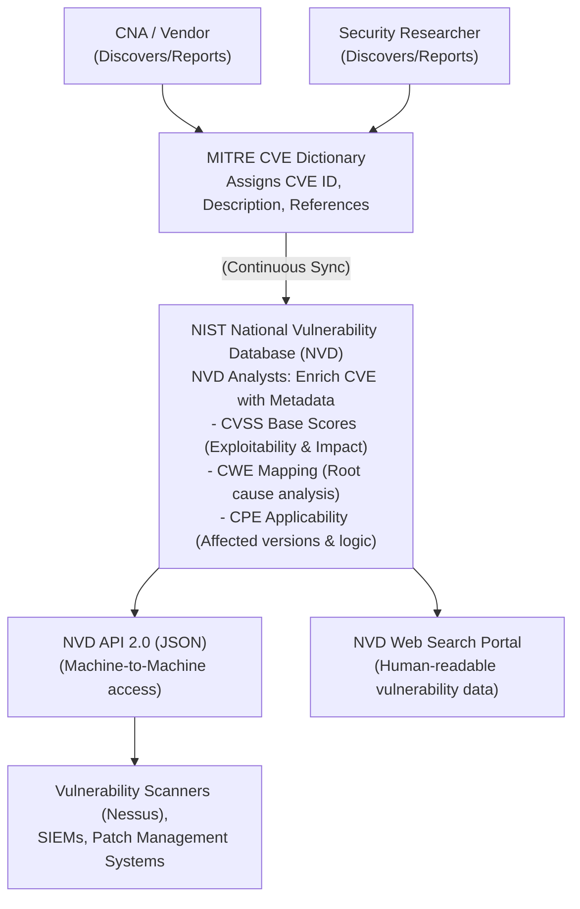

# NVD: The National Vulnerability Database

## Introduction to the NVD
The National Vulnerability Database (NVD) is the U.S. government repository of standards-based vulnerability management data, represented using the Security Content Automation Protocol (SCAP). Maintained by the National Institute of Standards and Technology (NIST) and sponsored by the Cybersecurity and Infrastructure Security Agency (CISA), the NVD is arguably the most critical database in the global cybersecurity ecosystem. 

While the MITRE Corporation maintains the dictionary of CVE identifiers (the names of the vulnerabilities), the NVD enriches these CVEs with critical metadata. This metadata transforms a simple identifier into actionable intelligence that can be used for risk assessment, vulnerability management, and penetration testing.

## Synchronisation with MITRE's CVE List
It is a common misconception that CVE and NVD are the same entity. They are completely separate, though tightly integrated.
1. **MITRE** receives a vulnerability report from a CNA, assigns a CVE ID, and publishes a brief description and references.
2. **NVD** continuously monitors the MITRE CVE feed. When a new CVE is published, NVD analysts ingest it into their system.
3. **Enrichment**: The NVD team then performs a detailed analysis of the CVE to append structured data, including CVSS scores, CWE mappings, and CPE applicability statements.

Because of this workflow, there is often an "NVD lag." A zero-day vulnerability might be assigned a CVE and heavily exploited in the wild for several days or weeks before the NVD analysts complete their assessment and publish the CVSS scores. Penetration testers must be aware of this lag and not rely solely on NVD for real-time threat intelligence.

## Searching and Interpreting NVD Entries
When examining a vulnerability on the NVD portal, several key pieces of information are presented. Understanding how to parse this data is essential for a VAPT professional.

### 1. The Vulnerability Description
A brief, vendor-neutral description of the flaw, often highlighting the affected component and the potential impact.

### 2. CVSS Scores (Exploitability vs Impact)
The NVD provides the official CVSS v3.1 (and increasingly v4.0) base scores. A crucial aspect of this is the breakdown into **Exploitability Subscore** and **Impact Subscore**.
- **Exploitability Subscore**: Measures how easily the vulnerability can be exploited (derived from Attack Vector, Attack Complexity, Privileges Required, and User Interaction). A high exploitability score means the barrier to entry for an attacker is low.
- **Impact Subscore**: Measures the direct consequence of a successful exploit on the CIA triad (Confidentiality, Integrity, Availability). A high impact score means an exploit is devastating, even if it is difficult to execute.
During a penetration test, a vulnerability with high exploitability but low impact might be used as a stepping stone (e.g., reading an internal config file), whereas a high impact but low exploitability vulnerability might be the ultimate objective (e.g., a complex race condition leading to root access).

### 3. Weakness Enumeration (CWE)
NVD maps the CVE to a specific CWE. This allows security teams to categorize vulnerabilities and identify systemic weaknesses in their software architecture.

### 4. Known Affected Software Configurations (CPE)
This is arguably the most complex and valuable part of an NVD entry. The NVD uses CPEs to define exactly which software versions and configurations are vulnerable. It uses a concept called "Applicability Statements," which can handle complex logic.
For example, a vulnerability might only affect `cpe:2.3:a:vendor:product:2.0` IF it is running on `cpe:2.3:o:microsoft:windows_10`. This conditional logic is vital for accurate vulnerability scanning and reducing false positives.

## Data Feeds and APIs
To support the global cybersecurity industry, the NVD provides its data in machine-readable formats.
Historically, this was done via massive JSON data feeds downloaded in bulk. However, the NVD has transitioned to the **NVD API 2.0**.
The API allows automated tools, SIEMs, and vulnerability scanners to query the database dynamically. 
Example API request: `https://services.nvd.nist.gov/rest/json/cves/2.0?cveId=CVE-2021-44228`
This returns a highly structured JSON object containing all the enriched metadata. Rate limiting is strictly enforced, and heavy users are encouraged to apply for API keys.

## Automating NVD Ingestion for Vulnerability Management
Modern enterprise security relies on automating NVD data.
1. **Asset Inventory**: An organisation maintains a database of all installed software (using CPEs).
2. **Continuous Polling**: An automated script or platform polls the NVD API daily for newly modified or published CVEs.
3. **Matching Engine**: The system cross-references the incoming CPEs from the NVD against the internal asset inventory.
4. **Alerting**: If a match is found, an alert is generated with the associated CVSS score, allowing the patch management team to prioritize remediation based on risk.

## Visualizing the NVD Architecture and Data Pipeline

## Limitations and Criticisms of NVD
While foundational, the NVD is not without flaws:
- **Analyst Backlogs**: Due to the sheer volume of vulnerabilities discovered annually, NVD analysts frequently fall behind, leading to thousands of CVEs sitting without CVSS or CPE enrichment. This creates a dangerous blind spot for organisations relying solely on automated scanners.
- **Static Scoring**: A CVSS base score assigned today may not reflect the actual risk next year. If an exploit becomes weaponised in Metasploit, the risk increases, but the base score in NVD remains the same (though temporal scores exist, they are rarely utilised effectively in basic tooling).
- **Incomplete CPEs**: Sometimes the CPE applicability statements lack the necessary nuance, leading to vulnerability scanners generating false positives.

## Chaining Opportunities
- NVD data provides the theoretical vulnerability; checking Exploit-DB validates if practical exploitation is immediately possible.
- CPE strings extracted during Nmap version scanning can be directly queried against the NVD to find potential entry points.

## Related Notes
- [[01 - What is Threat Intelligence]]
- [[02 - CVE CVSS CWE Terminology]]
- [[04 - Exploit-DB and Packet Storm]]
- [[05 - SearchSploit Offline Exploit-DB Search]]
