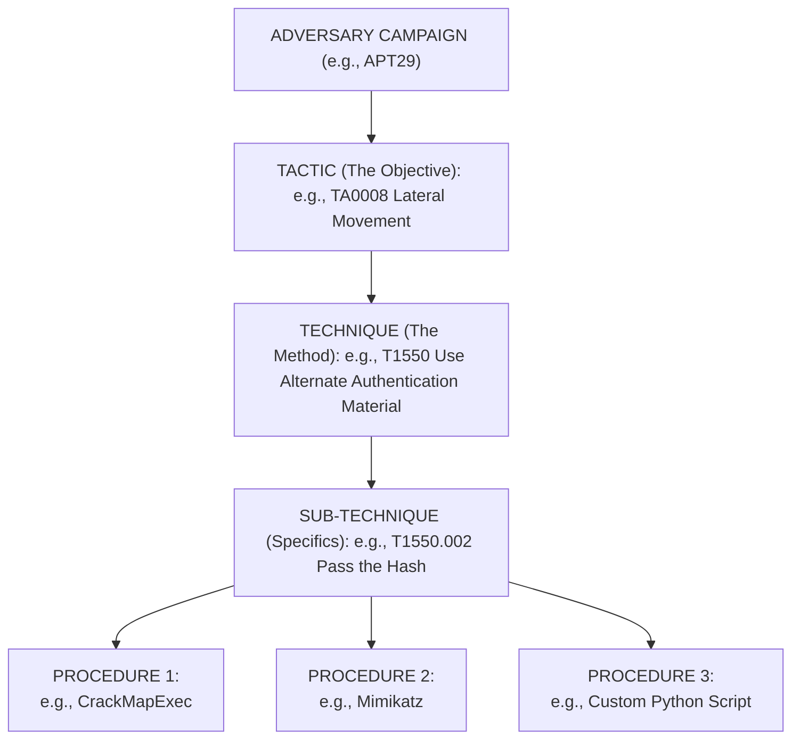

# MITRE ATT&CK Framework: A Comprehensive Deep Dive

## 1. Introduction to the MITRE ATT&CK Framework

The MITRE ATT&CK (Adversarial Tactics, Techniques, and Common Knowledge) framework is the globally recognized standard and knowledge base for understanding adversary behavior. Unlike traditional compliance-based frameworks or vulnerability-centric methodologies (like CVSS), ATT&CK focuses intensely on *how* adversaries operate. It is a curated knowledge base and model for cyber adversary behavior, reflecting the various phases of an adversary's attack lifecycle and the platforms they are known to target.

ATT&CK was created in 2013 as a way to document adversary behaviors for use within MITRE’s own research. It was released to the public in 2015 and has since grown into an industry standard. Its primary utility lies in its empirical nature: it is built almost entirely on publicly observable, real-world adversary behavior. If an action has not been seen in the wild or demonstrated in a highly realistic proof-of-concept, it generally does not make it into the framework.

### 1.1 The Shift from Indicators to Behaviors

Historically, threat intelligence heavily relied on Indicators of Compromise (IoCs) such as IP addresses, domain names, and file hashes. While useful, these are easily changed by attackers. This concept is formalized in the "Pyramid of Pain" by David Bianco:
- **Hash Values (Trivial to change):** Attackers recompile malware.
- **IP Addresses (Easy):** Attackers spin up new VPS instances.
- **Domain Names (Simple):** Fast-flux DNS and DGA algorithms.
- **Network/Host Artifacts (Annoying):** Dropped file paths, registry keys.
- **Tools (Challenging):** Custom malware, C2 frameworks.
- **TTPs (Tough!):** Tactics, Techniques, and Procedures.

ATT&CK maps directly to the apex of the Pyramid of Pain: the TTPs. By tracking and defending against TTPs, defenders force adversaries to reinvent their entire operational playbook, which is highly resource-intensive.

## 2. Core Structure: Tactics, Techniques, and Procedures (TTPs)

The entire framework is structured around TTPs, providing a hierarchical taxonomy of adversary actions.

### 2.1 Tactics (The "Why")
Tactics represent the tactical objective of an adversary. They are the *why* behind an action. For example, an adversary wants to achieve persistent access to a network; therefore, their Tactic is "Persistence". 

The Enterprise ATT&CK Matrix currently includes 14 Tactics:
1. **Reconnaissance (TA0043):** Gathering information to plan future adversary operations.
2. **Resource Development (TA0042):** Establishing resources to support operations (e.g., buying domains).
3. **Initial Access (TA0001):** The methods used to gain an initial foothold within a network.
4. **Execution (TA0002):** Running malicious code on a local or remote system.
5. **Persistence (TA0003):** Maintaining access to systems across restarts, changed credentials, and other interruptions.
6. **Privilege Escalation (TA0004):** Gaining higher-level permissions on a system or network.
7. **Defense Evasion (TA0005):** Avoiding detection during a compromise.
8. **Credential Access (TA0006):** Stealing account names and passwords.
9. **Discovery (TA0007):** Figuring out the environment and internal network.
10. **Lateral Movement (TA0008):** Moving through the environment to other systems.
11. **Collection (TA0009):** Gathering data of interest to the adversary's goal.
12. **Command and Control (TA0011):** Communicating with compromised systems to control them.
13. **Exfiltration (TA0010):** Stealing data from the target network.
14. **Impact (TA0040):** Disrupting availability or compromising integrity (e.g., Ransomware).

### 2.2 Techniques and Sub-Techniques (The "How")
Techniques represent *how* an adversary achieves a tactical goal. For example, to achieve the "Initial Access" tactic, an adversary might use the "Phishing" technique (T1566).

Sub-techniques provide a deeper level of granularity. They describe a more specific method used to perform a technique. For instance, Phishing (T1566) has several sub-techniques:
- **T1566.001:** Spearphishing Attachment
- **T1566.002:** Spearphishing Link
- **T1566.003:** Spearphishing via Service

### 2.3 Procedures (The "What Exactly")
Procedures describe the specific implementation or the exact command/tool an adversary used to execute a technique. 
- **Tactic:** Initial Access
- **Technique:** Phishing
- **Sub-Technique:** Spearphishing Attachment
- **Procedure:** APT28 sent emails containing malicious Microsoft Word documents that utilized macro code to execute a payload.

## 3. Visualizing the Framework (Mermaid Diagram)

Below is a conceptual architecture of how MITRE ATT&CK elements interrelate during an adversary campaign:

## 4. The ATT&CK Matrices

MITRE ATT&CK is not a single matrix; it is a collection of matrices tailored to specific technology domains.

### 4.1 Enterprise Matrix
The most widely used matrix, focusing on traditional enterprise IT environments. It covers:
- Windows, macOS, Linux
- Cloud environments (AWS, Azure, GCP, Azure AD, Office 365, SaaS)
- Network infrastructure (Routers, Switches, Firewalls)
- Containers (Docker, Kubernetes)

### 4.2 Mobile Matrix
Focuses on adversary behavior targeting mobile devices.
- Android
- iOS
It covers unique tactics such as "Network Effects" and "Hardware Additions" which are specific to the physical and radio aspects of mobile devices.

### 4.3 ICS (Industrial Control Systems) Matrix
Designed for operational technology (OT) and industrial environments (SCADA, PLCs). The tactics here focus heavily on physical impact, loss of control, and manipulation of physical processes, which differ drastically from IT data theft.

## 5. Key Artifacts within ATT&CK

To fully utilize the framework, one must understand the supporting artifacts that MITRE curates alongside the TTPs.

### 5.1 Groups
MITRE tracks known adversary groups (e.g., APT1, Lazarus Group, FIN7). Each group page maps the specific techniques they are known to use. This is crucial for Threat Intelligence-Led Penetration Testing (e.g., TIBER-EU, CBEST), where you must emulate a specific threat actor relevant to the target sector.

### 5.2 Software
This includes commercial, open-source, and custom tools used by adversaries (e.g., Cobalt Strike, Mimikatz, TrickBot). By understanding what software an adversary uses, defenders can create specific YARA rules and endpoint detections.

### 5.3 Mitigations
For every technique, ATT&CK provides recommended mitigations (e.g., M1026 Privileged Account Management, M1042 Disable or Remove Feature or Program). These map directly to defensive controls.

### 5.4 Data Sources and Data Components
A critical addition to the framework. Data sources describe *where* defenders need to look to detect a technique (e.g., "Process", "Network Traffic"). Data components break this down further (e.g., "Process Creation", "Network Connection"). This forms the foundation of SIEM engineering and detection logic.

## 6. Practical Applications in VAPT

Penetration testers and Red Teamers use ATT&CK constantly. It has transformed the industry from finding "vulns" to finding "paths."

### 6.1 Red Teaming and Adversary Emulation
During a Red Team engagement, the objective is not to find every vulnerability, but to test the organization's detection and response capabilities. ATT&CK allows the Red Team to build an "Emulation Plan."
- **Scenario:** Emulate FIN7 targeting a retail company.
- **Action:** Review the MITRE ATT&CK page for FIN7.
- **Execution:** Implement FIN7's known TTPs, such as Spearphishing with malicious macros (T1566.001) dropping a Carbanak backdoor (S0130), followed by living-off-the-land techniques using WMI (T1047).

### 6.2 Purple Teaming
Purple teaming involves the Red Team and Blue Team working together in an open environment. They use the ATT&CK framework as a scorecard.
- Red Team executes T1003.001 (OS Credential Dumping: LSASS Memory).
- Blue Team checks the SIEM to see if Event ID 4656 (A handle to an object was requested) targeting `lsass.exe` was triggered.
- If not, they build the detection together.

### 6.3 The ATT&CK Navigator
The [ATT&CK Navigator](https://mitre-attack.github.io/attack-navigator/) is an open-source tool built by MITRE that allows users to create interactive heatmaps of the matrix. 
- You can layer different groups on top of each other.
- You can color-code techniques based on testing results (e.g., Red = Not detected, Green = Detected).
- It generates JSON files that can be shared among teams.

## 7. Limitations and Common Pitfalls

While extremely powerful, ATT&CK is not a silver bullet.

1. **Not a Checklist:** Trying to achieve "100% MITRE coverage" is a fool's errand. It is impossible to block every single technique perfectly, as many rely on legitimate system functionality (e.g., PowerShell).
2. **Abstract Nature:** Some techniques are very broad. "Valid Accounts" (T1078) could mean a compromised domain admin password, or it could mean an attacker bought a VPN token on the dark web. The mitigation and detection for these differ wildly.
3. **Focus on Post-Exploit:** Historically, ATT&CK was weak on the pre-exploitation phase. While the addition of PRE-ATT&CK (now merged into Reconnaissance and Resource Development tactics) helped, it still assumes an attacker *can* get in eventually.

## 8. Deep Dive: Analyzing an Attack Lifecycle via ATT&CK

Let us analyze a hypothetical ransomware attack (e.g., Conti) through the lens of ATT&CK:

1. **Initial Access (TA0001):** Valid Accounts (T1078). The attacker purchases compromised RDP credentials from an Initial Access Broker (IAB) on the dark web.
2. **Discovery (TA0007):** Network Service Discovery (T1046) using Advanced IP Scanner to map the internal network.
3. **Credential Access (TA0006):** OS Credential Dumping (T1003). The attacker uses Procdump to dump the LSASS process on the compromised RDP jump server.
4. **Lateral Movement (TA0008):** Remote Services: SMB/Windows Admin Shares (T1021.002). Using the dumped credentials, the attacker moves to the Domain Controller using PsExec.
5. **Collection (TA0009):** Data from Local System (T1005). Attackers stage sensitive HR and financial data in a hidden folder.
6. **Exfiltration (TA0010):** Exfiltration Over Web Service (T1567). The staged data is pushed to Mega.io using Rclone.
7. **Impact (TA0040):** Data Encrypted for Impact (T1486). The Conti ransomware executable is deployed globally via Group Policy (GPO), encrypting all endpoints.

By breaking the attack down in this manner, VAPT professionals can identify exact points where security controls failed and recommend specific, actionable mitigations based on the ATT&CK knowledge base.

---
## Chaining Opportunities
- **[[07 - MITRE ATT&CK Mapping Findings]]:** Directly builds upon this knowledge to translate raw VAPT findings into actionable TTP reports.
- **[[08 - Cyber Kill Chain Lockheed Martin Model]]:** Provides a high-level strategic counterpart to the highly tactical ATT&CK framework.
- **[[09 - Threat Modeling STRIDE PASTA DREAD]]:** Uses ATT&CK TTPs to inform threat models and identify likely attack paths during the design phase of an application.

## Related Notes
- [[01 - OSINT Overview and Methodology]]
- [[10 - CVE Research Finding PoCs]]
- [[11 - Red Teaming vs Penetration Testing]]
- [[12 - Advanced Persistent Threats (APTs) Profiling]]
