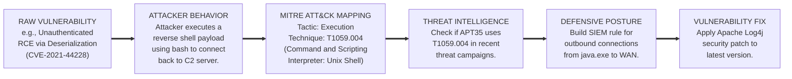

# MITRE ATT&CK Mapping Findings: Translating Vulnerabilities to Behavior

## 1. The Paradigm Shift in VAPT Reporting

For decades, Vulnerability Assessment and Penetration Testing (VAPT) reports have been structured around specific flaws: Cross-Site Scripting (XSS), SQL Injection, Missing Patches, or Misconfigurations. While this information is vital for developers and sysadmins, it fails to tell the complete story to Security Operations Center (SOC) analysts, threat intelligence teams, and executive leadership. 

A list of vulnerabilities answers the question: *"What is broken?"*
Mapping findings to the MITRE ATT&CK framework answers the questions: *"What can an adversary DO with this broken thing? How would we detect them doing it? Have we seen adversaries do this before?"*

Mapping findings to MITRE ATT&CK is the process of translating technical vulnerabilities and the penetration tester's exploitation steps into the standardized language of Tactics, Techniques, and Procedures (TTPs).

## 2. Why Map Findings to MITRE ATT&CK?

### 2.1 Bridging Offensive and Defensive Silos (Purple Teaming)
Offensive teams speak in terms of exploits (e.g., "I popped a shell using MS17-010"). Defensive teams speak in terms of detections (e.g., "I need a Sigma rule for suspicious SMB traffic"). MITRE ATT&CK acts as the Rosetta Stone. When a pentester maps their exploit to `T1210: Exploitation of Remote Services`, the defender immediately knows which data sources to check and which mitigation strategies apply.

### 2.2 Contextualizing Risk
A CVSS score of 9.8 (Critical) on a legacy internal server might seem urgent. However, if ATT&CK mapping reveals that exploiting it requires `T1059.001: PowerShell` execution, and the organization strictly enforces Constrained Language Mode and PowerShell Script Block Logging, the *actual* risk and likelihood of undetected exploitation are vastly lower.

### 2.3 Emphasizing Post-Exploitation
Traditional reporting often stops at the moment of compromise. ATT&CK mapping forces the tester to document the *entire* attack chain. How was persistence achieved? How were credentials dumped? How was data exfiltrated? This highlights defensive gaps far beyond the initial missing patch.

## 3. The Methodology of Mapping

Mapping is not simply a matter of looking up a CVE and assigning a technique. It requires analyzing the adversary (or pentester) behavior at every stage of the engagement.

### 3.1 Step 1: Deconstruct the Attack Path
Break down the successful exploit chain into discrete actions.
*Example: An attacker finds an SSRF vulnerability, uses it to read AWS metadata, steals temporary IAM credentials, and uses those credentials to download S3 buckets.*

### 3.2 Step 2: Identify the Tactic (The Objective)
For each discrete action, ask: "What was the goal?"
- Using SSRF to read internal IP: **Discovery**
- Stealing IAM credentials: **Credential Access**
- Accessing the S3 bucket: **Collection**
- Downloading the data: **Exfiltration**

### 3.3 Step 3: Identify the Technique and Sub-technique (The Method)
Map the action to the specific ATT&CK matrix technique.
- SSRF -> `T1190: Exploit Public-Facing Application` (Initial Access)
- AWS Metadata theft -> `T1552.005: Unsecured Credentials: Cloud Instance Metadata API`
- Using stolen IAM keys -> `T1078.004: Valid Accounts: Cloud Accounts`
- S3 Bucket access -> `T1530: Data from Cloud Storage Object`

### 3.4 Step 4: Document the Procedure
Record the exact commands, tools, or payloads used. This provides the actionable intelligence for the SOC to build IOCs.
- Procedure: `curl http://169.254.169.254/latest/meta-data/iam/security-credentials/s3-role`

## 4. Visualizing the Mapping Process (ASCII Diagram)

## 5. Case Studies in Mapping Findings

### 5.1 Case Study 1: The Active Directory Compromise
**The Finding:** The Red Team successfully compromised the Domain Admin account.
**The Attack Path:** 
1. The team found a responsive LLMNR broadcast.
2. They used Responder to poison the request and capture an NTLMv2 hash.
3. They cracked the hash offline.
4. The cracked password belonged to a Helpdesk user.
5. They used BloodHound to find a path to DA.
6. The Helpdesk user had local admin rights on a server where a Domain Admin's session was active.
7. They used Mimikatz to dump the DA's NTLM hash.
8. They used Pass-the-Hash to access the Domain Controller.

**The ATT&CK Mapping:**
- **LLMNR Poisoning:** `T1557.001: Adversary-in-the-Middle: LLMNR/NBT-NS Poisoning and SMB Relay` (Credential Access)
- **Cracking Hash:** `T1110.002: Brute Force: Password Cracking` (Credential Access)
- **BloodHound:** `T1087.002: Account Discovery: Domain Account` AND `T1482: Domain Trust Discovery` (Discovery)
- **Mimikatz:** `T1003.001: OS Credential Dumping: LSASS Memory` (Credential Access)
- **Pass-the-Hash:** `T1550.002: Use Alternate Authentication Material: Pass the Hash` (Lateral Movement / Defense Evasion)

### 5.2 Case Study 2: Web Application SQL Injection
**The Finding:** Blind Time-Based SQL Injection on a login page.
**The Attack Path:**
1. Tester identified the delay in response using `WAITFOR DELAY`.
2. Tester used `sqlmap` to extract the `users` table containing bcrypt hashes.
3. Tester identified the database server was running as `NT AUTHORITY\SYSTEM`.
4. Tester enabled `xp_cmdshell` to execute commands.
5. Tester created a new local administrator account.

**The ATT&CK Mapping:**
- **SQL Injection:** `T1190: Exploit Public-Facing Application` (Initial Access)
- **Extracting Hashes:** `T1003.002: OS Credential Dumping: Security Account Manager` (Credential Access - *adapted as they dumped DB creds, but intent is similar*)
- **xp_cmdshell:** `T1059.003: Command and Scripting Interpreter: Windows Command Shell` (Execution)
- **Adding Local Admin:** `T1136.001: Create Account: Local Account` (Persistence)

## 6. Automating the Mapping Process

Manually mapping every finding is tedious. The industry has developed tools to assist.

### 6.1 Tools and Platforms
- **VECTR:** A popular open-source tool by Security Risk Advisors used to track Red/Purple team operations. It natively structures all engagements around ATT&CK.
- **MITRE ATT&CK Navigator:** While not an automation tool per se, it is used to generate heatmaps of the mapped findings to present to executives (e.g., "Here is our coverage before and after the pentest").
- **DeTT&CT (Detect Tactics, Techniques & Combat Threats):** A framework to score and compare data log sources, visibility, and detection coverage against ATT&CK.
- **AttackIQ / SCYTHE / Prelude:** Breach and Attack Simulation (BAS) tools that automatically execute procedures and instantly map the successes and failures to the ATT&CK matrix.

### 6.2 The Challenge of CVEd to ATT&CK Mapping
There have been numerous attempts to automatically map CVE databases directly to ATT&CK (e.g., Center for Threat-Informed Defense projects). 
The difficulty lies in the fact that a CVE is a *flaw*, while ATT&CK is a *behavior*. 
For example, CVE-2020-1472 (Zerologon) is a vulnerability in Netlogon. 
- Is it `T1190: Exploit Public-Facing Application`? (If exposed)
- Is it `T1210: Exploitation of Remote Services`? (Usually, yes)
- Is it `T1068: Exploitation for Privilege Escalation`? (Also yes, it grants DA).
Context matters, which is why human analysis during mapping remains crucial.

## 7. Deliverables and Reporting

When writing the final VAPT report, the ATT&CK mapping should be included in multiple sections:

1. **Executive Summary:** Include an ATT&CK Navigator heatmap showing the overall kill-chain progression. Show where the attack was stopped versus where it succeeded.
2. **Technical Findings:** Every technical finding should include a specific table detailing the mapped Tactic, Technique ID, Technique Name, and the specific Procedure used by the tester.
3. **Remediation Strategy:** Align mitigations not just to the CVE, but to the ATT&CK mitigation ID (e.g., `M1026: Privileged Account Management`).

By shifting the narrative from "Fix this bug" to "Defend against this behavior," organizations can build more resilient, threat-informed defense architectures.

## 8. Edge Cases in Mapping and Complex Scenarios

### 8.1 The "Dual-Use" Tool Conundrum
One of the most significant challenges in mapping VAPT findings involves "living off the land" (LotL) binaries and dual-use administrative tools. 
Consider the use of `PsExec.exe`. System administrators use it daily to manage servers. Pentesters use it to move laterally and execute commands as SYSTEM.
When mapping a finding involving `PsExec`, the context is critical.
- If it is used to move from a compromised workstation to a Domain Controller, the map is `T1021.002: Remote Services: SMB/Windows Admin Shares` (Lateral Movement).
- If it is used locally to escalate from an Administrator prompt to a SYSTEM prompt (e.g., `psexec -i -s cmd.exe`), the map is `T1134.001: Access Token Manipulation: Token Impersonation/Theft` (Privilege Escalation).
This requires the tester to meticulously document *intent*, not just the tool name.

### 8.2 Handling Zero-Days and Custom Exploits
VAPT engagements occasionally yield 0-day vulnerabilities. Since ATT&CK relies on *observed* adversary behavior, how do you map a technique that hasn't been officially documented by MITRE yet?
- **Option A (Abstract Mapping):** Map it to the closest parent technique. If it's a novel way of extracting memory, map it to `T1005: Data from Local System`.
- **Option B (Contribute to MITRE):** The framework is open. Pentesters frequently submit novel techniques or sub-techniques discovered during engagements to the MITRE team for inclusion in the next version.

## 9. Extending Mapping to Defense: MITRE D3FEND

While ATT&CK focuses on adversary actions, MITRE has introduced a complementary framework known as **D3FEND** (Demystifying, Defeating, and Detecting Defending).
D3FEND maps directly to ATT&CK, providing a matrix of specific, technically accurate defensive techniques.
When mapping VAPT findings, professional reports are now beginning to include D3FEND mappings in the remediation section.
- **Finding:** Attacker extracted LSASS memory.
- **ATT&CK Mapping:** `T1003.001: OS Credential Dumping: LSASS Memory`.
- **D3FEND Mitigation Mapping:** `D3-LSA: Local Security Authority Subsystem Service (LSASS) Protection` (e.g., enabling Credential Guard).
This full lifecycle mapping—from the vulnerability flaw, to the adversary behavior, to the specific defensive control architecture—represents the gold standard in modern VAPT reporting.

---
## Chaining Opportunities
- **[[06 - MITRE ATT&CK Framework]]:** The fundamental knowledge base required before any mapping can accurately take place.
- **[[10 - CVE Research Finding PoCs]]:** Understanding how a specific PoC works is essential for accurately mapping its behavior to a specific ATT&CK technique.
- **[[15 - SIEM and SOC Operations]]:** The primary consumers of ATT&CK mapped reports; they use this data to tune their EDR and SIEM detection logic.

## Related Notes
- [[08 - Cyber Kill Chain Lockheed Martin Model]]
- [[22 - Red Team Operations and Infrastructure]]
- [[40 - Exploit Development Basics]]
- [[45 - Writing Professional Pentest Reports]]
