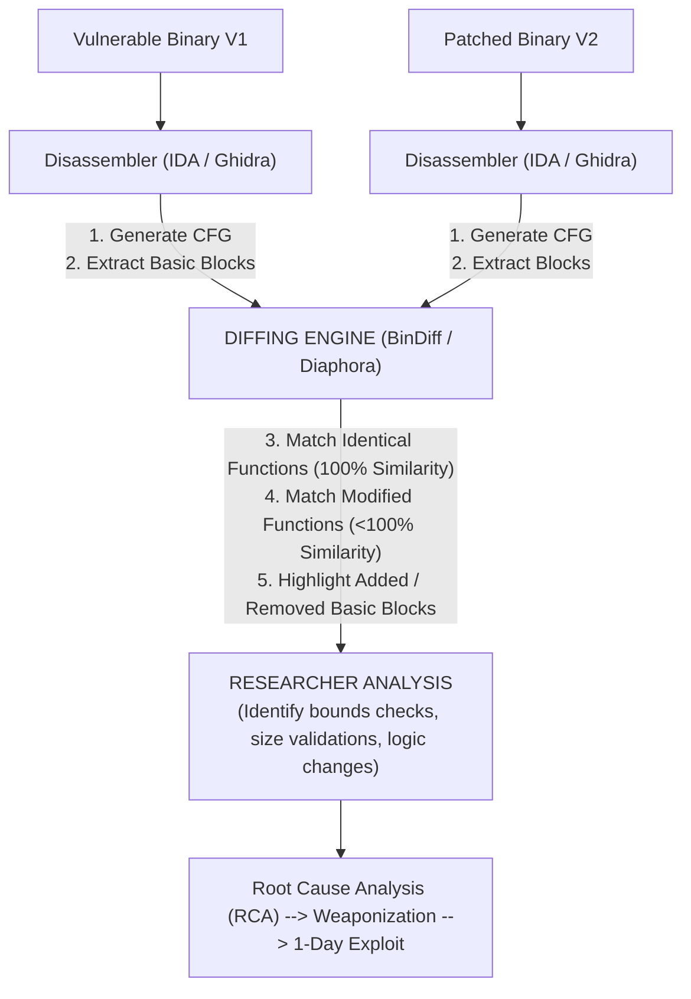

# Patch Diffing for Vulnerability Research

## 1. Introduction to Patch Diffing
Patch diffing is the systematic process of comparing two versions of a software component (an unpatched vulnerable version and a patched version) to identify the specific changes made by the developer. By isolating these changes, a security researcher can mathematically and logically deduce the root cause of the original vulnerability. 

Once the vulnerability is understood, the researcher can develop a "1-day" exploit. In many cases, developers create incomplete fixes—patching the immediate symptom but failing to address the underlying root cause. Patch diffing frequently leads to the discovery of bypasses and new 0-day vulnerabilities. It is a critical skill for advanced threat intelligence analysts, exploit developers, and reverse engineers.

## 2. Source Code vs. Binary Diffing
The methodology of patch diffing depends entirely on the availability of the target's source code.

- **Source Code Diffing:** When dealing with open-source software (e.g., Linux Kernel, Apache HTTP Server), diffing is straightforward. Tools like `git diff` or GitHub's commit history immediately reveal the exact lines of code altered. The challenge here is not *finding* the change, but *understanding* the complex context of the change to weaponize it.
- **Binary Diffing:** Closed-source, proprietary software (e.g., Microsoft Windows, macOS, Adobe Reader) requires binary diffing. Researchers must reverse-engineer the compiled binaries (.exe, .dll, .so) and compare their assembly instructions. This is vastly more difficult due to compiler optimizations, obfuscation, and the lack of variable names or comments.

## 3. The Core Mechanics of Binary Diffing

Binary diffing tools do not simply compare bytes. If a developer adds a single instruction to a function, every subsequent address shifts, breaking direct byte-to-byte comparison. Instead, advanced diffing relies on structural analysis.

### Structural Comparison Elements
1. **Control Flow Graphs (CFG):** The binary is broken down into functions, and each function is represented as a graph. The nodes are Basic Blocks (sequences of instructions with no branches), and the edges represent control flow (jumps, calls, returns).
2. **Call Graphs:** The macroscopic view of which functions call which other functions across the entire binary.
3. **Heuristics:** Diffing engines use heuristics to match functions between the old and new binaries. These include matching function names (if symbols are present), string references, the number of basic blocks, loop structures, and instruction mnemonic sequences.

## 4. Industry Standard Tooling

- **BinDiff (Zynamics / Google):** The undisputed industry standard for binary diffing. It integrates heavily with IDA Pro (and Ghidra). It relies heavily on graph isomorphism and structural matching, making it highly resilient to compiler optimization changes.
- **Diaphora:** An open-source, highly advanced diffing plugin for IDA Pro, Ghidra, and Binary Ninja. It uses dozens of different heuristics (fuzzy hashing, pseudo-code diffing, constant matching) and is arguably the most powerful tool for finding minute changes.
- **DarunGrim:** An older but still relevant tool, specifically optimized for diffing Microsoft Windows patches.
- **Ghidra Version Tracking:** Built natively into the NSA's Ghidra framework. It allows correlating functions and data across different versions of the same program using a complex scoring system.
- **Radare2 (radiff2):** A command-line utility within the radare2 framework, useful for quick, automated diffing of smaller binaries or integration into CI/CD pipelines.

## 5. The Patch Diffing Methodology

1. **Acquisition:** The researcher downloads the vulnerable binary and the patched update. For Windows, this means extracting `.msu` or `.cab` files to retrieve the specific updated `.dll` or `.sys` drivers.
2. **Normalization and Disassembly:** Both binaries are loaded into a disassembler. The researcher allows auto-analysis to complete, identifying all functions, strings, and cross-references.
3. **Exporting and Diffing:** The disassembly databases are exported and fed into the diffing engine. The tool calculates matches and presents a list of functions, sorted by similarity score.
4. **Analysis:** The researcher focuses on functions with a similarity score between 80% and 99%. A 100% match means the function didn't change; a 0% match means it's entirely new or completely rewritten. The most critical changes (e.g., adding an integer overflow check) usually only alter a few basic blocks, resulting in high, but not perfect, similarity.
5. **Basic Block Level Diffing:** Once a modified function is identified, the researcher examines the CFG side-by-side. The diffing tool color-codes added blocks (e.g., green), removed blocks (red), and changed blocks (yellow). 

## 6. Root Cause Analysis (RCA)

When a changed basic block is found, the researcher performs RCA to understand *why* the block was added. Common vulnerability indicators found via diffing include:
- **Added Bounds Checks:** A new `CMP` instruction followed by a conditional jump (`JA`, `JB`) added before a memory copy operation (`memcpy`, `strcpy`). This indicates a buffer overflow was patched.
- **Integer Validation:** Checks ensuring a value is not negative or exceeding maximum integer limits, indicating an integer overflow or underflow fix.
- **Reference Counting:** Added `IncRef` or `DecRef` calls, indicating a Use-After-Free (UAF) vulnerability was mitigated.
- **Type Checking:** Added structural validation to prevent Type Confusion vulnerabilities in object-oriented binaries.

## 7. Case Studies and Real-World Impact

### MS17-010 (EternalBlue)
When Microsoft patched the SMBv1 vulnerabilities (EternalBlue, EternalRomance) leaked by the Shadow Brokers, researchers immediately diffed `srv.sys`. By comparing the patched version against the unpatched version, they identified newly added size validation checks on the SMB transaction buffers. This allowed researchers to reverse-engineer the exact mathematical conditions required to trigger the integer overflow, leading to the creation of independent Metasploit modules long before the NSA exploit code was fully deciphered.

### Incomplete Patches (Bypasses)
A classic scenario: A developer patches an XSS vulnerability by blacklisting `<script>`. A researcher diffs the source, sees the blacklist, and immediately bypasses it using ``. The same concept applies to binary diffing. If a developer patches a buffer overflow by checking if `size > MAX`, the researcher might check if `size` is signed, and bypass the check by providing a negative size.

## 8. Defenses and Obfuscation Against Diffing

Vendors attempt to hinder patch diffing to protect their intellectual property and increase the time it takes attackers to develop 1-days.
- **Control Flow Flattening:** Obfuscators like OLLVM alter the CFG drastically between compilations, making structural matching nearly impossible.
- **Compiler Optimizations:** Recompiling the patched binary with different optimization flags (e.g., `-O2` vs `-O3`) can drastically alter the layout, confusing diffing tools.
- **Stripping Symbols:** Removing debug symbols (PDBs) removes function names, forcing the diffing tool to rely purely on complex heuristics.
- **Patch Bundling:** Releasing massive updates that touch thousands of files simultaneously (like macOS updates) hides the security-critical patches in an ocean of feature updates.

## 9. Chaining Opportunities
- Patch diffing is the direct catalyst for understanding [[14 - 1-Day vs 0-Day Research Concepts]]. The speed at which a researcher can diff a patch defines the "Window of Exposure."
- Insights gained from diffing heavily inform the generation of [[15 - IOCs Indicators of Compromise]], as understanding the exploit primitive allows defenders to create precise YARA rules or network signatures.
- Information discovered via diffing can sometimes be reported to [[12 - Bug Bounty Programs HackerOne Bugcrowd Intigriti]] if an incomplete fix (a bypass) is identified.

## 10. Related Notes
- [[11 - Vulnerability Disclosure Process]]
- [[12 - Bug Bounty Programs HackerOne Bugcrowd Intigriti]]
- [[14 - 1-Day vs 0-Day Research Concepts]]
- [[15 - IOCs Indicators of Compromise]]
- [[16 - Exploit Development Memory Corruption]]
