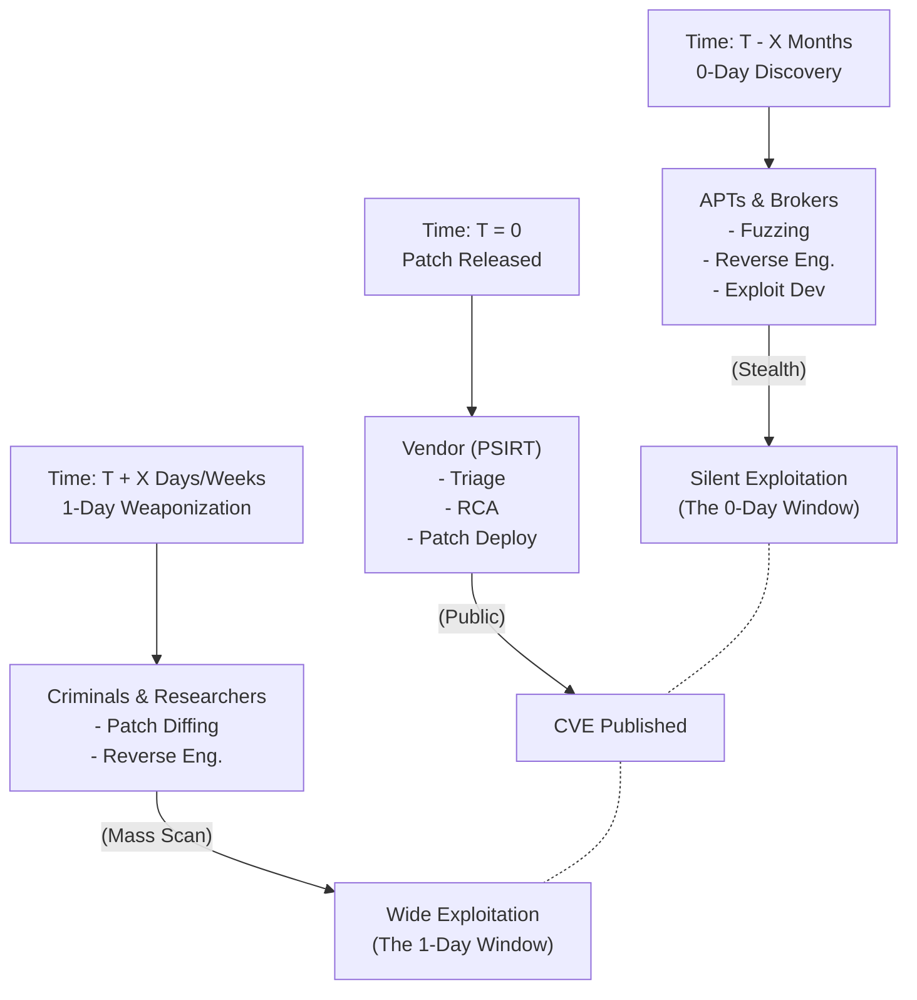

# 1-Day vs 0-Day Research Concepts

## 1. Defining the Threat Landscape
In vulnerability research and threat intelligence, vulnerabilities and their associated exploits are categorized by the temporal relationship between discovery, vendor awareness, and patch availability.

- **0-Day (Zero-Day):** A vulnerability unknown to the software vendor. There is zero days of notice to patch it. Defenders have no official remediation, making 0-days highly prized by nation-states and Advanced Persistent Threats (APTs).
- **1-Day (One-Day):** A vulnerability that has been publicly disclosed and a patch is available. The "1-day" refers to the period immediately following patch release. Attackers reverse-engineer the patch to create an exploit before organizations have time to apply the update.
- **N-Day:** A known vulnerability where a patch has been available for a significant time (months or years). N-days are the primary attack vectors for commodity malware, ransomware affiliates, and opportunistic attackers who prey on poor patch management.
- **Half-Day:** A colloquial term for a vulnerability whose details have been partially leaked or are known in private circles, but a patch is not yet widely distributed.

## 2. The Anatomy of a 0-Day Vulnerability

The lifecycle of a 0-day is a closely guarded process involving immense technical skill and financial resources.

### Discovery Methods
- **Fuzzing:** Automated testing technique where massively parallelized systems feed malformed inputs into target software to trigger crashes. Tools like AFL++, libFuzzer, and Syzkaller are used heavily by both researchers and Google Project Zero.
- **Symbolic Execution & Taint Analysis:** Advanced static/dynamic analysis utilizing SMT solvers (like Z3 via tools like KLEE or angr) to mathematically explore all execution paths of a program to find states that violate security constraints.
- **Manual Source Code Review & Auditing:** Highly skilled researchers reading complex codebases (e.g., browser JavaScript engines, OS kernels) to find subtle logic flaws or memory corruption issues that automated tools miss.

### Weaponization
Finding a crash is only 10% of the work. Weaponization transforms a crash into a reliable exploit primitive:
- **Memory Leaks:** Bypassing Address Space Layout Randomization (ASLR) by reading pointers from memory.
- **Arbitrary Read/Write (ARW):** Escalating a bug into the ability to read and write anywhere in memory.
- **Code Execution:** Utilizing Return-Oriented Programming (ROP) or Jump-Oriented Programming (JOP) to bypass Data Execution Prevention (DEP/NX) and execute shellcode.

## 3. The Economics of Exploit Acquisition

0-days are commodities. A thriving market exists for the acquisition and sale of these exploits.
- **Exploit Brokers:** Companies like Zerodium and Crowdfense purchase 0-days from independent researchers and sell them to government intelligence agencies or law enforcement.
- **Pricing:** Prices dictate the market focus. A 0-click, remote code execution (RCE) chain for iOS or Android can sell for upwards of $2,500,000. A local privilege escalation (LPE) in Windows might fetch $80,000. 
- **Pwn2Own:** An annual hacking competition run by the Zero Day Initiative (ZDI) where researchers demonstrate 0-days against targets like Tesla, Safari, and Windows, receiving huge cash prizes and prestige, while ZDI handles the CVD process with the vendors.

## 4. The Anatomy of a 1-Day Exploit

The 1-day lifecycle begins the second a vendor issues a patch. This triggers a race condition between network defenders (applying the patch) and attackers (reverse-engineering the patch).

### The Window of Exposure
Even in highly mature organizations, the time-to-patch is rarely instantaneous. Testing the patch for stability, navigating change advisory boards (CABs), and scheduling downtime takes days or weeks. This "Window of Exposure" is highly lucrative for attackers.

### The Weaponization Process
Attackers acquire the patch and use binary diffing tools (like BinDiff or Diaphora) to compare it against the vulnerable version. As detailed in patch diffing methodologies, isolating the specific block of code altered by the developer provides the exact location and conditions of the vulnerability. The attacker then constructs an exploit to trigger that specific code path. 
Because the vendor has already confirmed the vulnerability exists (via the patch release), the attacker has a guaranteed target.

## 5. Exploit Mitigations and Bypasses

Modern operating systems deploy numerous mitigations to complicate both 0-day and 1-day weaponization. Research constantly oscillates between new mitigations and new bypasses.

- **ASLR (Address Space Layout Randomization):** Randomizes memory locations. *Bypass:* Memory leaks, side-channel attacks, or finding non-randomized modules.
- **DEP / NX (Data Execution Prevention / No-eXecute):** Prevents execution of data pages (like the stack/heap). *Bypass:* ROP/JOP chains reusing existing executable code.
- **CFI (Control Flow Integrity):** Validates indirect jumps and calls to prevent ROP. *Bypass:* Bending control flow along valid but unintended paths (Data-Oriented Programming).
- **PAC (Pointer Authentication Codes):** ARM64 mitigation (used heavily in iOS) that cryptographically signs pointers. *Bypass:* Finding primitives to forge signatures or exploiting memory corruption prior to pointer verification.
- **Hardware Mitigations (MTE, CET):** Memory Tagging Extensions (ARM) and Control-flow Enforcement Technology (Intel) represent the next frontier, attempting to kill entire classes of memory corruption (like UAF) at the hardware level.

## 6. N-Day Exploitation and Threat Actors

While 0-days are the domain of elites, N-days are the lifeblood of the broader cybercriminal ecosystem.
- **Initial Access Brokers (IABs):** Actors who specialize in mass-scanning the internet for vulnerable VPNs, firewalls, and RDP servers (e.g., Citrix Bleed, Fortinet vulnerabilities) using weaponized 1-days or N-days. They compromise the perimeter and sell access to Ransomware-as-a-Service (RaaS) affiliates.
- **Patch Management Failures:** The persistence of N-days relies on organizational debt. Legacy systems that cannot be patched, forgotten shadow IT, and fear of breaking production systems keep N-day exploits viable for years after their initial release.

## 7. Chaining Opportunities

- 0-day research heavily involves the complexities of the [[11 - Vulnerability Disclosure Process]], forcing researchers to choose between lucrative broker sales, CVD, or bug bounty platforms.
- 1-day weaponization is entirely dependent on the skills detailed in [[13 - Patch Diffing Finding Vulns]].
- When 1-days and 0-days are utilized in the wild by threat actors, defenders rely on network monitoring and endpoint detection to generate [[15 - IOCs Indicators of Compromise]] to block the attacks.

## 8. Related Notes
- [[11 - Vulnerability Disclosure Process]]
- [[12 - Bug Bounty Programs HackerOne Bugcrowd Intigriti]]
- [[13 - Patch Diffing Finding Vulns]]
- [[15 - IOCs Indicators of Compromise]]
- [[16 - Exploit Development Memory Corruption]]
