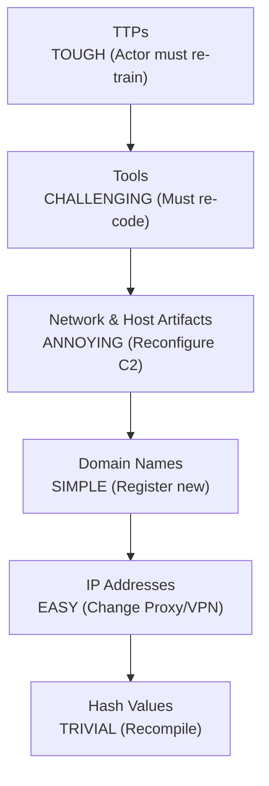

# Indicators of Compromise (IOCs)

## 1. Introduction to Indicators of Compromise (IOCs)
Indicators of Compromise (IOCs) are forensic artifacts, observable data points, or specific network behaviors that serve as high-fidelity evidence that a computer network or host system has been breached. They are the fundamental building blocks of reactive threat intelligence, incident response (IR), and digital forensics.

When a breach occurs, analysts extract these artifacts and ingest them into Security Information and Event Management (SIEM) systems, Endpoint Detection and Response (EDR) platforms, and firewalls. By matching these specific indicators against incoming traffic or host telemetry, defenders can detect malicious activity, trace the scope of an intrusion, and attribute attacks to specific threat actors.

## 2. The Pyramid of Pain

The "Pyramid of Pain," conceptualized by David Bianco, is a critical model for understanding the effectiveness of different IOCs. It measures how much "pain" (difficulty) an adversary experiences when a defender successfully denies them the use of a specific indicator.



### Breakdown of the Pyramid
1. **Hash Values (Trivial):** SHA-256, MD5 hashes of malicious binaries. These are exact matches. If an attacker flips a single bit in their malware, the hash changes entirely. Useless for long-term detection.
2. **IP Addresses (Easy):** The source IP of an attack or the destination of a Command & Control (C2) callback. Attackers use botnets, Tor, or fast-flux hosting, making IP blocking a constant game of whack-a-mole.
3. **Domain Names (Simple):** Domains used for phishing or C2 (e.g., `update-microsoft-auth.com`). Attackers register these in bulk via Domain Generation Algorithms (DGA) or bulletproof hosters.
4. **Network & Host Artifacts (Annoying):** User-Agent strings, specific HTTP URI patterns, dropped registry keys, or created mutexes. Changing these requires the attacker to slightly alter their operational setup.
5. **Tools (Challenging):** Identifying the specific tools used, like Mimikatz, Cobalt Strike, or BloodHound. Defenders hunt for tool-specific signatures. To bypass this, attackers must write custom tooling, which is expensive and time-consuming.
6. **TTPs - Tactics, Techniques, and Procedures (Tough):** The highest level of intelligence. This defines *how* the attacker operates (e.g., "Pass-the-Hash for lateral movement" or "WMI for execution"). Changing TTPs requires the attacker to learn entirely new methodologies and re-train their operators.

## 3. Categorization of IOCs

IOCs are broadly classified into three categories:

- **Atomic IOCs:** Pieces of data that cannot be broken down further while retaining their meaning in the context of an intrusion (e.g., an IP address, an email address, or a file hash).
- **Computed IOCs:** Data built from a specific incident that involves some calculation or logic (e.g., a regex pattern matching a specific log entry, or a complex YARA rule).
- **Behavioral IOCs:** Collections of atomic and computed indicators combined with logical conditions to describe a behavior (e.g., a process spawning `cmd.exe` making a network connection to an external IP, followed by large outbound data transfers).

## 4. Host-Based vs. Network-Based IOCs

Understanding where to deploy detection mechanisms requires differentiating between host and network artifacts.

### Host-Based Artifacts
Found on the endpoint operating system.
- **File System:** Malicious executables dropped in `C:\Windows\Temp`, unexpected hidden files, or modified system files.
- **Registry Keys:** Persistence mechanisms (e.g., Run keys, AppInit_DLLs) or configuration data stored by malware.
- **Memory Artifacts:** Injected shellcode, hollowed processes, or specific mutexes used by malware to prevent multiple infections on the same host.
- **Event Logs:** Cleared Security event logs, abnormal Service Creation events (Event ID 7045), or specific PowerShell execution policies.

### Network-Based Artifacts
Found via packet capture (PCAP), firewall logs, or proxy logs.
- **C2 Beacons:** Regular, periodic outbound connections to unknown IP addresses with small, consistent payload sizes (jitter and sleep patterns).
- **Protocol Anomalies:** HTTP traffic operating over non-standard ports (e.g., HTTP over port 443 instead of TLS), or abnormally large DNS TXT records indicating DNS tunneling.
- **Signatures:** Specific byte sequences in network payloads that match known exploit attempts (e.g., Snort or Suricata rules triggering on Log4j JNDI lookup strings).

## 5. IOC Representation and Frameworks

To facilitate machine-to-machine sharing of threat intelligence, structured formats are utilized.

### STIX and TAXII
- **STIX (Structured Threat Information Expression):** A standardized XML/JSON language for representing threat intelligence. It allows organizations to define threat actors, campaigns, observables (IOCs), and courses of action.
- **TAXII (Trusted Automated eXchange of Intelligence Information):** The transport mechanism used to transmit STIX data over HTTPS. SIEMs subscribe to TAXII feeds to automatically ingest STIX-formatted IOCs.

*Example STIX 2.1 JSON Snippet representing a Malicious File:*
```json
{
  "type": "file",
  "id": "file--e277603e-424b-5bf4-996b-6325997b5e40",
  "hashes": {
    "SHA-256": "8a0a91e5...[truncated]...a9b3d"
  },
  "name": "malicious_payload.exe"
}
```

### MISP (Malware Information Sharing Platform)
An open-source threat intelligence platform widely used by CERTs and the infosec community. MISP allows analysts to create "Events" containing numerous attributes (IOCs), tag them using the MITRE ATT&CK framework, and share them in real-time with trusted partners.

## 6. Yara Rules for IOC Matching

YARA is the "pattern matching swiss knife" for malware researchers. It allows analysts to write rules based on textual or binary patterns to identify specific malware families or exploit payloads.

*Example YARA Rule for a generic Web Shell:*
```yara
rule Generic_PHP_WebShell {
    meta:
        description = "Detects basic PHP execution payloads"
        author = "Threat Intel Team"
        date = "2026-06-09"
    strings:
        $cmd1 = "shell_exec(" ascii
        $cmd2 = "system(" ascii
        $cmd3 = "passthru(" ascii
        $b64  = "base64_decode" ascii
        $evl  = "eval(" ascii
    condition:
        ($b64 and $evl) or 2 of ($cmd*)
}
```

## 7. Threat Hunting with IOCs

Threat Hunting is the proactive search for adversaries who have evaded traditional security controls.
- **Retroactive Hunting:** When a new intelligence report is published containing fresh IOCs, hunters search historical SIEM logs to determine if the organization was compromised in the past.
- **Limitations:** Relying purely on atomic IOCs (hashes/IPs) results in high false negatives. Advanced threat hunting focuses on the top of the Pyramid of Pain—hunting for TTPs (e.g., searching for abnormal parent-child process relationships) rather than static indicators.

## 8. Transitioning to Indicators of Attack (IOAs)
While IOCs focus on *what* happened (reactive), Indicators of Attack (IOAs) focus on the *intent* of what is happening (proactive). An IOA might be a series of commands designed to execute a stealthy data exfiltration, regardless of the specific IP or hash used. Modern EDRs are increasingly shifting focus from IOC matching to IOA behavioral analysis.

## 9. Chaining Opportunities
- The discovery of new 0-days or 1-days during [[14 - 1-Day vs 0-Day Research Concepts]] directly fuels the creation of fresh IOCs distributed to defenders.
- Researchers utilizing [[13 - Patch Diffing Finding Vulns]] often extract highly specific binary patterns that are translated into YARA rules (Computed IOCs).
- Organizations mature their security posture by feeding IOCs discovered during incident response back into their [[02 - Application Security Posture Management (ASPM)]] frameworks.

## 10. Related Notes
- [[11 - Vulnerability Disclosure Process]]
- [[13 - Patch Diffing Finding Vulns]]
- [[14 - 1-Day vs 0-Day Research Concepts]]
- [[02 - Application Security Posture Management (ASPM)]]
- [[16 - Exploit Development Memory Corruption]]
