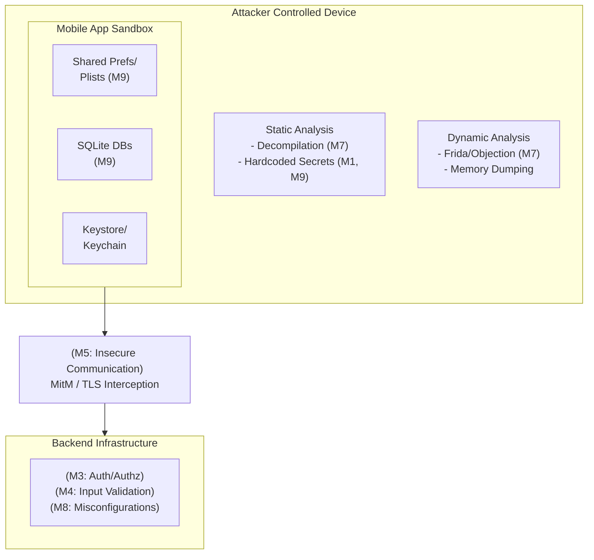

# OWASP Mobile Top 10 Walkthrough

## Executive Summary
The OWASP Mobile Top 10 maps the most critical security risks facing mobile applications on iOS and Android platforms. Unlike web applications where the attack surface is primarily server-side, mobile applications present a unique hybrid attack surface. Attackers have full control over the client environment—they can decompile the binary, manipulate the local file system, intercept network traffic, and attach debuggers to runtime processes. This requires a distinctly different threat modeling approach.

## Mobile Architecture and Attack Surface ASCII Diagram

## Deep Dive into the Mobile Top 10
*(Note: Referencing the latest industry-recognized OWASP Mobile Top 10 categories, frequently updated through the OWASP MAS project).*

### M1: Improper Credential Usage
Mobile apps frequently need to authenticate with backend APIs, third-party services, and local databases. Improper handling of these credentials is a massive risk.
- **Attack Scenarios**:
  - Hardcoding API keys, AWS credentials, or symmetric encryption keys directly into the source code.
  - Storing user passwords in plaintext within `SharedPreferences` (Android) or `NSUserDefaults` (iOS).
- **Remediation**:
  - Never hardcode credentials in the codebase.
  - Use the platform's secure storage mechanisms: Android Keystore and iOS Keychain.

### M2: Inadequate Supply Chain Security
Modern mobile apps rely heavily on third-party SDKs, libraries, and frameworks (e.g., analytics, ad networks, payment processors).
- **Attack Scenarios**:
  - A malicious third-party SDK is included in the app, secretly exfiltrating user location data or clipboard contents.
  - Vulnerable open-source libraries are compiled into the binary, exposing the app to known CVEs.
- **Remediation**:
  - Maintain a strict Software Bill of Materials (SBOM) for mobile apps.
  - Regularly audit and update third-party dependencies.

### M3: Insecure Authentication/Authorization
This relates to failures in how the mobile app verifies the user's identity and permissions, both locally and server-side.
- **Attack Scenarios**:
  - The app relies on local PIN validation (e.g., verifying a 4-digit PIN purely on the client side) which can be bypassed using Frida or runtime hooking.
  - The mobile app sends device IMEI or MAC address as the sole identifier for API authentication.
- **Remediation**:
  - Ensure all critical authentication and authorization decisions occur server-side.
  - If using biometrics (TouchID/FaceID), use cryptographic binding (e.g., CryptoObject in Android) rather than simple boolean checks.

### M4: Insufficient Input/Output Validation
Mobile apps accept input from various sources: UI forms, IPC (Intents, Custom URL schemes), and API responses.
- **Attack Scenarios**:
  - **Cross-Site Scripting (XSS)** in mobile WebViews because untrusted data is rendered without encoding.
  - **SQL Injection** in the local SQLite database via malicious user input.
  - Malicious applications sending crafted Intents (Android) to exported activities to trigger unintended actions.
- **Remediation**:
  - Validate and sanitize all input, regardless of the source (including IPC mechanisms).
  - Use parameterized queries for all local SQLite database operations.

### M5: Insecure Communication
Mobile apps transmit highly sensitive data across wireless networks, making them prime targets for interception.
- **Attack Scenarios**:
  - Transmitting data over plaintext HTTP.
  - The app uses HTTPS but fails to validate the server certificate, allowing an attacker on public Wi-Fi to execute a Man-in-the-Middle (MitM) attack using a proxy like Burp Suite.
- **Remediation**:
  - Enforce TLS for all communications.
  - Implement **SSL Certificate Pinning** to ensure the app only communicates with the specific, trusted backend server, rejecting interception proxies.

### M6: Inadequate Privacy Controls
Failure to protect Personally Identifiable Information (PII) leading to privacy violations and regulatory non-compliance.
- **Attack Scenarios**:
  - The application logs sensitive PII (credit card numbers, passwords) to the system log (`logcat` on Android, `syslog` on iOS).
  - The application takes a screenshot when pushed to the background (for the task switcher), inadvertently exposing sensitive data on the screen.
- **Remediation**:
  - Strip all debug logs in production builds.
  - Implement screen blurring or blanking when the application enters the background lifecycle state.

### M7: Insufficient Binary Protection
An attacker can analyze, reverse engineer, and modify the application binary.
- **Attack Scenarios**:
  - Decompiling an APK to recover source code, identifying backend API endpoints, hidden parameters, and business logic flaws.
  - Repackaging the app with a malicious payload (trojanizing) and distributing it on third-party app stores.
  - Attaching dynamic instrumentation tools (Frida) to bypass local security controls at runtime.
- **Remediation**:
  - Apply code obfuscation (e.g., ProGuard/R8 on Android) to increase reverse engineering difficulty.
  - Implement runtime protections: Root/Jailbreak detection, anti-debugging, and emulator detection.

### M8: Security Misconfiguration
Misconfigurations in the project settings, manifest files, or backend infrastructure.
- **Attack Scenarios**:
  - Setting `android:debuggable="true"` in the manifest of a production build.
  - Exporting components (Activities, Services, Content Providers) that should be strictly internal.
  - Permitting arbitrary loads in iOS (`NSAllowsArbitraryLoads` set to true in `Info.plist`).
- **Remediation**:
  - Utilize automated CI/CD checks to ensure debug flags are disabled for release builds.
  - explicitly set `android:exported="false"` for internal components.

### M9: Insecure Data Storage
Attackers physically accessing a lost/stolen device, or malware operating on the device, extracting stored data.
- **Attack Scenarios**:
  - Storing auth tokens or PII unencrypted in SQLite databases or Realm databases.
  - Saving sensitive files to external storage (SD card on Android), which is globally readable by any app with the `READ_EXTERNAL_STORAGE` permission.
- **Remediation**:
  - Encrypt all local databases (e.g., SQLCipher).
  - Store sensitive files exclusively in the app's internal sandbox.

### M10: Insufficient Cryptography
Flaws in the application's cryptographic implementation.
- **Attack Scenarios**:
  - Using deprecated algorithms like RC4, MD5, or SHA1.
  - Using AES but utilizing static, hardcoded Initialization Vectors (IVs) or weak modes like ECB (Electronic Codebook).
  - Relying on weak PRNGs (Pseudo-Random Number Generators) for critical token generation.
- **Remediation**:
  - Use modern algorithms (AES-GCM, SHA-256 or better).
  - Ensure cryptographic operations are handled by the platform's trusted secure enclaves (e.g., Android Keystore, iOS Secure Enclave).

## Chaining Opportunities
- **M7 (Insufficient Binary Protection) + M1 (Improper Credential Usage)**: Decompiling the mobile app using `jadx` to extract hardcoded AWS keys, allowing full compromise of the backend infrastructure.
- **M8 (Misconfiguration - Exported Component) + M4 (Input Validation)**: Identifying an exported Android component that parses URL schemas, and sending a maliciously crafted intent to trigger a local SQL injection or XSS in a WebView.
- **M5 (Insecure Communication) + M3 (Insecure Auth)**: Bypassing missing SSL Pinning to intercept traffic, stealing session tokens, and subsequently interacting with the backend API to extract user data.

## Related Notes
- [[01 - OWASP Top 10 2021 Full Walkthrough]]
- [[04 - OWASP Testing Guide OTG Web Application]]
- [[15 - Mobile Application Penetration Testing Methodology]]
- [[16 - SSL Pinning Bypass Techniques]]
- [[17 - Introduction to Frida and Dynamic Instrumentation]]
