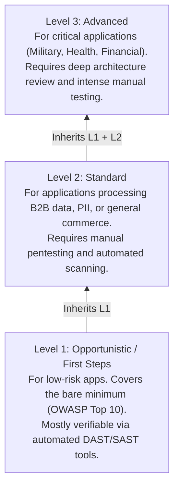

# OWASP Application Security Verification Standard (ASVS) Full Walkthrough

## Executive Summary
The OWASP Application Security Verification Standard (ASVS) provides a basis for testing web application technical security controls and provides developers with a list of requirements for secure development. 

While the OWASP Top 10 focuses on the most critical risks (what *not* to do), and the WSTG focuses on testing methodologies (how to *find* the bugs), the ASVS acts as a highly granular blueprint of security requirements (what you *must* do). It is widely used for creating Secure Software Development Lifecycles (SSDLC), guiding code reviews, and setting contractual security requirements during software procurement.

## ASCII Architecture Diagram of ASVS Levels

## The ASVS Verification Levels

### ASVS Level 1: Opportunistic
Level 1 is the starting point. It covers the fundamental security vulnerabilities that are relatively easy to discover and exploit (e.g., OWASP Top 10 vulnerabilities). 
- **Target Audience**: All applications, regardless of sensitivity.
- **Verification Method**: Can be largely achieved through automated tools (SAST/DAST) with minimal manual effort.

### ASVS Level 2: Standard
Level 2 is the recommended security baseline for the vast majority of applications today. It defends against most of the risks associated with software today.
- **Target Audience**: Applications handling significant B2B transactions, sensitive PII, healthcare data, or applications mandated by compliance frameworks (PCI-DSS, HIPAA).
- **Verification Method**: Requires automated scanning paired heavily with manual penetration testing and business logic review.

### ASVS Level 3: Advanced
Level 3 is the highest level of security verification. It requires a highly secure architecture and deep security integration at every layer.
- **Target Audience**: Critical infrastructure, military, top-tier financial platforms, and life-critical applications.
- **Verification Method**: Requires comprehensive threat modeling, extensive manual penetration testing, deep code review, and architectural analysis.

## Deep Dive into ASVS Verification Requirements (V-Categories)

The ASVS is broken down into 14 chapters (V-Categories), each containing specific, testable requirements.

### V1: Architecture, Design and Threat Modeling Requirements
Focuses on ensuring the application is secure by design.
- **Key Concepts**: Implementing a secure development lifecycle, utilizing threat modeling, maintaining strict separation of components, and managing secrets securely outside the codebase.

### V2: Authentication Verification Requirements
Verifies that the application securely establishes the user's identity.
- **Key Concepts**: Enforcing strong password policies (aligning with NIST 800-63b, avoiding arbitrary composition rules, checking against breached password lists), implementing robust MFA, and securing the credential recovery workflow.

### V3: Session Management Verification Requirements
Ensures that after authentication, the user's state is securely maintained.
- **Key Concepts**: Using cryptographically strong session identifiers, implementing absolute and idle timeouts, securing cookies with `HttpOnly`, `Secure`, and `SameSite` flags, and preventing session fixation.

### V4: Access Control Verification Requirements
Validates that users can only access data and functions they are authorized to use.
- **Key Concepts**: Enforcing a "deny by default" policy, preventing Insecure Direct Object References (IDOR), and implementing strict Role-Based Access Control (RBAC) or Attribute-Based Access Control (ABAC).

### V5: Validation, Sanitization and Encoding Verification Requirements
Ensures all input is validated and all output is encoded to prevent injection attacks.
- **Key Concepts**: Implementing positive ("whitelist") input validation, utilizing parameterized queries for SQL, escaping output contextually to prevent XSS, and securely handling file uploads (verifying headers, renaming files, executing in sandboxes).

### V6: Stored Cryptography Verification Requirements
Focuses on protecting data at rest.
- **Key Concepts**: Classifying data, using modern cryptographic algorithms (AES-GCM, RSA-2048+), securely managing the lifecycle of cryptographic keys, and avoiding custom cryptographic implementations.

### V7: Error Handling and Logging Verification Requirements
Verifies that the application logs critical events securely and fails gracefully.
- **Key Concepts**: Logging all authentication and access control failures, preventing log injection by sanitizing inputs, and ensuring stack traces and sensitive system details are never exposed to the end user.

### V8: Data Protection Verification Requirements
Ensures data is protected from unauthorized access or leakage.
- **Key Concepts**: Preventing caching of sensitive data in the browser (using `Cache-Control: no-store`), clearing sensitive data from memory securely, and minimizing data retention.

### V9: Communications Verification Requirements
Validates the security of data in transit.
- **Key Concepts**: Enforcing TLS 1.2 or higher everywhere, disabling weak ciphers, and utilizing HTTP Strict Transport Security (HSTS) and Certificate Pinning for high-security applications.

### V10: Malicious Code Verification Requirements
Ensures the application is free from backdoors, time bombs, or malicious dependencies.
- **Key Concepts**: Utilizing Software Composition Analysis (SCA) to detect known vulnerabilities in third-party libraries, and reviewing source code for logic bombs or unauthorized administrative backdoors.

### V11: Business Logic Verification Requirements
Addresses flaws in the application's core functionality.
- **Key Concepts**: Preventing workflow bypasses, defending against automated attacks and anti-scalping mechanisms, and ensuring sequential logic steps cannot be skipped.

### V12: File and Resources Verification Requirements
Ensures the application securely interacts with files and network resources.
- **Key Concepts**: Defending against Server-Side Request Forgery (SSRF) using allow-lists, and preventing Local File Inclusion (LFI) and path traversal attacks.

### V13: API and Web Service Verification Requirements
Specifically targets REST, SOAP, and GraphQL interfaces.
- **Key Concepts**: Validating API schemas, enforcing strict content-type handling, implementing rate limiting, and ensuring APIs implement the same robust authentication and authorization as the main application.

### V14: Configuration Verification Requirements
Ensures the infrastructure, web servers, and application frameworks are hardened.
- **Key Concepts**: Disabling unused ports and services, utilizing robust Security Headers (CSP, X-Frame-Options), and ensuring default passwords and configurations are changed before production deployment.

## Chaining Opportunities & Practical Application
- **Using ASVS in Procurement**: Organizations frequently use ASVS Level 2 as an appendix in vendor contracts. A vendor must provide a third-party pentest report validating that the application meets all Level 2 requirements before purchase.
- **ASVS + Threat Modeling**: Using V1 (Architecture) during the design phase to identify the need for V4 (Access Control) and V5 (Input Validation) controls early, significantly reducing the cost of fixing vulnerabilities post-deployment.

## Related Notes
- [[01 - OWASP Top 10 2021 Full Walkthrough]]
- [[04 - OWASP Testing Guide OTG Web Application]]
- [[20 - Secure Software Development Lifecycle SSDLC]]
- [[21 - NIST 800-63b Digital Identity Guidelines]]
