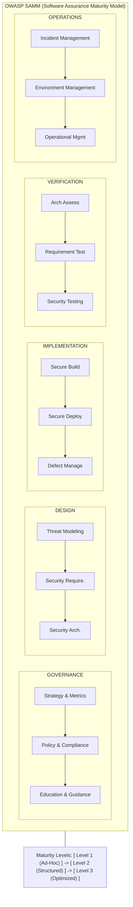

# OWASP SAMM (Software Assurance Maturity Model)

## 1. Introduction to SAMM
The **OWASP Software Assurance Maturity Model (SAMM)** is an open framework intended to help organizations formulate and implement a tailored strategy for software security. Unlike generic security models, SAMM provides an effective and measurable way to analyze and improve the software security posture.

SAMM is highly flexible and can be customized to any organizational context, whether you are utilizing Agile, DevOps, or traditional Waterfall development methods.

### Core Objectives:
*   Evaluate an organization's existing software security practices.
*   Build a balanced software security assurance program in iterative chunks.
*   Demonstrate concrete improvements to a security assurance program over time.
*   Define and measure security-related activities throughout the software lifecycle.

---

## 2. SAMM Architectural Diagram
The following ASCII diagram illustrates the core components and structure of the SAMM framework, highlighting its tiered, hierarchical layout.

---

## 3. The Five Business Functions

SAMM v2 organizes software security into five core Business Functions. Each Business Function contains three Security Practices.

### 3.1 Governance
Governance focuses on the processes and activities necessary to manage, direct, and control the software security initiative (SSI).
*   **Strategy & Metrics**: Establishing the overall plan and measuring its success.
    *   *Stream A:* Create and Promote (Building the roadmap).
    *   *Stream B:* Measure and Improve (KPIs and metrics).
*   **Policy & Compliance**: Understanding and adhering to external regulatory and internal policy constraints.
    *   *Stream A:* Policy and Standards.
    *   *Stream B:* Compliance Management.
*   **Education & Guidance**: Equipping personnel with the knowledge necessary to build secure software.
    *   *Stream A:* Training and Awareness.
    *   *Stream B:* Organization and Culture.

### 3.2 Design
Design relates to the processes of defining security goals and architectural constraints for the software.
*   **Threat Modeling**: Identifying and understanding potential risks.
    *   *Stream A:* Application Risk Profile.
    *   *Stream B:* Threat Architecture.
*   **Security Requirements**: Specifying necessary security controls.
    *   *Stream A:* Software Requirements.
    *   *Stream B:* Supplier Security (Third-party risks).
*   **Security Architecture**: Establishing structural security patterns.
    *   *Stream A:* Architecture Design.
    *   *Stream B:* Technology Management.

### 3.3 Implementation
Implementation encompasses building and deploying software securely.
*   **Secure Build**: Creating a repeatable, secure build process.
    *   *Stream A:* Build Process.
    *   *Stream B:* Software Dependencies (e.g., SCA, SBOM).
*   **Secure Deployment**: Transferring the software into production securely.
    *   *Stream A:* Deployment Process.
    *   *Stream B:* Secret Management.
*   **Defect Management**: Tracking and mitigating vulnerabilities.
    *   *Stream A:* Defect Tracking.
    *   *Stream B:* Metrics and Feedback.

### 3.4 Verification
Verification focuses on checking that the software meets security requirements and expectations.
*   **Architecture Assessment**: Reviewing the design and architecture.
    *   *Stream A:* Architecture Validation.
    *   *Stream B:* Mitigation Review.
*   **Requirements Testing**: Testing for positive security controls.
    *   *Stream A:* Control Verification.
    *   *Stream B:* Misuse/Abuse Testing.
*   **Security Testing**: Discovering latent vulnerabilities (SAST, DAST, IAST, Pen Testing).
    *   *Stream A:* Scalable Baseline.
    *   *Stream B:* Deep Understanding.

### 3.5 Operations
Operations involve securing the running application and underlying environment.
*   **Incident Management**: Detecting and responding to security events.
    *   *Stream A:* Incident Detection.
    *   *Stream B:* Incident Response.
*   **Environment Management**: Securing the hosting infrastructure.
    *   *Stream A:* Configuration Hardening.
    *   *Stream B:* Patching and Updating.
*   **Operational Management**: Handling operational security processes.
    *   *Stream A:* Data Protection.
    *   *Stream B:* System Decommissioning.

---

## 4. Maturity Levels

For each Security Practice, SAMM defines three maturity levels. These levels measure the depth, consistency, and formalization of security activities.

*   **Level 0 (Implicit):** No formal process. Ad-hoc security efforts, if any.
*   **Level 1 (Initial / Ad-hoc):** The practice is performed reactively or opportunistically. There is a basic understanding of the practice, but execution lacks structure and documentation.
*   **Level 2 (Structured / Managed):** The practice is well-defined, formalized, documented, and applied consistently across the organization or project.
*   **Level 3 (Optimized / Comprehensive):** The practice is fully integrated, automated where possible, and continuously improved based on metrics and feedback loops.

---

## 5. How to Implement OWASP SAMM

Implementing SAMM is an iterative process. Organizations should not attempt to reach Level 3 across all practices simultaneously. Instead, they should follow a structured lifecycle.

### Step 1: Preparation
*   Identify the scope (e.g., a specific business unit or the entire organization).
*   Secure executive sponsorship.
*   Understand organizational constraints (budget, resources, culture).

### Step 2: Assessment
*   Conduct interviews with key stakeholders (developers, operations, management).
*   Use the SAMM Assessment Tool (available in Excel or web app format) to score the current maturity level for each practice.
*   Document evidence for each score to establish a credible baseline.

### Step 3: Target Definition
*   Define a realistic target maturity state.
*   Align targets with organizational risk appetite and compliance requirements.
*   Example: A healthcare company might target Level 3 in *Data Protection* and *Compliance Management*, but accept Level 1 in *Threat Modeling* for legacy applications.

### Step 4: Roadmap Planning
*   Develop a phased action plan (typically divided into 3-6 month phases).
*   Identify specific, actionable tasks required to move from the current state to the target state.
*   Allocate necessary budget, tools, and personnel.

### Step 5: Implementation & Rollout
*   Execute the roadmap tasks.
*   Integrate security activities into existing development workflows (e.g., embedding SAST tools in the CI/CD pipeline, establishing a security champions program).

### Step 6: Measurement & Evolution
*   Periodically re-assess maturity using the SAMM tool (e.g., annually).
*   Track Key Performance Indicators (KPIs) such as vulnerability density, time to remediation, and training completion rates.
*   Adjust the roadmap based on changing business needs and threat landscapes.

---

## 6. SAMM and DevSecOps Integration

Modern development relies heavily on DevSecOps. SAMM maps directly to DevSecOps pipelines:

1.  **Plan:** Aligns with *Governance* and *Security Requirements*.
2.  **Code/Build:** Aligns with *Secure Build* (SAST, SCA).
3.  **Deploy:** Aligns with *Secure Deployment* and *Environment Management* (IaC scanning, secret management).
4.  **Operate/Monitor:** Aligns with *Operations* (WAF, SIEM integration, DAST).

By automating SAMM activities (e.g., automated defect tracking, CI/CD security gating), organizations can achieve Level 2 and Level 3 maturity efficiently.

---

## 7. Chaining Opportunities

While SAMM is a governance framework rather than an attack technique, assessing an organization's SAMM maturity can reveal systemic weaknesses:
*   **Low "Secure Build" Maturity:** Indicates a high probability of finding vulnerable dependencies, leading to potential supply chain attacks or exploitation via known CVEs (e.g., chaining an outdated library with an RCE exploit).
*   **Low "Secret Management" Maturity:** Suggests that sensitive credentials might be hardcoded in source code or poorly protected in deployment scripts, facilitating privilege escalation.
*   **Low "Architecture Assessment" Maturity:** Highlights a potential lack of structural security, making the application vulnerable to fundamental design flaws like broken trust boundaries or lack of defense-in-depth.

---

## 8. Related Notes
*   [[07 - OWASP WSTG Testing Checklist]] - Deep dive into tactical testing.
*   [[08 - OWASP Cheat Sheet Series Key Sheets]] - Tactical implementation of secure coding standards.
*   [[09 - OWASP Dependency-Check]] - Implementing the *Secure Build* practice.
*   [[10 - OWASP ModSecurity CRS WAF Rules]] - Implementing the *Environment Management* practice.
*   [[01 - Threat Modeling Frameworks]] - Expanding on the *Design* business function.
