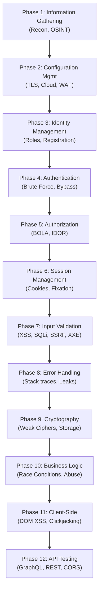

# OWASP WSTG (Web Security Testing Guide) Checklist

## 1. Introduction to OWASP WSTG
The **OWASP Web Security Testing Guide (WSTG)** is the premier cybersecurity testing resource for web application developers and security professionals. It provides a comprehensive framework of best practices used by penetration testers and organizations globally.

The WSTG outlines a rigorous, repeatable methodology that spans the entire testing lifecycle, ensuring that web applications are thoroughly evaluated for vulnerabilities ranging from misconfigurations to complex business logic flaws.

### Objectives of the WSTG:
*   Provide a standardized methodology for web application penetration testing.
*   Ensure comprehensive coverage across all critical vulnerability domains.
*   Produce actionable, consistent, and reproducible test results.

---

## 2. WSTG Testing Lifecycle Diagram

The following ASCII diagram maps out the core phases of the WSTG testing methodology, moving from external reconnaissance to deep internal application logic testing.

---

## 3. Comprehensive Testing Categories & Checklist

The WSTG is divided into 12 core testing categories. Each category contains specific test cases denoted by unique identifiers (e.g., `WSTG-INFO-01`).

### 3.1 Information Gathering (WSTG-INFO)
The foundation of any penetration test. This phase involves mapping the application's attack surface without actively exploiting vulnerabilities.
*   **WSTG-INFO-01:** Conduct Search Engine Discovery and Reconnaissance (Google Dorks).
*   **WSTG-INFO-02:** Fingerprint Web Server (e.g., `Server` header, default pages).
*   **WSTG-INFO-03:** Review Webserver Metafiles for Information Leakage (`robots.txt`, `sitemap.xml`, `.well-known/`).
*   **WSTG-INFO-04:** Enumerate Applications on Webserver (Virtual host routing).
*   **WSTG-INFO-05:** Review Webpage Comments and Metadata for Information Leakage.
*   **WSTG-INFO-06:** Identify application entry points (Input vectors, hidden parameters).
*   **WSTG-INFO-07:** Map Execution Paths through Application.
*   **WSTG-INFO-08:** Fingerprint Web Application Framework.
*   **WSTG-INFO-09:** Fingerprint Web Application Architecture.

### 3.2 Configuration and Deployment Management Testing (WSTG-CONF)
Assessing the security of the infrastructure supporting the application.
*   **WSTG-CONF-01:** Test Network/Infrastructure Configuration (Ports, Services).
*   **WSTG-CONF-02:** Test Application Platform Configuration (Cloud storage, S3 buckets).
*   **WSTG-CONF-03:** Test File Extensions Handling for Sensitive Information.
*   **WSTG-CONF-04:** Review Old, Backup and Unreferenced Files for Sensitive Information.
*   **WSTG-CONF-05:** Enumerate Infrastructure and Application Admin Interfaces.
*   **WSTG-CONF-06:** Test HTTP Methods (OPTIONS, PUT, DELETE, TRACE).
*   **WSTG-CONF-07:** Test HTTP Strict Transport Security (HSTS).
*   **WSTG-CONF-08:** Test RIA Cross Domain Policy (`crossdomain.xml`, `clientaccesspolicy.xml`).
*   **WSTG-CONF-09:** Test File Permission.
*   **WSTG-CONF-10:** Test for Subdomain Takeover.
*   **WSTG-CONF-11:** Test Cloud Storage (Misconfigured ACLs).

### 3.3 Identity Management Testing (WSTG-IDNT)
Testing how the application handles users, roles, and identities.
*   **WSTG-IDNT-01:** Test Role Definitions.
*   **WSTG-IDNT-02:** Test User Registration Process.
*   **WSTG-IDNT-03:** Test Account Provisioning Process.
*   **WSTG-IDNT-04:** Testing for Account Enumeration and Guessable User Account.
*   **WSTG-IDNT-05:** Testing for Weak or unenforced username policy.

### 3.4 Authentication Testing (WSTG-ATHN)
Verifying the mechanisms used to confirm an identity.
*   **WSTG-ATHN-01:** Testing for Credentials Transported over an Encrypted Channel.
*   **WSTG-ATHN-02:** Testing for Default Credentials.
*   **WSTG-ATHN-03:** Testing for Weak Lock Out Mechanism.
*   **WSTG-ATHN-04:** Testing for Bypassing Authentication Schema.
*   **WSTG-ATHN-05:** Test Remember Password Functionality.
*   **WSTG-ATHN-06:** Testing for Browser Cache Weaknesses.
*   **WSTG-ATHN-07:** Testing for Weak Password Policy.
*   **WSTG-ATHN-08:** Testing for Weak Security Question/Answer.
*   **WSTG-ATHN-09:** Testing for Weak Password Change or Reset Functionalities.
*   **WSTG-ATHN-10:** Testing for Weaker Authentication in Alternative Channel.

### 3.5 Authorization Testing (WSTG-ATHZ)
Ensuring authenticated users only access permitted resources.
*   **WSTG-ATHZ-01:** Testing Directory Traversal/File Include.
*   **WSTG-ATHZ-02:** Testing for Bypassing Authorization Schema.
*   **WSTG-ATHZ-03:** Testing for Privilege Escalation (Horizontal and Vertical).
*   **WSTG-ATHZ-04:** Testing for Insecure Direct Object References (IDOR/BOLA).

### 3.6 Session Management Testing (WSTG-SESS)
Evaluating how the application tracks state across HTTP requests.
*   **WSTG-SESS-01:** Testing for Bypassing Session Management Schema.
*   **WSTG-SESS-02:** Testing for Cookies Attributes (Secure, HttpOnly, SameSite).
*   **WSTG-SESS-03:** Testing for Session Fixation.
*   **WSTG-SESS-04:** Testing for Exposed Session Variables.
*   **WSTG-SESS-05:** Testing for Cross Site Request Forgery (CSRF).
*   **WSTG-SESS-06:** Testing for Logout Functionality.
*   **WSTG-SESS-07:** Test Session Timeout.
*   **WSTG-SESS-08:** Testing for Session Puzzling.

### 3.7 Input Validation Testing (WSTG-INPV)
The largest category, covering vulnerabilities arising from malformed data.
*   **WSTG-INPV-01:** Testing for Reflected Cross Site Scripting.
*   **WSTG-INPV-02:** Testing for Stored Cross Site Scripting.
*   **WSTG-INPV-03:** Testing for HTTP Verb Tampering.
*   **WSTG-INPV-04:** Testing for HTTP Parameter Pollution.
*   **WSTG-INPV-05:** Testing for SQL Injection.
*   **WSTG-INPV-06:** Testing for LDAP Injection.
*   **WSTG-INPV-07:** Testing for XML Injection (XXE).
*   **WSTG-INPV-08:** Testing for SSI Injection.
*   **WSTG-INPV-09:** Testing for XPath Injection.
*   **WSTG-INPV-10:** Testing for IMAP/SMTP Injection.
*   **WSTG-INPV-11:** Testing for Code Injection.
*   **WSTG-INPV-12:** Testing for Command Injection.
*   **WSTG-INPV-13:** Testing for Buffer Overflow.
*   **WSTG-INPV-14:** Testing for Insecure Deserialization.
*   **WSTG-INPV-15:** Testing for Server-Side Template Injection (SSTI).
*   **WSTG-INPV-16:** Testing for Server-Side Request Forgery (SSRF).

### 3.8 Testing for Error Handling (WSTG-ERRH)
*   **WSTG-ERRH-01:** Testing for Improper Error Handling (Stack traces).
*   **WSTG-ERRH-02:** Testing for Stack Traces.

### 3.9 Testing for Weak Cryptography (WSTG-CRYP)
*   **WSTG-CRYP-01:** Testing for Weak SSL/TLS Ciphers, Insufficient Transport Layer Protection.
*   **WSTG-CRYP-02:** Testing for Padding Oracle.
*   **WSTG-CRYP-03:** Testing for Sensitive Information Sent via Unencrypted Channels.

### 3.10 Business Logic Testing (WSTG-BUSL)
*   **WSTG-BUSL-01:** Test Business Logic Data Validation.
*   **WSTG-BUSL-02:** Test Ability to Forge Requests.
*   **WSTG-BUSL-03:** Test Integrity Checks.
*   **WSTG-BUSL-04:** Test for Process Timing.
*   **WSTG-BUSL-05:** Test Number of Times a Function Can Be Used Limits.
*   **WSTG-BUSL-06:** Testing for the Circumvention of Work Flows.
*   **WSTG-BUSL-07:** Test Defenses Against Application Misuse.
*   **WSTG-BUSL-08:** Test Upload of Unexpected File Types.
*   **WSTG-BUSL-09:** Test Upload of Malicious Files.

### 3.11 Client-Side Testing (WSTG-CLNT)
*   **WSTG-CLNT-01:** Testing for DOM-based Cross Site Scripting.
*   **WSTG-CLNT-02:** Testing for JavaScript Execution.
*   **WSTG-CLNT-03:** Testing for HTML Injection.
*   **WSTG-CLNT-04:** Testing for Client-Side URL Redirect.
*   **WSTG-CLNT-05:** Testing for CSS Injection.
*   **WSTG-CLNT-06:** Testing for Client-Side Resource Manipulation.
*   **WSTG-CLNT-07:** Test Cross Origin Resource Sharing (CORS).
*   **WSTG-CLNT-08:** Testing for Cross Site Flashing.
*   **WSTG-CLNT-09:** Testing for Clickjacking.
*   **WSTG-CLNT-10:** Testing WebSockets.
*   **WSTG-CLNT-11:** Testing Web Messaging.

---

## 4. Execution Methodology

To execute a WSTG-aligned penetration test:

1.  **Preparation:** Define scope, obtain authorization, map business critical flows.
2.  **Execution:** Follow the checklist systematically using tools like Burp Suite Pro, OWASP ZAP, Nmap, and custom scripts.
3.  **Documentation:** As each WSTG control is tested, document the status (Pass/Fail/Not Applicable) and record evidence (HTTP requests/responses).
4.  **Reporting:** Map findings back to the WSTG IDs to provide standardized, easily understandable reports to developers.

---

## 5. Chaining Opportunities

The WSTG structured approach actively encourages vulnerability chaining by defining interconnected phases:
*   **Information Gathering + Input Validation:** Discovering hidden API endpoints (WSTG-INFO-06) often reveals unprotected parameters highly susceptible to SQL Injection (WSTG-INPV-05) or SSRF (WSTG-INPV-16).
*   **Identity Management + Business Logic:** Enumerating user accounts (WSTG-IDNT-04) combined with a lack of rate limiting (WSTG-BUSL-05) enables massive credential stuffing attacks leading to account takeover.
*   **Client-Side + Session Management:** Finding DOM XSS (WSTG-CLNT-01) can be weaponized to steal session tokens if cookies lack the `HttpOnly` flag (WSTG-SESS-02).

---

## 6. Related Notes
*   [[06 - OWASP SAMM Software Assurance Maturity Model]]
*   [[08 - OWASP Cheat Sheet Series Key Sheets]]
*   [[04 - Broken Access Control]]
*   [[05 - Cryptographic Failures]]
*   [[12 - Cross Site Scripting XSS]]
