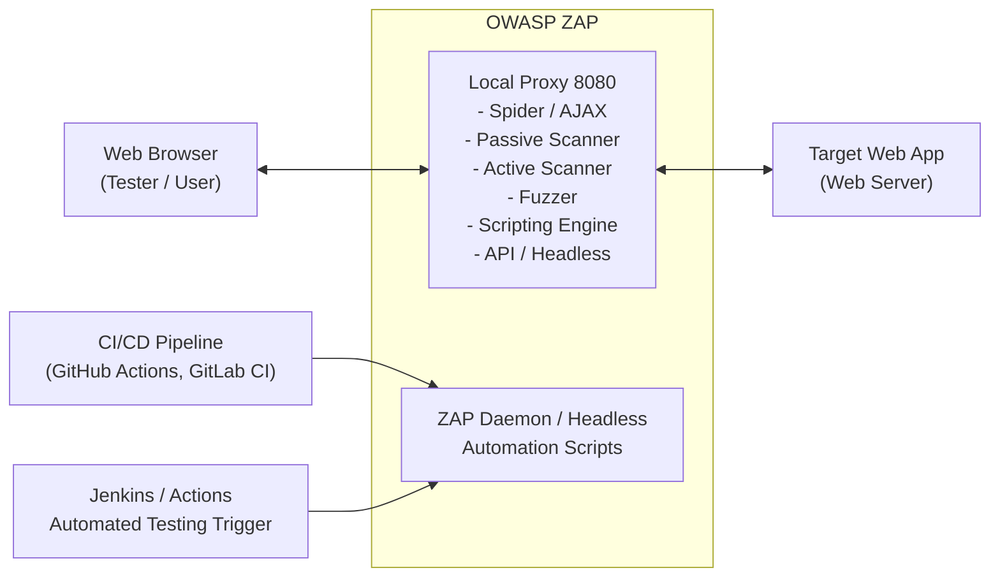

# OWASP ZAP Full Configuration Guide

## Introduction to OWASP ZAP

The OWASP Zed Attack Proxy (ZAP) is one of the world's most popular free security tools and is actively maintained by hundreds of international volunteers. It can help you automatically find security vulnerabilities in your web applications while you are developing and testing your applications. ZAP is fundamentally a "man-in-the-middle" proxy: it stands between the tester's browser and the web application so that it can intercept and inspect messages sent between browser and web application, modify the contents if needed, and then forward those packets on to the destination.

This guide provides an extreme-depth technical walkthrough of advanced configuration, automation, tuning, and integration of OWASP ZAP into complex testing ecosystems. We will cover the granular details of setting up ZAP for deeply nested Single Page Applications (SPAs), microservices, and CI/CD pipelines.

## ZAP Architecture Diagram



## Core Architecture and Components

At its core, ZAP is designed as a modular interception proxy. Its components include:
1. **Local Proxy**: Intercepts HTTP/S traffic. This is the foundation of manual testing.
2. **Contexts**: Groups URLs and configurations (authentication, session management) logically. Contexts are essential for ensuring scans do not bleed into out-of-scope targets.
3. **Spiders**: Includes the traditional HTML spider and the AJAX spider (using a headless browser) to map out application structures.
4. **Scanners**: Passive scanners analyze traffic without altering it. Active scanners send payloads to uncover vulnerabilities like SQLi, XSS, and command injection.
5. **Scripting Engine**: Allows custom Python, JavaScript, and Zest scripts for advanced payloads, authentication flows, and logic flow manipulation.
6. **API/Daemon**: Allows controlling ZAP fully via REST API for CI/CD integration and headless execution in cloud environments.

### Proxy Setup and Intercepting Traffic

To capture traffic correctly, especially in modern applications using TLS/SSL, proper proxy setup is required.

#### TLS Interception
ZAP generates a dynamic Root CA certificate to perform SSL interception. Without this, HTTPS traffic will throw certificate errors.
1. Navigate to **Options > Dynamic SSL Certificates**.
2. Generate a new certificate. This creates a new Root CA specifically for your ZAP instance.
3. Save it and install it in your browser or system trust store as a Trusted Root Certification Authority.
4. Note: On Firefox, you can import this directly into the browser's certificate manager. On Chrome/Edge, it relies on the OS-level certificate store.
5. Without this, modern browsers enforcing HTTP Strict Transport Security (HSTS) will completely reject the connection, and APIs testing with scripts will fail with SSL handshake errors.

#### Routing Traffic
Configure browsers, API clients (like Postman), or automated test runners to route through `127.0.0.1:8080`.
For CLI tools like `curl`, export environments:
```bash
export HTTP_PROXY=http://127.0.0.1:8080
export HTTPS_PROXY=http://127.0.0.1:8080
```
For Python scripts using `requests`:
```python
import requests
proxies = {
  "http": "http://127.0.0.1:8080",
  "https": "http://127.0.0.1:8080",
}
r = requests.get("https://target.com", proxies=proxies, verify=False)
```

## Managing Contexts, Sessions, and Scope

Defining a scope and context is critical. Without a strictly defined scope, ZAP might inadvertently scan out-of-scope third-party services (e.g., Google Analytics, CDN endpoints), which is legally and operationally hazardous.

### Defining Scope
1. In the **Sites** tree, right-click the target domain and select **Include in Context > Default Context**.
2. Open **Session Properties > Contexts > Include in Context**.
3. Use strict regex to define what is included: `\Qhttps://target-app.com\E/.*`
4. Use **Exclude from Context** to ignore specific paths like `/logout` to prevent the active scanner from destroying the session.
   Regex for exclusion: `\Qhttps://target-app.com/api/v1/logout\E`

### Authentication Configuration

Modern applications rarely rely on simple Basic Auth. ZAP supports multiple authentication methods:

1. **Manual Authentication**: Tester logs in via browser; ZAP captures the session token and reuses it. This is best for quick tests but fails for automation.
2. **Form-Based Authentication**: ZAP automatically submits a login form.
   - Configure the Login URL.
   - Map the username and password parameter names (e.g., `user_email` and `user_pwd`).
   - Define a "Logged In" or "Logged Out" regex indicator (e.g., `\QWelcome, User\E` in the response body, or `Location: /login` in headers).
3. **Script-Based Authentication**: For complex flows (OAuth, JWT, SSO), a custom JavaScript/Python script can handle the handshake, extract the JWT from the response, and inject it into the `Authorization` header for subsequent requests.
   - You must enable the Scripting add-on and write an Authentication script that implements the required interface methods (e.g., `authenticate(helper, paramsValues, credentials)`).

### Session Management

Session management tells ZAP how to maintain state after authenticating.
- **Cookie-based**: Standard `JSESSIONID` or `PHPSESSID`. ZAP tracks these automatically.
- **Header-based**: ZAP extracts the token from the auth script and injects it as a header. Useful for modern SPAs using `Authorization: Bearer <token>`.

## Spiders: Traditional vs. AJAX

### Traditional Spider
The standard spider parses HTML responses, extracting `href`, `src`, and form actions. It is fast but fails on Single Page Applications (SPAs) like React or Angular where content is loaded dynamically via JavaScript.
- **Configuration**: Set maximum depth (e.g., 5) to prevent infinite loops on dynamically generated URLs.

### AJAX Spider
The AJAX Spider launches a headless browser (Chrome, Firefox) and interacts with the DOM.
- **How it works**: It clicks buttons, fills out forms, and waits for DOM mutations to map out the application state.
- **Configuration**: Set the max duration, max depth, and click events.
- **Warning**: AJAX Spider is computationally expensive and slow. Only run it on defined contexts, and tune the allowed crawl duration.

## Active vs Passive Scanning Strategies

### Passive Scanning
Runs continuously as traffic flows through ZAP. It looks for missing security headers, exposed secrets, weak cookie flags, and known vulnerable JavaScript libraries.
- **Tuning**: You can disable specific passive rules in **Options > Passive Scan Rules** to reduce noise. For example, disabling "Timestamp Disclosure" if the application heavily uses timestamps for functionality.
- **Custom Rules**: You can write custom passive scan scripts using Zest or JavaScript to look for proprietary internal IP disclosures or specific error messages.

### Active Scanning
Active scanning attacks the application with payloads (SQLi, XSS, Path Traversal). It sends modified requests and analyzes the responses for vulnerabilities.
- **Input Vectors**: Define where ZAP should inject payloads (URL query, POST data, Headers, Cookies). Turn off Header injection if it causes WAF blocking and isn't part of the core test scope.
- **Policies**: Create custom Scan Policies. For example, a "Light SQLi" policy that only uses time-based payloads, or a "No-DoS" policy to avoid taking the target offline.
- **Concurrent Scanning**: Adjust the concurrent threads per host (default is 2). Increasing it to 10 makes the scan faster but risks rate-limiting or bringing down fragile servers.

## Automating ZAP in CI/CD Environments

ZAP is incredibly powerful when integrated into DevSecOps pipelines using the ZAP Docker image.

### Baseline Scan
The baseline scan only runs the spider and passive scanner. It is extremely fast and ideal for every PR. It identifies low-hanging fruit without delaying the build pipeline significantly.
```bash
docker run -t owasp/zap2docker-stable zap-baseline.py \
  -t https://target-app.com \
  -g gen.conf \
  -r baseline-report.html
```

### Full Scan
The full scan includes the active scanner. It should be run nightly or on staging environments, as it can take hours to complete on complex applications.
```bash
docker run -t owasp/zap2docker-stable zap-full-scan.py \
  -t https://target-app.com \
  -d \
  -I \
  -m 5 \
  -r full-report.html
```

### Automation Framework (AF)
The Automation Framework uses a YAML configuration file to define a complete job: Spider, Active Scan, Reporting. This replaces the legacy command-line script approach with a highly configurable, version-controllable document.
```yaml
env:
  contexts:
    - name: "Target App"
      urls: ["https://target-app.com"]
      includePaths: ["https://target-app.com/.*"]
      excludePaths: ["https://target-app.com/logout"]
jobs:
  - type: spider
    parameters:
      maxDuration: 5
  - type: activeScan
    parameters:
      policy: "Default Policy"
  - type: report
    parameters:
      template: "traditional-html"
      reportDir: "/zap/reports"
      reportFile: "zap-report"
```
Run with: `zap.sh -cmd -autorun config.yaml`

## API Interaction and Headless Mode

ZAP provides a robust REST API for managing scans programmatically. This is useful for building custom orchestrators.
- **Starting Headless**: 
  `zap.sh -daemon -host 127.0.0.1 -port 8080 -config api.key=MY_SECRET_KEY`
- **Triggering a scan via curl**:
```bash
curl "http://127.0.0.1:8080/JSON/ascan/action/scan/?apikey=MY_SECRET_KEY&url=https://target-app.com&recurse=true"
```
- **Checking Status**: Polling the API to check scan progress (`/JSON/ascan/view/status/`).
- **Retrieving Alerts**: Fetching the findings in JSON format for ingestion into DefectDojo (`/JSON/core/view/alerts/`).

## Tuning ZAP for Modern SPA and API Testing

### Testing REST / GraphQL APIs
ZAP can natively parse OpenAPI (Swagger) and GraphQL schemas.
1. **Importing OpenAPI**: Use the OpenAPI add-on. Provide the URL to the `swagger.json`. ZAP will generate standard requests for all defined endpoints, drastically reducing manual spidering time.
2. **GraphQL**: Provide the endpoint URL. ZAP will run introspection (if enabled) to map out queries and mutations, generating test cases for each variable.
3. **SOAP**: ZAP also supports legacy WSDL parsing.

### Fuzzing with ZAP
ZAP's Fuzzer allows you to select a specific parameter or string in a request, right-click, and select "Fuzz".
- **Payloads**: You can load wordlists (e.g., SecLists) directly into the Fuzzer.
- **Message Processors**: Add logic to update the `Content-Length` header or regenerate anti-CSRF tokens for each fuzzed request. This is crucial for applications that drop requests with invalid CSRF tokens.
- **Assertions**: Define regex patterns to quickly identify successful exploitation (e.g., flagging responses containing `root:x:0:0:` for LFI, or SQL syntax errors for SQLi).

## Advanced Configurations (Scripts, Add-ons)

### Zest Scripts
Zest is a visual scripting language. You can record a sequence of actions (e.g., logging in, navigating to a dashboard, and submitting a form), save it as a Zest script, and run it as a macro for authentication or automated testing. It eliminates the need to write complex Python for simple multi-step workflows.

### HTTP Sender Scripts
These scripts allow you to intercept and modify every single request or response going through ZAP. Useful for:
- Injecting custom headers (e.g., `X-Forwarded-For: 127.0.0.1` to bypass IP restrictions).
- Calculating custom cryptographic signatures required by the target API before sending the request.

### Add-on Marketplace
ZAP's core is minimalistic. You must install add-ons for specific tasks:
- **OAST (Out-of-band Application Security Testing)**: Integrates BOAST/Interactsh for detecting blind vulnerabilities (Blind SSRF, Blind SQLi).
- **Wappalyzer**: For technology fingerprinting.
- **Custom Payloads**: Adds additional dictionaries and payloads to the active scanner.

## Best Practices and Pitfalls

1. **State Modification**: Active scanning can create thousands of garbage records in the database. It can submit "delete" forms. Always use a dedicated test environment. Never run an unconfigured active scan against production.
2. **Rate Limits and WAFs**: Ensure the target environment has whitelisted your ZAP IP address, or configure ZAP's request delay (`Options > Active Scan > Delay when scanning`) to bypass strict rate limits.
3. **Log Overwhelm**: Running ZAP proxy with high verbosity will generate massive log files and consume RAM. Give ZAP sufficient memory (`-Xmx8G`) when scanning large targets by modifying the `zap.sh` startup script.
4. **Context Switching**: Always clear the session and create a new one when switching between different projects or clients to avoid cross-contamination of findings and scope.

## Chaining Opportunities
- **Recon to ZAP**: Output discovered subdomains and URLs from `amass` or `gau` into a text file and feed them into ZAP's URL importer or context manager.
- **ZAP to Burp**: If ZAP finds an interesting injection point but you prefer Burp Suite's Intruder for deep manual exploitation, you can configure ZAP to proxy its traffic upstream to Burp Suite (`Options > Connection > Use proxy chain`).
- **CI/CD Integration**: Combine ZAP output with DefectDojo for vulnerability management tracking over time, allowing security teams to track metrics like Mean Time to Remediation (MTTR).

## Related Notes
- [[12 - NIST Cybersecurity Framework]]
- [[11 - Introduction to Continuous Integration Security]]
- [[04 - Burp Suite Advanced Features]]
- [[07 - Fuzzing Methodologies]]

