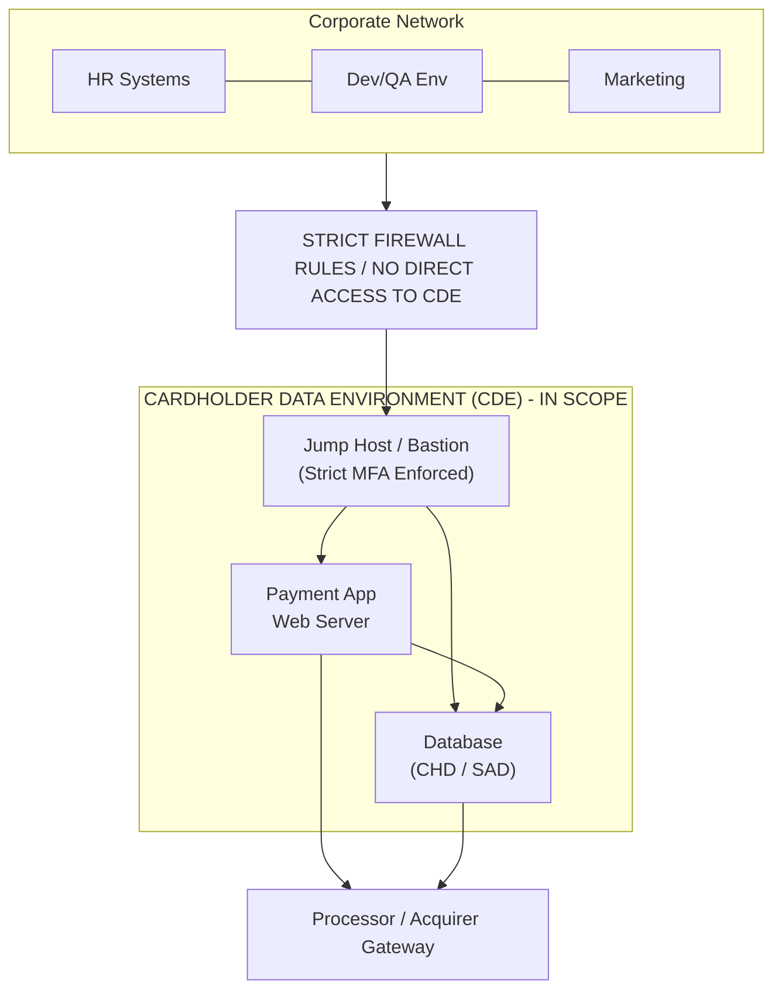

# PCI DSS Payment Card Security Requirements

## Introduction to PCI DSS

The Payment Card Industry Data Security Standard (PCI DSS) is a rigorous, prescriptive information security standard for organizations that handle branded credit cards from major card schemes (Visa, MasterCard, American Express, Discover, and JCB). The PCI Standard is mandated by the card brands but administered by the Payment Card Industry Security Standards Council (PCI SSC). 

For security professionals, network architects, and penetration testers, understanding PCI DSS is non-negotiable when dealing with e-commerce platforms, payment gateways, retail point-of-sale (POS) systems, or any infrastructure touching Cardholder Data (CHD) or Sensitive Authentication Data (SAD).

Failure to comply with PCI DSS can result in massive fines (often hundreds of thousands of dollars per month of non-compliance), increased transaction fees, and the ultimate revocation of card processing privileges, effectively destroying a retail business overnight.

## The Cardholder Data Environment (CDE) Boundary

Understanding the boundary of the CDE is the most important concept in PCI DSS.

## Applicability and Scoping

The most critical, time-consuming, and potentially expensive step in PCI DSS compliance is scoping. Scoping involves identifying all systems components, people, and processes that are included in or connected to the CDE.

- **In-Scope**: 
  - Systems that store, process, or transmit CHD (PAN, Cardholder Name, Expiration Date) or SAD (Track data, CVV/CVC, PINs).
  - Systems that connect directly or indirectly to the CDE.
  - Systems that provide security services to the CDE (e.g., Active Directory, Firewalls, Jump Hosts, Log Servers, NTP Servers).
- **Out-of-Scope**: 
  - Systems completely isolated from the CDE via proper, tested network segmentation.

A primary goal of system architecture is to reduce the scope of the CDE as much as possible. A smaller CDE means fewer systems to patch under strict deadlines, fewer systems to audit, and a vastly reduced attack surface. Tokenization and P2PE (Point-to-Point Encryption) are highly effective scope-reduction strategies.

## Network Segmentation Deep Dive

Network segmentation is not technically a mandatory PCI DSS requirement to achieve compliance (you could theoretically have your entire global network in-scope), but it is universally recommended to reduce the scope of the CDE. Without adequate segmentation, the entire corporate network becomes the CDE.

- **Micro-segmentation**: Utilizing technologies like VMware NSX, Cisco ACI, or strict cloud Security Groups (AWS SG) to isolate individual workloads, not just physical networks.
- **VAPT Perspective**: Penetration testers are explicitly required to test segmentation controls. This involves attempting to reach the CDE from out-of-scope networks (e.g., the corporate Wi-Fi or HR VLAN) to prove the isolation is effective. This must be documented meticulously.

## The 12 Primary Requirements

PCI DSS is built on 12 core requirements, categorized into 6 overarching goals. Every requirement has dozens of sub-requirements.

### Build and Maintain a Secure Network and Systems
1. **Install and maintain network security controls**: Firewalls, VPC configurations. Routers must have strict ACLs.
2. **Apply secure configurations to all system components**: Changing default passwords, hardening OS according to CIS benchmarks, removing unnecessary services (e.g., disabling Telnet, FTP).

### Protect Account Data
3. **Protect stored account data**: Masking PAN (Primary Account Number) when displayed (e.g., only showing the last 4 digits). Critically, it explicitly prohibits the storage of SAD (Track data, CVV) after authorization, even if encrypted. If you store the CVV, you fail PCI immediately.
4. **Protect cardholder data with strong cryptography during transmission**: Enforcing TLS 1.2+ and rejecting SSL/early TLS across public networks.

### Maintain a Vulnerability Management Program
5. **Protect all systems and networks from malicious software**: Antivirus, EDR, and ensuring signature databases are updated continuously.
6. **Develop and maintain secure systems and software**: Secure SDLC, identifying vulnerabilities (OWASP Top 10), applying critical security patches within one month of release.

### Implement Strong Access Control Measures
7. **Restrict access to system components and cardholder data by business need to know**: Default deny policies, RBAC (Role-Based Access Control).
8. **Identify users and authenticate access to system components**: Unique IDs for all users, enforcing MFA for all access into the CDE (not just remote access). Generic accounts (e.g., `admin`, `root`) must be strictly controlled and audited.
9. **Restrict physical access to cardholder data**: Securing data centers, using badge readers, maintaining visitor logs.

### Regularly Monitor and Test Networks
10. **Log and monitor all access to system components and cardholder data**: Centralized logging to a secure SIEM, FIM (File Integrity Monitoring) on critical system files.
11. **Test security of systems and networks regularly**: Vulnerability scans, penetration testing, ASV scans, wireless rogue AP detection.

### Maintain an Information Security Policy
12. **Support information security with organizational policies and programs**: Risk assessments, security awareness training, incident response plan testing.

## Requirement 6: Secure Development and OWASP Integration

Requirement 6 mandates that software must be developed securely, directly referencing frameworks like the OWASP Top 10.
- Developers must be formally trained in secure coding practices at least annually.
- Custom code must be reviewed (manual code review or SAST) prior to release to production.
- Applications facing the internet must be protected by an automated technical solution that detects and prevents web-based attacks (like a WAF) or subjected to rigorous, continuous vulnerability assessment.

## Requirement 11: Regular Security Testing (VAPT)

Requirement 11 is the most critical area for offensive security professionals.

### Internal vs External Vulnerability Scans
- **Internal Scans**: Must be performed quarterly by qualified personnel. Must identify 'High' risk vulnerabilities based on CVSS.
- **External Scans**: Must be performed quarterly by a PCI SSC Approved Scanning Vendor (ASV). All failures (CVSS 4.0 or higher) must be remediated to achieve a passing ASV report.

### Penetration Testing Requirements
PCI requires both **Internal** and **External** penetration testing.
- **Frequency**: At least annually, and after any significant infrastructure or application upgrade/modification (e.g., migrating to a new OS, adding a new web server).
- **Methodology**: Must be based on industry-accepted approaches (e.g., NIST SP 800-115, PTES).
- **Application Layer**: Must include testing against the OWASP Top 10 for web applications.
- **Network Layer**: Must include testing of network security controls and OS vulnerabilities.
- **Segmentation Testing**: If segmentation is used to reduce scope, penetration testing must verify the operational effectiveness of the segmentation controls at least annually (or bi-annually for service providers).

### Exploitation Limits in PCI VAPT
While penetration testing implies exploitation, PCI testing has specific boundaries.
- The goal is to prove risk, not cause outages. Denial of Service (DoS) testing is typically excluded or heavily restricted.
- Testers must take extreme care not to extract, log, or exfiltrate real Cardholder Data during an engagement. If CHD is accessed to prove a vulnerability (e.g., proving a SQLi can read the `credit_cards` table), it must be heavily obfuscated in the report and securely deleted from the tester's machine immediately.

## Reporting Requirements for PCI

A PCI pentest report is structured rigidly compared to a standard pentest report. It must clearly state:
- The exact scope of the engagement (IPs, URLs, physical locations).
- A statement confirming that application-layer and network-layer testing occurred.
- A section explicitly dedicated to the results of segmentation testing.
- Clear evidence of vulnerabilities mapped directly to specific PCI DSS requirements (e.g., "Finding 1: XSS maps to Req 6.5.7").
- Remediation testing: A follow-up test must be performed to verify that exploitable vulnerabilities were corrected, and this must be documented in the final report.

## Transitioning to PCI DSS v4.0

PCI DSS v4.0 (mandatory as of March 2024, with some requirements phasing in by 2025) introduces several major shifts:
- **Customized Approach**: Organizations can meet the intent of a requirement using alternative security technologies, offering more flexibility than the strict "Defined Approach" of v3.2.1. This requires a targeted risk analysis.
- **Continuous Security**: Moving away from annual point-in-time compliance to continuous security posture management.
- **E-commerce Security**: Stricter controls over payment page scripts (e.g., protecting against Magecart attacks via Content Security Policy (CSP) and Subresource Integrity (SRI) to manage third-party JavaScript).
- **Phishing and Passwords**: Increased focus on anti-phishing technical controls, stricter password length requirements (minimum 12 characters), and stronger authentication requirements.

## Best Practices for Maintaining Compliance

1. **Tokenization**: Replace PANs in your internal databases with non-sensitive tokens provided by your payment processor (e.g., Stripe, Braintree). If you don't store the PAN, the database falls out of scope for many stringent requirements.
2. **Infrastructure as Code (IaC) Security**: Scan Terraform/CloudFormation templates to ensure CDE environments are deployed securely by default.
3. **Automated Compliance Scanning**: Use CSPM (Cloud Security Posture Management) tools to alert on configuration drift (e.g., an S3 bucket in the CDE becoming public).

## Chaining Opportunities
- **SSRF to CDE Compromise**: Server-Side Request Forgery on a public web server (out of scope) that can reach an internal API (in scope) completely breaks network segmentation. This chains a web vulnerability into a massive PCI non-compliance event, forcing the out-of-scope system into scope.
- **XSS to Magecart**: Cross-Site Scripting on a checkout page allows attackers to inject malicious JavaScript (Magecart) to skim credit card details directly from the user's browser, bypassing backend encryption and directly violating Requirement 6.

## Related Notes
- [[12 - NIST Cybersecurity Framework]]
- [[02 - Cross-Site Scripting (XSS) Deep Dive]]
- [[05 - Server-Side Request Forgery (SSRF)]]
- [[11 - OWASP ZAP Full Configuration Guide]]
