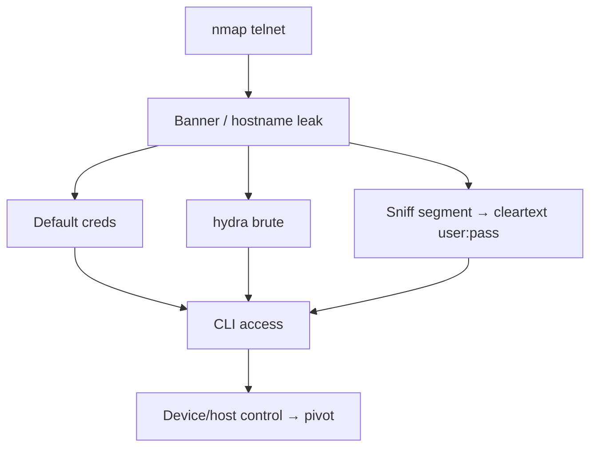

# 02 - Telnet (Port 23) Pentesting

## 1. Executive Summary

Telnet provides remote terminal access over **TCP port 23** with **zero encryption** — credentials and all session data travel in cleartext. Largely replaced by SSH, it survives on legacy gear, routers, switches, printers, and IoT devices, where it is frequently exposed with default or hard-coded credentials. Finding Telnet is often a fast win.

## 2. Protocol Overview

Telnet negotiates options using **IAC** (Interpret As Command) byte sequences with **DO / DONT / WILL / WONT** verbs to enable features (echo, encryption, terminal type, NTLM on Windows). The negotiation happens before login and can leak server details.

## 3. Enumeration

```bash
# Version + safe telnet scripts
nmap -n -sV -Pn --script "*telnet* and safe" -p23 <IP>

# Microsoft Telnet leaks NTLM info: NetBIOS/DNS name, OS build
nmap -p23 --script telnet-ntlm-info <IP>

# Does it support the ENCRYPT option?
nmap -p23 --script telnet-encryption <IP>
```
Just connecting often dumps a banner/hostname:
```bash
telnet <IP> 23
nc -nv <IP> 23
```

## 4. Exploitation

### 4.1 Default / Hard-coded Credentials
IoT and network gear ship with known logins (admin:admin, root:root, etc.). Try a default-creds list first.

### 4.2 Brute Force
```bash
hydra -L users.txt -P pass.txt telnet://<IP>
nmap -p23 --script telnet-brute --script-args userdb=users.txt,passdb=pass.txt <IP>
```

### 4.3 Cleartext Sniffing
On the same segment, capture the whole session — including the login:
```bash
tcpdump -i eth0 -A 'tcp port 23'
# Wireshark: Follow TCP Stream reveals username + password
```

## 5. Notable CVEs
- **CVE-2024-45698** — D-Link DIR-X4860: hard-coded Telnet creds → OS command injection (fixed in fw 1.04B05+).
- **CVE-2023-40478** — NETGEAR RAX30: stack overflow in Telnet CLI `passwd` → RCE as root.

## 6. Mermaid Attack Flow


## 7. Post-Exploitation
- Network device CLI → dump running-config (creds, SNMP strings, VPN secrets).
- Pivot deeper; reuse captured creds against SSH/web/SNMP.

## 8. Defense & Hardening
1. **Disable Telnet** entirely; use SSH.
2. If unavoidable, restrict to an isolated management VLAN with strict ACLs.
3. Change all default credentials; patch device firmware.

## 9. Chaining Opportunities
- Captured device creds → SNMP/SSH lateral movement.
- Router config → network pivot. See **[[01 - SSH (Port 22) Pentesting]]**.

## 10. Related Notes
- [[01 - SSH (Port 22) Pentesting]]
- [[37 - rlogin (Port 513) Pentesting]]
