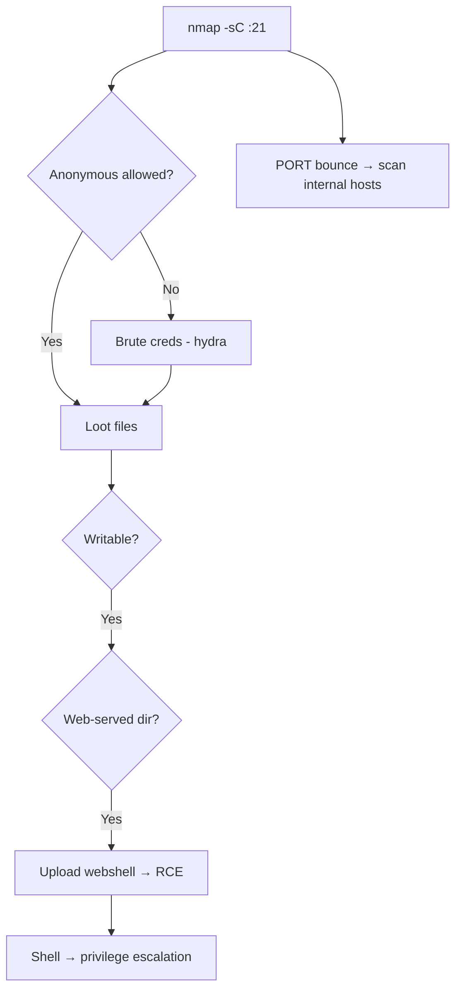

# 04 - FTP (Port 21) Pentesting

## 1. Executive Summary

FTP transfers files over **TCP port 21** (control) plus a separate data channel, in **cleartext** by default. Common weaknesses: **anonymous login**, default/weak credentials, the legacy **FTP bounce attack**, writable webroots leading to RCE, and sniffable credentials. A writable, web-served FTP root is a classic path to a web shell.

## 2. Protocol Overview

- **Active mode:** client opens control to server:21, server connects *back* from port 20 to client's data port (firewall-hostile).
- **Passive mode (PASV):** client opens both connections; server tells the client which port to use.
- **FTPS** = FTP over TLS (ports 21/990). **SFTP** is unrelated (it rides SSH/22).

## 3. Enumeration

```bash
# Version, default scripts (anon + bounce checks run automatically)
nmap -sV -p21 -sC -A <IP>

# Manual
ftp <IP>           # try anonymous : anonymous
nc -nv <IP> 21
```

### Anonymous Login
```bash
ftp <IP>
Name: anonymous
Password: anonymous   (or blank / any email)
```
If allowed, `ls -la`, `get` everything, and check whether the directory is writable (`put test.txt`).

## 4. Exploitation

### 4.1 Credential Brute Force
```bash
hydra -L users.txt -P pass.txt ftp://<IP>
```
Try default-creds lists first (vendor appliances).

### 4.2 FTP Bounce Attack
The `PORT` command lets you direct the data connection to a **third host**, turning the FTP server into a port-scanning/relay proxy that bypasses firewall rules:
```bash
nmap -b anonymous:anonymous@<FTP_IP> <internal_target>
```

### 4.3 Writable Webroot → RCE
If the FTP root is served by a web server (e.g. `/var/www/html`), upload a shell:
```bash
ftp <IP>
put shell.php
# browse http://<IP>/shell.php?cmd=id
```

### 4.4 Cleartext Sniffing
On-segment capture reveals credentials:
```bash
tcpdump -i eth0 -A 'tcp port 21'
```

## 5. Notable CVEs
- **vsftpd 2.3.4** backdoor (CVE-2011-2523) — a `:)` in the username opens a root shell on port 6200.
- **ProFTPD mod_copy** (CVE-2015-3306) — unauthenticated `SITE CPFR/CPTO` file copy → RCE.

## 6. Mermaid Attack Flow


## 7. Post-Exploitation
- Downloaded configs/backups often hold credentials.
- Writable + scheduled-task/webroot → persistence and RCE.

## 8. Defense & Hardening
1. Prefer SFTP/FTPS; disable plain FTP.
2. Disable anonymous and the `PORT`/bounce capability; enforce PASV with restricted ranges.
3. Strong creds, chroot users, never serve the FTP root via a web server with write access.

## 9. Chaining Opportunities
- Writable webroot → web shell → **[[08 - Linux Privilege Escalation]]**.
- Looted creds → SSH/SMB reuse.

## 10. Related Notes
- [[05 - SMTP (Port 25) Pentesting]]
- [[36 - rsync (Port 873) Pentesting]]
- [[61 - TFTP (Port 69) Pentesting]]
