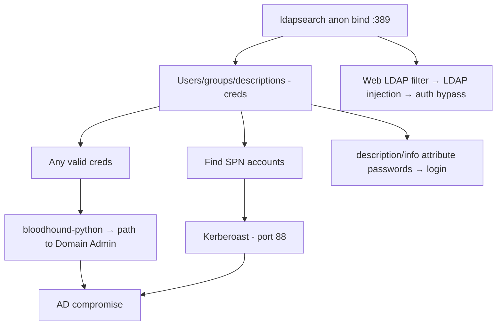

# 08 - LDAP (Ports 389/636) Pentesting

## 1. Executive Summary

LDAP (Lightweight Directory Access Protocol) queries directory services on **TCP 389** (plain), **636** (LDAPS), and in Active Directory **3268/3269** (Global Catalog). In AD environments LDAP is the directory itself — users, groups, computers, GPOs, ACLs. **Anonymous bind** or any low-priv credential lets you enumerate the entire domain, find privileged accounts, and discover attack paths.

## 2. Protocol Overview

- Hierarchical entries by **Distinguished Name** (DN), e.g. `CN=admin,OU=IT,DC=corp,DC=local`.
- **Bind** = authenticate (anonymous, simple bind = cleartext password, or SASL).
- AD exposes LDAP on the DC; Global Catalog (3268) holds a partial forest-wide replica.

## 3. Enumeration

```bash
# Nmap (anonymous)
nmap -n -sV --script "ldap* and not brute" <IP>
nmap -p389 --script ldap-search -Pn <IP>

# Anonymous bind base query
ldapsearch -x -H ldap://<IP> -s base namingcontexts
ldapsearch -x -H ldap://<IP> -b "DC=corp,DC=local"

# Authenticated full dump
ldapsearch -x -H ldap://<IP> -D 'corp\user' -w 'pass' -b "DC=corp,DC=local"

# Windapsearch / ldapdomaindump
windapsearch -d corp.local --dc-ip <IP> -u user@corp.local -p pass --da --computers
ldapdomaindump -u 'corp\user' -p 'pass' <IP>
```

## 4. Exploitation

### 4.1 Anonymous Bind
If allowed, dump users, groups, and descriptions — `description` fields often hold passwords. No creds needed.

### 4.2 AD Attack-Path Discovery
With any valid creds, feed LDAP into **BloodHound** to map paths to Domain Admin:
```bash
bloodhound-python -d corp.local -u user -p pass -c All -ns <IP>
```
Find Kerberoastable accounts (SPN set), AS-REP-roastable (no preauth), and dangerous ACLs.

### 4.3 LDAP Injection
In web apps that build LDAP filters from input, inject `*)(uid=*))(|(uid=*` style payloads to bypass auth or enumerate. See **[[LDAP Injection]]**.

### 4.4 Credential Brute / Spray
```bash
nxc ldap <IP> -u users.txt -p 'Spring2026!' --continue-on-success
```

## 5. Mermaid Attack Flow


## 6. Post-Exploitation
- `description`/`info` attribute passwords → immediate login.
- Map group memberships → target privileged users; locate LAPS/gMSA readable accounts.

## 7. Defense & Hardening
1. Disable anonymous bind; require LDAPS (no cleartext simple bind).
2. Enforce LDAP signing + channel binding (blocks relay).
3. Never store secrets in `description`; least-privilege ACLs.
4. Monitor bulk LDAP queries (BloodHound collection signature).

## 8. Chaining Opportunities
- SPN accounts from LDAP → **[[09 - Kerberos (Port 88) Pentesting]]** Kerberoasting.
- BloodHound paths → AD privilege escalation. See **[[Active Directory]]**.

## 9. Related Notes
- [[09 - Kerberos (Port 88) Pentesting]]
- [[06 - SMB (Ports 139-445) Pentesting]]
- [[12 - LDAP — Anonymous Bind, Enumeration, Injection]]

## 10. Tools
`ldapsearch`, `windapsearch`, `ldapdomaindump`, `bloodhound-python`, `netexec ldap`.
