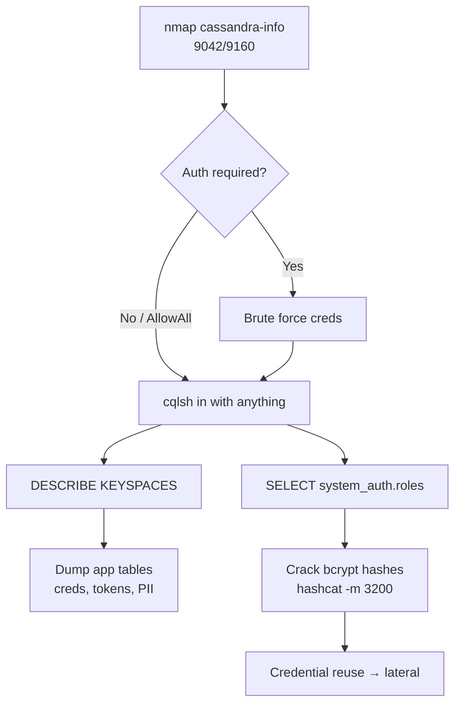

# 17 - Cassandra (Ports 9042-9160) Pentesting

## 1. Executive Summary

Apache Cassandra is a distributed, highly available NoSQL database built to spread huge datasets across many commodity nodes with no single point of failure. It speaks the **CQL native protocol on TCP 9042** and the legacy **Thrift protocol on TCP 9160**. The dominant weakness is configuration, not code: out of the box Cassandra ships with the `AllowAllAuthenticator`, meaning it **accepts any credentials (or none)**. An exposed cluster therefore usually hands over full read/write access to every keyspace, which is where applications stash credentials, tokens, and PII.

## 2. Protocol Overview & Architecture

Cassandra is a peer-to-peer ring — every node is equal, data is partitioned by a hash of the partition key and replicated to N nodes. You interact with it using **CQL (Cassandra Query Language)**, which deliberately resembles SQL (`SELECT`, `INSERT`) but has no JOINs and no general-purpose subqueries. Authentication and authorization are pluggable: `AllowAllAuthenticator` (open) vs `PasswordAuthenticator` (credentials stored in the `system_auth` keyspace). Because the default is open, the first question on any engagement is simply "does it let me in with nothing?".

## 3. Enumeration & Footprinting

```bash
# Identify version + native protocol
nmap -sV --script cassandra-info -p 9042,9160 <IP>

# Connect with the CQL shell (try empty / cassandra:cassandra)
cqlsh <IP> 9042
cqlsh <IP> 9042 -u cassandra -p cassandra
```
Once connected:
```sql
DESCRIBE KEYSPACES;          -- list databases
USE <keyspace>;
DESCRIBE TABLES;
SELECT * FROM system_auth.roles;   -- stored credential hashes (if PasswordAuthenticator)
SELECT * FROM <table> LIMIT 100;
```

## 4. Exploitation Deep Dive

### 4.1 Unauthenticated / Default Access
If `AllowAllAuthenticator` is set (the default), any login string works. Enumerate every keyspace and dump application tables wholesale. The default superuser is `cassandra:cassandra`.

### 4.2 Credential Brute Force
When `PasswordAuthenticator` is enabled it is plain credential auth — brute force normally:
```bash
nmap --script cassandra-brute -p 9042 <IP>
hydra -L users.txt -P pass.txt <IP> cassandra
```

### 4.3 Credential Looting from system_auth
With access, the `system_auth.roles` table stores bcrypt hashes of other roles — crack offline for reuse elsewhere (`hashcat -m 3200`).

## 5. Mermaid Attack Flow



## 6. Post-Exploitation
- Application keyspaces commonly hold user records, session data, and secrets.
- Cracked `system_auth` hashes feed credential reuse against SSH/web/other DBs.
- Write access lets you tamper data or insert a privileged app account.

## 7. Defense & Hardening
1. Switch to `PasswordAuthenticator` + `CassandraAuthorizer`; change the default `cassandra` superuser.
2. Enable client-to-node and node-to-node TLS encryption.
3. Bind to internal interfaces only; firewall 9042/9160 to the application tier.
4. Apply least-privilege roles per application.

## 8. Chaining Opportunities
- Looted app credentials → lateral movement and credential reuse.
- Cracked role hashes → access to other Cassandra clusters / services.

## 9. Related Notes
- [[14 - MongoDB (Ports 27017-27018) Pentesting]]
- [[18 - Elasticsearch (Port 9200) Pentesting]]

## 10. Tools
`cqlsh`, `nmap` cassandra-*, `hydra`, `hashcat`.
