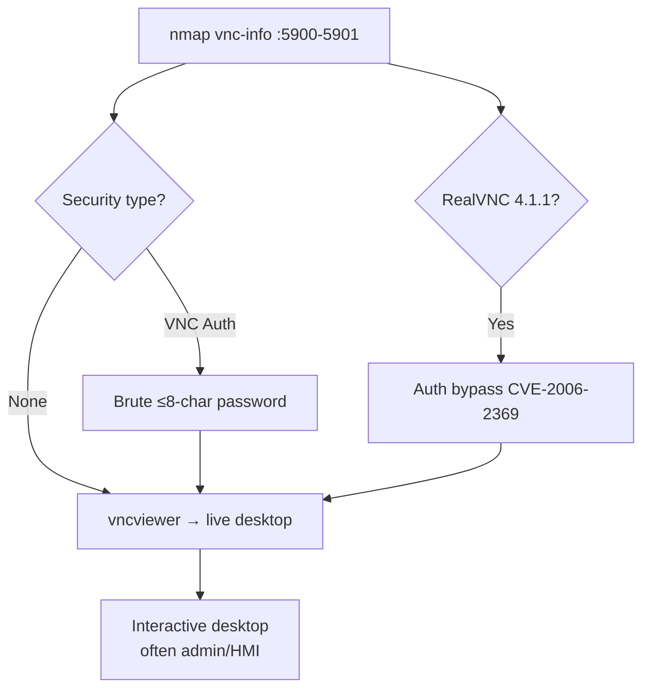

# 21 - VNC (Ports 5900-5901) Pentesting

## 1. Executive Summary

VNC (Virtual Network Computing) shares a graphical desktop over the **RFB protocol on TCP 5900** (display `:0`), with additional displays at 5901, 5902, etc. (HTTP/Java viewer variants on 5800). It is the cross-platform cousin of RDP and is regularly found with **no authentication** or a **weak 8-character password** (VNC's classic auth truncates passwords to 8 bytes). An open VNC server is an instant interactive desktop — often a logged-in admin session, kiosk, or industrial HMI.

## 2. Protocol Overview & Architecture

RFB ("Remote Framebuffer") negotiates a security type after connecting: **None** (no auth), **VNC Authentication** (DES challenge-response, password ≤ 8 chars), or vendor schemes. The framebuffer (screen) is streamed to the viewer and input events are sent back. The weak DES challenge means captured handshakes are crackable, and the 8-char cap drastically shrinks the keyspace.

## 3. Enumeration & Footprinting

```bash
# Security types, title, RealVNC bypass check
nmap -sV --script vnc-info,realvnc-auth-bypass,vnc-title -p 5900-5901 <IP>

# Just connect and look
vncviewer <IP>:5900
```

## 4. Exploitation Deep Dive

### 4.1 No Authentication
If `vnc-info` reports security type **None**, connect straight to a live desktop with `vncviewer`.

### 4.2 Password Brute Force
```bash
hydra -P pass.txt vnc://<IP>
nxc vnc <IP> -p pass.txt
```
Remember the 8-char truncation — many real passwords collapse to a small effective space.

### 4.3 RealVNC Auth Bypass (CVE-2006-2369)
Old RealVNC 4.1.1 lets the client choose the "None" security type even when auth is configured — full bypass:
```bash
nmap -p5900 --script realvnc-auth-bypass <IP>
msf> use auxiliary/admin/vnc/realvnc_41_bypass
```

### 4.4 Cracking Stored VNC Passwords
Looted `.vnc/passwd` files use a fixed DES key and can be decrypted instantly (`vncpwd` / `vncpasswd.py`).

## 5. Mermaid Attack Flow



## 6. Post-Exploitation
- Desktop access = whatever the logged-in user can do; open a terminal, harvest creds.
- HMI/SCADA consoles via VNC → operational-technology impact.
- Decrypt stored VNC passwords for lateral movement to other VNC hosts.

## 7. Defense & Hardening
1. Never run VNC unauthenticated; use strong auth and tunnel over SSH/VPN.
2. Patch RealVNC bypass; prefer modern encrypted VNC implementations.
3. Bind to localhost + SSH tunnel; firewall 5900-590x.
4. Avoid VNC for sensitive consoles where 8-char limits apply.

## 8. Chaining Opportunities
- Open desktop → local shell → **[[08 - Linux Privilege Escalation]]** / Windows privesc.
- Decrypted VNC passwords → access more hosts.

## 9. Related Notes
- [[20 - RDP (Port 3389) Pentesting]]
- [[23 - X11 (Port 6000) Pentesting]]
- [[29 - VNC — No Authentication, Weak Password]]

## 10. Tools
`vncviewer`, `nmap` vnc-*, `hydra`, `netexec vnc`, `vncpwd`.
