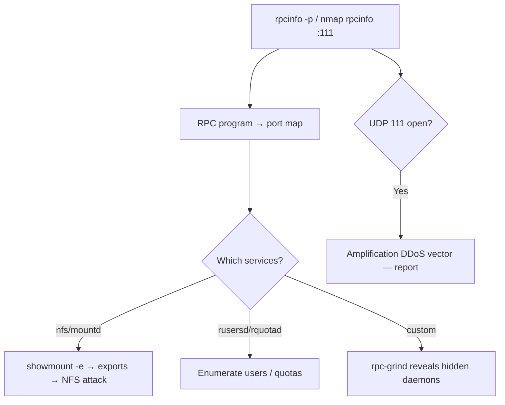

# 24 - rpcbind / Portmapper (Port 111) Pentesting

## 1. Executive Summary

rpcbind (a.k.a. the **portmapper**) is the directory service for Sun **RPC** programs on **TCP/UDP 111** (32771 on Oracle Solaris). It does not do anything exploitable by itself — its value to an attacker is **discovery**: it maps RPC program numbers (NFS, mountd, rusersd, rquotad, NIS, custom daemons) to the dynamic ports they actually run on. Querying rpcbind tells you which RPC services exist and where, most importantly pointing you at **NFS exports** to attack next. It is also a known UDP **amplification** vector.

## 2. Protocol Overview & Architecture

RPC services register their program number + version + port with rpcbind on startup. A client first asks rpcbind "where is program X?", then connects to the returned port. So port 111 is the index; the interesting services live on other (often high, dynamic) ports that you only learn by querying it.

## 3. Enumeration & Footprinting

```bash
# List all registered RPC programs and their ports
rpcinfo -p <IP>
rpcinfo -T udp -p <IP>          # works even if TCP/111 is filtered

# Nmap: dump RPC table + brute program numbers
nmap -sSUC -p111 <IP>
nmap --script=rpcinfo,rpc-grind -p111 <IP>
nmap --script rpc-grind --script-args 'rpc-grind.threads=8' -p111 <IP>

# Immediately check for NFS exports surfaced via rpcbind
showmount -e <IP>
```

## 4. Exploitation Deep Dive

### 4.1 Service Discovery → Next Target
The `rpcinfo` output reveals services like `nfs` (2049), `mountd`, `rusersd`, `rquotad`, `ypserv` (NIS). Each is its own attack path — most commonly **NFS** (note 25).

### 4.2 rpc-grind for Hidden Daemons
`rpc-grind` walks the `nmap-rpc` database with null calls; daemons that reply "can't support version" reveal themselves, exposing quietly registered services not obvious from a port scan.

### 4.3 UDP Amplification
UDP/111 can be abused for reflection/amplification DDoS — report exposure; do not launch.

## 5. Mermaid Attack Flow



## 6. Post-Exploitation
- The discovered service list drives the rest of the host assessment (especially NFS).
- `rusersd` may leak logged-in usernames for password attacks.

## 7. Defense & Hardening
1. Disable rpcbind and RPC services if not required (modern NFSv4 doesn't need the portmapper).
2. Firewall 111 (TCP+UDP) and the dynamic RPC port range to trusted hosts only.
3. Disable UDP where unused to remove the amplification vector.

## 8. Chaining Opportunities
- rpcbind → NFS exports → file read/write. See **[[25 - NFS (Port 2049) Pentesting]]**.
- Discovered NIS/rusersd → username harvesting.

## 9. Related Notes
- [[25 - NFS (Port 2049) Pentesting]]
- [[26 - MSRPC (Port 135) Pentesting]]

## 10. Tools
`rpcinfo`, `nmap` rpcinfo/rpc-grind, `showmount`.
